

# Lecture 1: what we are going to do {background-color="#121011"}

* Introduction to Big Data
* Architectures
  * Hardware
  * Software
    * Data storage
    * Data processing (batch, interactive, streaming)
  * Reference architectures

# Introduction to Big Data {background-color="#121011"}

# Why data matters

__Data-Driven Innovation__

  * Use of data and  **analytics** to foster new products, processes, and markets
  * Drive discovery and execution of innovation, achieving new services with a business value

__Analytics__

* A catch-all term for different business intelligence (BI)- and application-related initiatives
  * E.g., of analyzing information from a particular domain
  * E.g., applying BI capabilities to a specific content area (e.g., sales, service, supply chain)

__Advanced Analytics__

* (Semi-)Autonomous examination of data to discover deeper insights, make predictions, or generate recommendations (e.g., through data/text mining and machine learning)

__Augmented Analytics__

* Use of technologies such as machine learning and AI to assist with data preparation, insight generation, and insight explanation to augment how people explore and analyze data

[https://www.gartner.com/en/information-technology/glossary](https://www.gartner.com/en/information-technology/glossary) (accessed 2022-08-01)

#

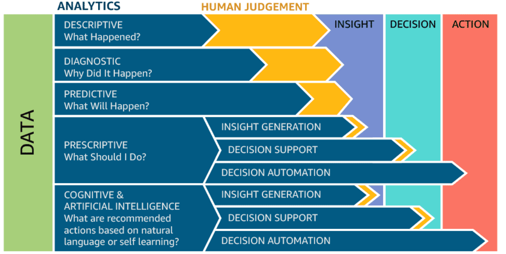

# Define big data

The term _big data_ comes in two flavors.

* Noun: "We have _big data_"
* Adjective: "We use _big data_ tools"

# Big data as a noun

When does data become _big_?

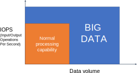

* "Big data _exceeds the reach of commonly used HW and SW_ environments to capture, manage, and process it within a tolerable elapsed time." </br> Teradata Magazine article (2011)
* "Big data refers to data sets whose _size is beyond the ability of typical database software_ tools to capture, store, manage, and analyze." </br> The McKinsey Global Institute (2012)

* "Big data is data sets that are _so voluminous and complex that traditional data processing application software is inadequate_ to deal with them." </br> Wikipedia

# Big data as a noun – The V's

::::{.columns}
:::{.column width="33%"}

The big-data cube [@meijer2012your]

* *Volume*: small to big
* *Variety*: structure to unstructured
* *Velocity*: pull to push

:::
:::{.column width="66%"}

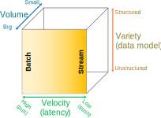

:::
::::

# Big data as a noun – The V's

](img/phdslides_2.jpg)

# Big data as a noun – The V's

::::{.columns}
:::{.column width="50%"}

*Volume*

* Large quantity of data

*Velocity*

* Refers to the speed of data production...
* ...and to the speed of consumption and analysis

*Variety*

* Structured, unstructured, multimedia

*Veracity*

* Refers to the trustworthiness of data
* Potentially inconsistent, incomplete, ambiguous, obsolete, false, approximate

...

:::
:::{.column width="50%"}

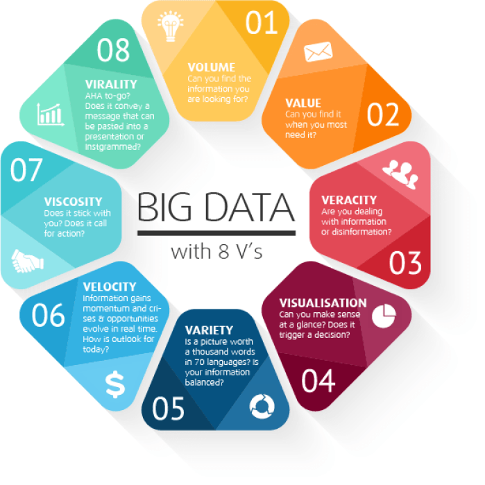

:::
::::

# Big data as an adjective

* When used as a noun, the boundary between _normal_ and _big_ data is vague
* When used as an adjective, its meaning is more specific
  * *Big data architecture* (e.g., the Lambda architecture)
  * *Big data tools* (e.g., Apache Spark)
  * *Big data paradigm* (e.g., Map-Reduce)

# Why the hype?

)](img/etf-bigdata.png)

# Why the hype?

- [The Tropical Island With the Hot Domain Name](https://www.bloomberg.com/news/articles/2023-08-31/ai-startups-create-digital-demand-for-anguilla-s-website-domain-name)
- [These Prisoners Are Training AI](https://www.wired.com/story/prisoners-training-ai-finland/)
- [Amazon Mechanical Turk](https://www.mturk.com/)
- [IA e Lavoro Gen-Z](https://www.ilsole24ore.com/art/l-intelligenza-artificiale-gia-ruba-lavoro-giovani-gen-z-AHgfnmz)
- [Google turns to nuclear to power AI data centres](https://www.bbc.com/news/articles/c748gn94k95o)
- [‘We definitely messed up’: why did Google AI tool make offensive historical images?](https://www.theguardian.com/technology/2024/mar/08/we-definitely-messed-up-why-did-google-ai-tool-make-offensive-historical-images)
- [Why Google's 'woke' AI problem won't be an easy fix](https://www.bbc.com/news/technology-68412620)

# Why the hype?


# Why the hype?

::::{.columns}
:::{.column width="25%"}
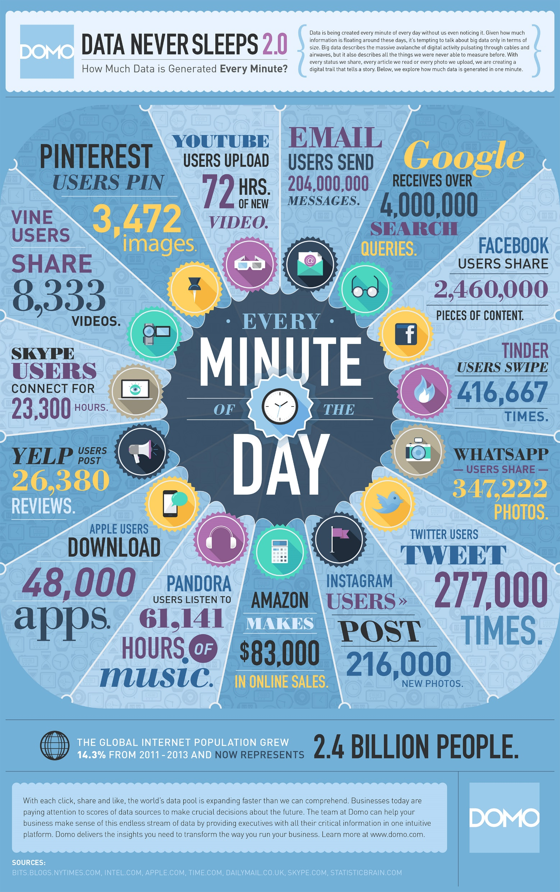
:::
:::{.column width="25%"}

:::
:::{.column width="25%"}

:::
:::{.column width="25%"}

:::
::::

[https://www.domo.com/data-never-sleeps\#](https://www.domo.com/data-never-sleeps) (accessed 2023-06-14)

# Data never sleeps

::::{.columns}
:::{.column width="25%"}

:::
:::{.column width="25%"}

:::
:::{.column width="25%"}

:::
:::{.column width="25%"}

:::
::::

[https://www.domo.com/learn/data-never-sleeps-9](https://www.domo.com/learn/data-never-sleeps-9)

# Data never sleeps: The Netflix scenario

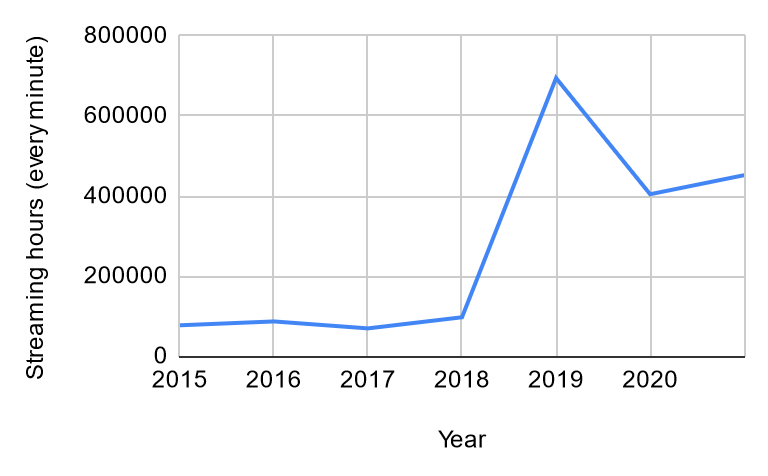

[https://www.domo.com/learn/data-never-sleeps-9](https://www.domo.com/learn/data-never-sleeps-9)

# Data never sleeps

::::{.columns}
:::{.column width="25%"}


:::
:::{.column width="75%"}


:::
::::

[https://www.domo.com/data-never-sleeps\#data](https://www.domo.com/data-never-sleeps#data) (accessed 2023-06-14)

# Can we drop data to bring "big data" to "small data"?

# The long tail

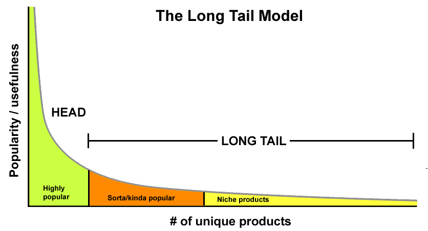

The highest value does not come from the small set of highly popular items, but from the long list of niche items.

* Put together, the _insignificant_ data is actually the most valuable
* The inverse of the 80-20 Pareto rule
    - Pareto principle (80/20 rule): 20% of the causes generate 80% of the value, suggesting focus on the main drivers.
    - Long Tail model: the accumulation of many niche elements outweighs the mainstream.
    - Applications (e.g., Amazon): collecting as much data as possible enables greater customer satisfaction and higher overall value.

# Bigger = Smarter (?)

Getting value from data is not (only) a matter of storage.

* Any example?

# Bigger = Smarter (?): photo gallery

::::{.columns}
:::{.column width="50%"}


:::
:::{.column width="50%"}


:::
::::

# Architectures {background-color="#121011"} 

* Hardware-wise
* Software-wise
  * Data storage (files, databases)
  * Data processing (batch, interactive, streaming)
  * Reference architecture (components, lambda vs kappa)

# Scaling

Big data is _big_

* It doesn't fit a single drive
* It doesn't fit a single (typical) machine

Processing big data requires substantial computing resources.

* Simply scaling only the disk is not an option

What do we do?

# Scale up


# Scale up: SMP

_Symmetric Multi Processing_ (SMP)

* Several processors share the same RAM, the same I/O bus and the same disk(s)
* BUS bottleneck

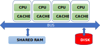

# Scale up

Add more processors and RAM, and buy a more expensive and robust server.

* Pros
  * Less power consumption than running multiple servers
  * Cooling costs are less than scaling horizontally
  * Generally less challenging to implement
  * Less licensing costs
  * Less networking equipment
* Cons
  * PRICE
  * Greater risk of hardware failure, causing bigger outages
  * Generally severe vendor lock-in
  * Not long-term: limited upgradeability in the future

# Scale out


# Scale out: MPP


 _Massively Parallel Processing_ (MPP)

- Several processors, equipped with their own RAM and disks, collaborating to solve a single problem by splitting it into several independent tasks
- It is also called shared-nothing architecture

# Scale out

Adding more servers with fewer processors and RAM

* Pros
  * Much cheaper than scaling vertically
  * New technologies simplify fault-tolerance and systems monitoring
  * Easy to upgrade
  * Usually cheaper
  * Can literally scale infinitely
* Cons
  * [More licensing fees](https://w4bo.github.io/AA2425-unibo-bigdataandcloudplatforms/08-migration)
  * Bigger footprint in the Data Center
  * Higher utility cost (electricity and cooling)
  * More networking equipment (switches/routers)

# Commodity hardware

You are not tied to expensive, proprietary offerings from a single vendor

* You can choose standardized, commonly available hardware from a large range of vendors to build your cluster
* [Commodity](https://it.wikipedia.org/wiki/Commodity) ≠ Low-end!
  * Cheap components with a high failure rate can be a false economy
* Example of commodity hardware specifications:
  * Processor: 12-core i7-8700 CPU @ 3.20GHz
  * Memory: 64 GB RAM
  * Storage: 3 × 4TB SATA disks
  * Network: Gigabit Ethernet
* Yahoo!'s Hadoop installation:
  * 100,000 CPUs in > 60,000 computers (as of 2017)
  * Used to support research for Ad Systems and Web Search
  * Also used to do scaling tests to support the development of Hadoop
* [Data centers in the world](https://brightlio.com/largest-data-centers-in-the-world/)

# Cluster

::::{.columns}
:::{.column width="70%"}

A **cluster** is a group of linked computers (nodes) that work together as a "single" computer.

* Typically connected via fast LAN
* Shared-nothing: each node is a self-contained system capable of independent operation
  * Offers unlimited scalability and no vendor lock-in
* Number of nodes in a cluster >> number of CPUs per node

**Compute nodes** are mounted on racks:

* 8–64 compute nodes per rack
* Many racks can be used in a cluster
* Nodes on a rack are linked by a network (typically gigabit Ethernet)
* Racks are connected by a higher-level network or switch
  * Intra-rack bandwidth >> inter-rack bandwidth

:::
:::{.column width="30%"}


:::
::::

# Cesena Campus (UniBO), May 2023


# Multiple clusters

Having a single large cluster that is tantalizing to many organizations

* No data silos, simpler governance

Multiple clusters are inevitable within medium- to large-sized enterprise settings.

* Resiliency: every cluster sits within a single point of failure due to geography
* Legal separation
* Independent Storage and Compute

# Multiple clusters

With the success of cloud services, the *"independent storage and compute"* solution for big data clusters is on the rise

*Network is no longer a problem*

* *Data locality is* (?)

*Scalability is modularized*

* Disk and computation needs are different

*Cost-efficient*

* Data must be persistent, 24/7
* Compute nodes are activated only on demand

# Data storage {background-color="#121011"}

- Distributed file system
- Distributed databases

# The data lake

Big data stored in a DFS usually becomes a _data lake_: a central location that holds large amounts of data in its native, raw format.

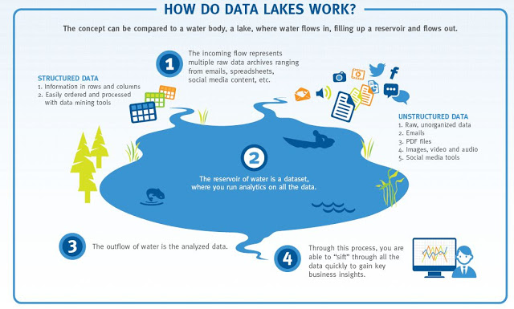

# Distributed FS

Different implementations of data lakes, relying on similar principles

* Apache Hadoop
* AWS S3
* Azure Data Lake
* GCP Colossus

# HDFS

HDFS is a filesystem built to store very large files with streaming data access on clusters of commodity hardware.

* **Typical file size:** gigabytes to terabytes; clusters may store petabytes of data  
* **Access pattern:** optimized for batch processing, prioritizing throughput over low latency  
* **File model:** write-once, read-many — simplifies data consistency and boosts performance  
* **Fault tolerance:** assumes frequent hardware failures, emphasizing fast, automatic recovery  

# HDFS: blocks

Block: minimum amount of data read/written

* Disk blocks are normally 512B
* Filesystem blocks are typically a few KB

HDFS blocks range between 64MB and 1GB (default: 128MB)

* If a file is smaller, it will occupy the necessary disk space, not the full block size

Why blocks?

* Files can be larger than disks. This way, storage management is simplified and replication is easier

Why this big?

* Large files split into many small blocks require a huge number of seeks
* E.g.: block size = 4KB; file = 1GB; number of seeks = 250.000

# HDFS: namenodes and datanodes


Nodes in an HDFS cluster operate in a master-slave pattern.

* Namenode (NN) - the master
  * Persistently maintains the filesystem tree and all files' and directories' metadata
  * Keeps in memory the location of each block for a given file (_block pool_)
* Datanodes (DNs) - the slaves
  * Store and retrieve blocks
  * Periodically report to the NN with the list of blocks they are storing;
    * _Heartbeats_ are sent to the DN to signal their active state (every 10 minutes by default)

# HDFS: the SPoF


The NN is a single point of failure: without it, the filesystem cannot be used.

* *Backup solution*: NN writes its persistent state to multiple filesystems, preventing loss of data
* *Secondary NN solution*
  * A separate machine regularly connects with the primary NN to build snapshots of its persistent data.
  * These _checkpoints_ can be used to restart a failed NN without having to replay the entire journal of file-system actions.

# High-Availability

**High Availability (HA)** means the system can tolerate faults  

* Service continues while faults are detected, reported, and repaired offline  

Backups and secondary NNs prevent data loss.  

* But restarting an NN on large clusters can take 30+ minutes  

HA uses two NameNodes (NNs):  

* One **active**, one **standby**  
* If the active NN fails, the standby takes over  

The standby NN stays updated by:  

* Reading **edit logs** from shared storage (usually replicated **Journal Nodes**)  
* Receiving block locations and heartbeats directly from DataNodes reporting to both NNs  

# HDFS: federation

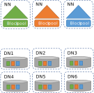

The size of the block pool is limited by the memory size of the NN.

* May incur scaling issues on very large clusters with many files

Solution: configure additional NNs

* Each NN manages a portion of the filesystem, i.e., a _namespace_
* NNs are independent of each other
* Introduced with Hadoop 2.0

# HDFS: federation

*Scalability*

- Because the NN stores all namespace and block locations in memory, its heap size limits the number of files, blocks, and total cluster storage.

*Performance*

- The NN can become a bottleneck when handling many files, especially numerous small ones.

*Availability*  

- Using separate namespaces for different applications improves cluster availability.

*Maintainability, Security & Flexibility*  

- The block pool abstraction lets other services use block storage with different namespace structures.
- Each namespace is isolated from the others.
- Applications can read/write across multiple namespaces.

# HDFS: cluster topology

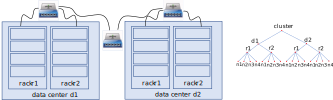

To carry out proper choices, Hadoop must be aware of the cluster topology that is defined during the cluster setting phase.

* Block storage and process allocation (data locality) need such information

Nodes are organized in racks, and racks are organized in data centers.

* Hadoop models such concepts in a tree-like fashion and computes the distance between nodes as their distance on the tree.

# HDFS: replication

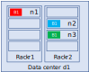

Each data block is independently replicated at multiple DNs in order to improve performance and robustness.

* Replication is aware of the cluster topology

The default replication factor is 3:

* *Replica 1* is stored on the node (n1) where the client issued the write command(if the client resides within the cluster)
* *Replica 2* is stored on a node (n2) in a rack  (r2) different from the one of n1 (off-rack)
* *Replica 3* is stored on a node, different from n2, but that belongs to r2

Replicas can be rebalanced when nodes are added or unavailable.

# HDFS: not always the best fit

HDFS is not ideal for some use cases:

* **Low-latency data access**  
  * Optimized for high throughput, not low latency — unsuitable for applications needing millisecond-level access.  

* **Many small files**  
  * NN memory limits the number of files, as it stores all metadata in memory.  
  * Millions of files are manageable, but billions exceed current hardware limits.  

# File formats

*Raw files*

* From simple text to multimedia files
* No support besides reading/writing the whole file (e.g., no record compression, no splittability)

*Row-oriented file formats*


* Apache Avro, Google's Protocol Buffers, Facebook's Apache Thrift
* Better suited for row-level access to the data (e.g., OLTP)

*Column-oriented file formats*

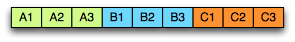

* Apache Parquet, ORC
* Better suited for column-level access to the data (e.g., OLAP)
  * Better compression
  * Reduced I/O

# Parquet

A columnar storage format for efficient querying of __nested structures__ in a __flat format__

* Supported by most frameworks and query engines

One column per primitive type

* The structure of the record is captured for each value by two integers: _repetition level_ and _definition level_
* Enough to fully reconstruct the nested structures

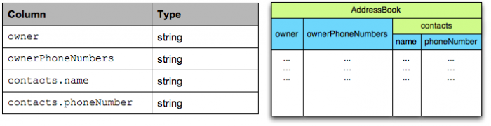

#


# Distributed databases {background-color="#121011"}

New types of databases have emerged.

# Strengths of RDBMSs?

# Strengths of RDBMSs

*ACID properties*

- Provides guarantees in terms of consistency and concurrent accesses

*Data integration and normalization of schemas*

- Several applications can share and reuse the same information

*Standard model and query language*

- The relational model and SQL are very well-known standards
- The different implementations share the same theoretical background

*Robustness*

- Have been used for over 40 years

# Weaknesses of RDBMS?

# Weaknesses of RDBMS

*Impedance mismatch*

- Data are stored according to the relational model, but applications to modify them typically rely on the object-oriented model
- Many solutions, no standard
  - E.g.: Object Oriented DBMS (OODBMS), Object-Relational DBMS (ORDBMS), Object-Relational Mapping (ORM) frameworks

*Painful scaling-out*

- Not suited for a cluster architecture
- Distributing an RDBMS is neither easy nor cheap (e.g., Oracle RAC)

*Consistency vs latency*

- Consistency is a must – even at the expense of latency
- Today's applications require high reading/writing throughput with low latency

*Schema rigidity*

- Schema evolution is often expensive

# What NoSQL means

The term was first used in 1998 by Carlo Strozzi.

- It referred to an open-source RDBMS that used a query language different from SQL

In 2009, it was adopted by a meetup in San Francisco.

- Goal: discuss open-source projects related to the newest databases from Google and Amazon
- Participants: Voldemort, Cassandra, Dynomite, HBase, Hypertable, CouchDB, MongoDB

Today, *NoSQL* indicates *DBMSs* adopting a *different data model from the relational one*

- **NoSQL = Not Only SQL**
- According to Strozzi himself, NoREL would have been a more proper noun

# The first NoSQL systems

*LiveJournal, 2003*

- Goal: reduce the number of queries on a DB from a pool of web servers
- Solution: *Memcached*, designed to keep queries and results in RAM

*Google, 2005*

- Goal: handle Big Data (web indexing, Maps, Gmail, etc.)
- Solution: *BigTable*, designed for scalability and high performance on Petabytes of data

*Amazon, 2007*

- Goal: ensure the availability and reliability of its e-commerce service 24/7
- Solution: *DynamoDB*, characterized by strong simplicity for data storage and manipulation

# NoSQL common features

*Not just rows and tables*: several data models adopted to store and manipulate data

:::: {.columns}
::: {.column width=50%}


:::
::: {.column width=50%}


:::
::::

# NoSQL common features

*Freedom from joins*: joins are either not supported or discouraged

:::: {.columns}
::: {.column width=50%}


:::
::: {.column width=50%}


:::
::::

# NoSQL common features

*Distributed, shared-nothing architecture*

- A shared-nothing architecture is a distributed architecture in which each update request is satisfied by a single node in a computer cluster
  - Nodes do not share (independently access) the same memory or storage. 
- Trivial scalability in a distributed environment with no performance decay


# NoSQL common features

*Freedom from rigid schemas*: data can be stored or queried without pre-defining a schema (*schemaless* or *soft-schema*)

:::: {.columns}
::: {.column width=50%}

|Product|Name|Price|
|:-:|:-:|:-:|
|P1|Beer|6|
|P2|Cola|5|
|P3|Pizza|6|

:::
::: {.column width=50%}

```json
[
    {
        "Product": "P1",
        "Name": "Beer",
        "Price": 6,
        "Quantity": "0.4L"
    },
    {
        "Product": "P2",
        "Name": "Milk",
        "Price": 1,
        "Expiration": "2024-11-30"
    },
    {
        "Product": "P3",
        "Name": "Pizza",
        "Price": 6,
        "Ingredients": [...]
    }
]
```

:::
::::

# NoSQL common features

*SQL is dead, long live SQL*!

- Some systems do adopt SQL (or a SQL-like language)

# NoSQL in the Big Data world

*NoSQL* systems are mainly used for operational workloads (*OLTP*)

- Optimized for high read and write throughput on small amounts of data

*Big Data* technologies are mainly used for analytical workloads (*OLAP*)

- Optimized for high read throughput on large amounts of data

Can NoSQL systems be used for OLAP?

- Possibly, but through Big Data analytical tools (e.g., Spark)

# NoSQL: several data models

One of the key challenges is to determine which one best suits the required application.

| Model | Description | Use cases |
|:-: |:-: |:-: |
| **Key-value** | Associates any kind of value to a string | Dictionary, lookup table, cache, file, and image storage |
| **Document** | Stores hierarchical data in a tree-like structure | Documents, anything that fits into a hierarchical structure |
| **Wide-column** | Stores sparse matrices where a cell is identified by the row and column keys | Crawling, high-variability systems, sparse matrices |
| **Graph** | Stores vertices and arches | Social network queries, inference, pattern matching |

# Running example

Typical use case: customers, orders, and products

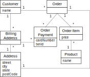

# Relational: data model

Based on tables and rows


# Data modeling example: relational model


# Graph: data model

Each DB contains one or more *graphs*

- Each graph contains *vertices* and *arcs*
- *Vertices*: usually represent real-world entities
  - E.g.: people, organizations, web pages, workstations, cells, books, etc.
- *Arcs*: represent directed relationships between the vertices
  - E.g.: friendship, work relationship, hyperlink, ethernet links, copyright, etc.
- Vertices and arcs are described by *properties*
- Arcs are stored as physical pointers

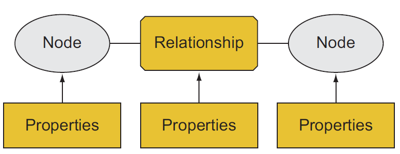

# Graph: storage

**Index-free adjacency**

- Each node directly references its adjacent (neighboring) nodes
- Accessing relationships is simply a memory pointer lookup

Graph processing time 

- Proportional to the amount of data processed
- Not increasing exponentially with the number of relationships traversed

# 

[Implementing a graph as a relational database](https://dist.neo4j.com/wp-content/uploads/20181218005826/non-native-graph-database-relying-on-index.png)

#

[Index-free adjacency](https://dist.neo4j.com/wp-content/uploads/20181218005743/native-graph-technology-index-free-adjacency.png)

# Graph: querying

Graph databases usually model relationship-rich scenarios.

- *Query language based on detecting patterns* (e.g., Cypher)
  - Simplifies the navigation of the relationships
- Support for transactions, indexes, selections, and projections

| Query | Pattern |
|:- |:- |
| Find friends of friends | `(user)-[:KNOWS]-(friend)-[:KNOWS]-(foaf)` |
| Find shortest path from A to B | `shortestPath((userA)-[:KNOWS*..5]-(userB))` |
| What products were bought by users who purchased the same items? | `(u)-[:PURCHASED]->(p)<-[:PURCHASED]-()-[:PURCHASED]->(otherP)` |

# Data modeling example: graph model

IDs are implicitly handled; different edge colors imply different edge types.

:::: {.columns}
::: {.column width=50%}

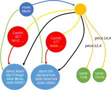

:::
::: {.column width=50%}


:::
::::

# Graph vs Aggregate modeling

The graph data model is intrinsically different from the others.

**Data-driven modeling**

- Focused on the relationships rather than on the entities per se
- *Limited scalability*: it is often impossible to shard a graph on several machines without "cutting" several arcs
  - I.e., having several cross-machine links
  - Batch cross-machine queries: don’t follow relationships one by one, but "group them" to make fewer requests
  - Limit the depth of cross-machine node searches

**Aggregate-oriented modeling**: data queries are stored together

- Aggregate = key-value pair, document, row (respectively)
- The aggregate is the atomic block (no guarantees for multi-aggregate operations)

Based on the concept of encapsulation

- Avoid joins as much as possible and achieve *high scalability*
- Data denormalization and *potential inconsistencies in the data*
- *Query-driven modeling*

# Document: querying

The query language is quite expressive.

- Return more documents with one query

```js
db.collection.find({})  // retrieves multiple documents matching the filter
```

- Select which fields to project

```js
db.collection.find({}, { field1: 1, field2: 1, _id: 0 })  // only include specific fields
```

- Filter on the fields

```js
db.collection.find({ status: "active", age: { $gt: 30 } })  // filter by conditions
```

- Update specific fields

```js
db.collection.updateMany(
    { status: "active" },           // filter
    { $set: { verified: true } }    // update specific field(s)
)
```

Different implementations, different functionalities

- Create indexes on fields and (materialized) views
- Provide connectors to Big Data tools (e.g., Spark, Hive, MapReduce)
- Provide *full-text search* capabilities

# Data modeling example: aggregate model

:::: {.columns}
::: {.column width=40%}


:::
::: {.column width=60%}

Collection answering the blue query

```json
[
  {
    "_id": 1,
    "name": "Martin",
    "adrs": [
      { "street": "Adam", "city": "Chicago", "state": "Illinois", "code": 60007 },
      { "street": "9th", "city": "New York", "state": "New York", "code": 10001 }
    ]
  }
]
```

:::{.fragment}
Collection answering the purple query

```json
[
  {
    "_id":1,
    "customer":"1",
    "orderpayments":[
      {
        "card":457,
        "billadrs": { "street":"Adam", "city":"Chicago", "state":"Illinois", "code":60007 }
      },
      {
        "card":457,
        "billadrs": { "street":"9th", "city":"New York", "state":"New York", "code":10001 }
      }
    ],
    "products":[
      { "id":1, "name":"Cola", "price":10.4 },
      { "id":2, "name":"Beer", "price":14.4 }
    ],
    "shipadrs":{ "street":"9th", "city":"New York", "state":"New York", "code":10001 }
  }
]
```
:::
:::
::::

# Data modeling example: document model

:::: {.columns}
::: {.column width=40%}


:::
::: {.column width=60%}

```json
[
  {
    "_id":1,
    "name":"Martin",
    "adrs":[
      { "street":"Adam", "city":"Chicago", "state":"Illinois", "code":60007 },
      { "street":"9th", "city":"New York", "state":"New York", "code":10001 }
    ],
    "orders":[
      {
        "orderpayments":[
          {
            "card":457,
            "billadrs":{ "street":"Adam", "city":"Chicago", "state":"Illinois", "code":60007 }
          },
          {
            "card":457,
            "billadrs":{ "street":"9th", "city":"New York", "state":"New York", "code":10001 }
          }
        ],
        "products":[
          { "id":1, "name":"Cola", "price":10.4 },
          { "id":2, "name":"Beer", "price":14.4 }
        ]
      }
    ],
    "shipadrs":{ "street":"9th", "city":"New York", "state":"New York", "code":10001 }
  }
]
```

:::
::::

# Aggregate modeling strategy

The *aggregate* term comes from Domain-Driven Design.

- An aggregate is a group of tightly coupled objects to be handled as a block
- Aggregates are the basic unit for data manipulation and consistency management

Advantages

- *Can be distributed trivially*
  - Data that should be used together (e.g., orders and details) is stored together
- *Facilitate the developer's job*
  - By surpassing the impedance mismatch problem

Disadvantages

- **No design strategy exists for aggregates**
  - *It only depends on how they are meant to be used*
- Can optimize only a limited set of queries
- Data denormalization -> possible inconsistencies

RDBMSs are agnostic from this point of view.

# Polyglot persistence

The _one-size-fits-all_ is "no more" (more on this in the next lectures)

::::{.columns}
:::{.column width="50%"}


:::
:::{.column width="50%"}

:::{.fragment}

:::
:::
::::
 
# Data processing {background-color="#121011"}

Main kinds of data processing

* Batch
* Interactive
* Streaming

# Batch

Simple/complex computations over large amounts of stored data

* Execution takes minutes to hours

What we need

* A cluster manager to negotiate resources (e.g., YARN)
* An execution engine

# YARN (Yet Another Resource Negotiator)

Assign resources for applications to run their processes.

Similar to HDFS, two daemons

* *Resource Manager* (RM) - the master
  * The ultimate authority that arbitrates resources among all the applications
* *Node Managers* (NM) - the slaves
  * Responsible for the allocation and monitoring of containers

# Data locality

When computations involve a large set of data, *it is cheaper (i.e., faster) to move code to data rather than data to code*

* Exploit cluster topology and data block replication to apply the data locality principle
* The following cases respect the order the resource manager prefers:
  * Process and data on the same node
  * Process and data on the different nodes of the same rack
  * Process and data on different racks of the same data center
  * Process and data on different racks of the different data centers

# Typical Workflow of Big-Data Problem

1. Iterate over a large number of records
1. Extract something of interest from each
1. Shuffle and sort intermediate results
1. Aggregate intermediate results
1. Generate final output

*Key idea: provide a functional abstraction for these two operations*

# Roots in Functional Programming


`MAP` takes a function `f` and applies it to every item.

- The application of  `f` to each item can be _parallelized_ (in different machines) since each functional application happens in isolation.

`FOLD` iteratively applies a function `g` to aggregate results.

- Has more _restrictions on data locality_, items must be "brought together" before `g` can be applied.
- Some applications do not require  `g` to be applied to all items.
  - If elements in the list can be divided into groups, `g` *aggregations can proceed in parallel*.

# Disambiguation of MapReduce

MapReduce [@dean2008mapreduce] *is a programming model* and an associated implementation for processing and generating large data sets.

- A *map* function processes a key/value pair to generate a set of intermediate key/value pairs
- A *reduce* function merges all intermediate values associated with the same intermediate key.


Hadoop MapReduce *is an open-source implementation* of the MapReduce programming model

# Sort

Return all the domains indexed by Google and the number of pages in each, ordered by the number of pages.

* The programming model does not support this per se
  * But the implementations do: the *shuffle stage* performs grouping and ordering!
* General pattern:
  * `map(key, record) -> emit(sortKey, record)`
  * `reduce(sortKey, records) -> emit(sortKey, records[1]), ...`
* With 1 reducer, we get sorted output
* With many reducers, we get partly sorted output (unless: TotalOrderPartitioner)

# Two-stage MapReduce

As map-reduce calculations get more complex, it's useful to break them down into stages.

* The output of the first stage serves as input to the next one
* The **different subsequent stages**
* The output can be stored in the DFS, forming a **materialized view**

Early stages of map-reduce operations often represent the heaviest amount of data access, so b

* Building and saving them once as a basis for many downstream uses saves a lot of work!

Slow due to data replication and disk I/O

# Spark [@zaharia2010spark]

::::{.columns}
:::{.column width=40%}
Spark project started in 2009

* Developed at UC Berkeley's AMPLab by [Matei Zaharia](https://scholar.google.com/citations?user=I1EvjZsAAAAJ&hl=en&oi=sra) (co-founders of Databricks)
* Open sourced in 2010, Apache project from 2013
  * In 2014, Zaharia founded Databricks
  * Written in Scala; supports Java and Python
* Currently, the most used tool for batch (big data) analyses
:::
:::{.column width=60%}
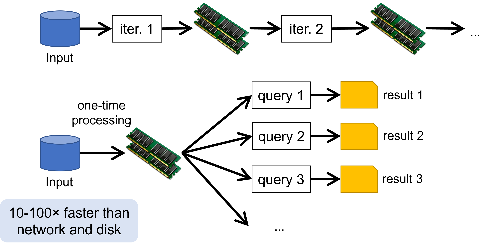
:::
::::

# Spark pillars: RDD

RDDs (resilient distributed datasets) are an immutable distributed collection of objects.

* **Resilient**: automatically rebuild on failure
* **Distributed**: the objects belonging to a given collection are split into _partitions _ and spread across the nodes
  * RDDs can contain any type of Python, Java, or Scala objects
  * Distribution allows for scalability and locality-aware scheduling
  * Partitioning allows control of parallel processing

Fundamental characteristics (mostly from _pure functional programming_)

* **Immutable**: once created, it can't be modified
* **Lazily evaluated**: optimization before execution
* **Cacheable**: can persist in memory, spill to disk if necessary
* **Type inference**: data types are not declared but inferred (≠ dynamic typing)

# Spark pillars: DAG

Based on the user application and on the lineage graphs, Spark computes a  **logical execution plan** in the form of a DAG.

* Which is later transformed into a physical execution plan

The DAG (Directed Acyclic Graph) is  **a sequence of computations performed on data**

* Nodes are __RDDs__
* Edges are operations on RDDs
* The graph is Directed: transformations from a partition A to a partition B
* The graph is Acyclic: transformations cannot return an old partition

# Spark sample DAG

Word count

```scala
textFile = sc.textFile("hdfs://...")
counts = textFile
              .flatMap(line => line.split(" "))
              .map(lambda word: (word, 1))
              .reduceByKey(lambda a, b: a + b)
counts.saveAsTextFile("hdfs://...")
```


# DAG decomposed into stages

The execution plan is compiled into physical __stages__

* Stages' boundaries are defined by shuffle operations
* Operations with narrow dependencies are pipelined as much as possible


# Stages decomposed into tasks

The fundamental unit of execution is the one of __tasks__

* A task is created for each partition in the new RDD
* Tasks are scheduled and assigned to the worker nodes based on data locality
* The scheduler can run the same task on multiple nodes in case of stragglers (i.e., slow nodes)

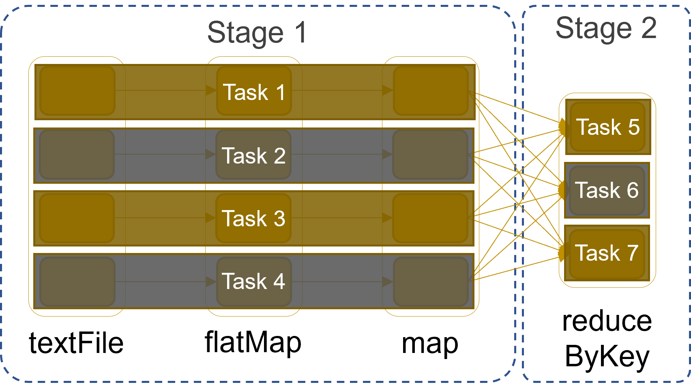

# Spark architecture

Spark uses a _master/slave architecture_ with one central coordinator (_driver_) and many distributed workers (_executors_)

* The driver and each executor are independent Java processes
* Together they form a Spark _application_
* The architecture is independent of the cluster manager that Spark runs on


# Spark architecture (in YARN)

_Driver Program _ ≅  **Application**

* Driver can be run _externally _ from the client (e.g., spark-shell) or _internally _ from the AMP (e.g., for production jobs)
* The  **Application master process (AMP)** is not shown for simplicity

_Executor_ =  **Container**

* Executors are run and monitored by the  **Node Manager (NM)**

_Cluster Manager_ =  **Resource Manager (RM)**

# Reference architectures {background-color="#121011"}

# Reference architectures

A stack of many components

* NIST's reference
* Coexistence of batch and streaming (Lambda vs Kappa)
* The technological stack

# National Institute of Standards and Technology's reference architecture

](./img/nist.jpg)

# NIST's reference

System Orchestrator: *Integrate required application activities into an operational vertical system*

* Configure and manage Big Data architecture components to run workloads  
* Monitor workloads and systems to ensure quality requirements are met  
* Elastically provision additional physical or virtual resources  
* Performed by human and/or software components  

# NIST's reference

Data Provider: *Introduces new data or information feeds into the Big Data system*

* Can be a sensor, human, or another Big Data system  
* Includes activities such as:  
  * Collecting and storing data  
  * Transforming data to remove sensitive information  
  * Creating metadata describing sources, usage policies, and access rights  
  * Enforcing access rights and establishing contracts for data authorization  
  * Providing access via suitable push or pull interfaces  
  * Publishing data availability and access methods  

Data Consumer: *Uses interfaces or services from the Big Data Application Provider to access needed information* 

* May be an end user or another Big Data system

# NIST's reference

Big Data Application Provider: *Performs specific operations across the data life cycle*  

* Meets requirements set by the System Orchestrator  
* Ensures security and privacy compliance  
* Activities include: Collection, Preparation, Analytics, Visualization, and Access  
* Each activity  
  * Is application-specific  
  * May be implemented by independent stakeholders or as standalone services  
* Multiple instances of each activity may exist, or a single program may perform several  
* Functions can run on separate or shared Big Data Framework Providers  

# NIST's reference

Big Data Framework Provider  

* *Supplies general resources and services for Big Data Application Providers*
  * Manages communication and assigns physical resources to activities  
* Includes Infrastructure frameworks that:  
  * Support core **computing, storage, and networking** functions  
  * Operate on physical or virtual infrastructure resources  
* Includes Data Platform frameworks that:  
  * Manage **data organization and distribution** (file systems, databases, etc.)  
* Includes Processing frameworks that:  
  * Define how data is processed (e.g., **batch or streaming frameworks**)  

# Microsoft's reference


# Microsoft's reference

*Data sources*

- Data stores, static files, real-time sources

*Data storage*

- Distributed file store (data lake) or database

*Batch processing*

- Long-running batch jobs to filter, aggregate, and prepare the data for analysis

*Analytical data store*

- Serve the processed data in a structured format that can be queried using analytical tools

*Analysis and reporting*

- Traditional OLAP and BI tools, interactive exploration, analytical notebooks

# Microsoft's reference

*Real-time message ingestion*

* Captures and stores real-time messages for stream processing  
* Acts as a message buffer  
* Supports scale-out processing, reliable delivery, and message queuing semantics  

*Stream processing*

* Filters, aggregates, and prepares data for analysis  
* Writes processed stream data to an output sink  

*Orchestration*

* Automates repeated data processing tasks within workflows  
* Includes transforming data, moving it between sources and sinks, loading into analytical stores, and pushing results to dashboards  

# Lambda vs Kappa

Batch and streaming analyses follow different principles.

* *Batch*: large amounts of data at rest with fault-tolerance
* *Streaming*: a small amount of continuously incoming data without fault-tolerance

Two philosophies to make them coexist

* *Lambda*
* *Kappa*

# Lambda architecture

::::{.columns}
:::{.column width="50%"}
All data coming into the system goes through two paths

* _Hot path_: for timely, yet potentially less accurate data in real time
* _Cold path_: for less timely but more accurate data

Pros of Lambda

* Emphasizes retaining the input data unchanged
* Highlights the problem of reprocessing data (bugs, evolution, etc.)

Cons of Lambda

* Parallel development and maintenance of two parallel pipelines
* Same goal, different languages, different frameworks

:::
:::{.column width="50%"}
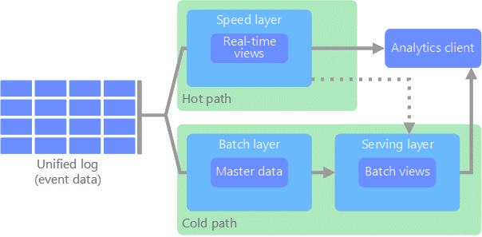
:::
::::

# Streaming: a superset of batch

Can we do better?

* Well-designed streaming systems provide a strict superset of batch functionality
* Introduce correctness (exactly-once semantics, strong consistency) and the result of a streaming job is the same as that of a batch job
* A streaming engine can handle a bounded dataset

# Kappa architecture

All data flows through a single path using a stream processing system.

* Similar to the Lambda Architecture’s speed layer, all event processing occurs on the input stream and is stored as a real-time view  
* To recompute the full dataset (as in the batch layer of Lambda), simply replay the stream  

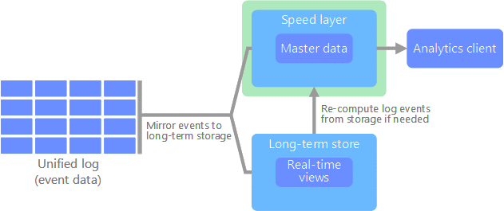

# Kappa architecture

* Modeling everything under the streaming paradigm is not trivial
* Advanced tools provide a single framework and unified APIs for writing and executing both batch and streaming jobs
  * Google Cloud Dataflow
  * Apache Flink

_"Broad maturation of streaming systems combined with robust frameworks for unbounded data processing will, in time, allow for the relegation of the Lambda Architecture to the antiquity of big data history where it belongs"_

# The technological stack

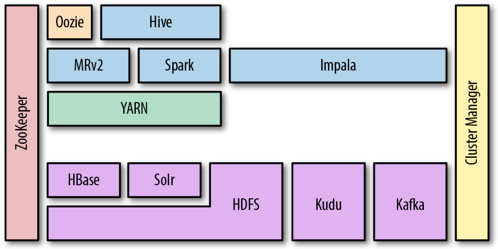

# The technological stack beyond Hadoop

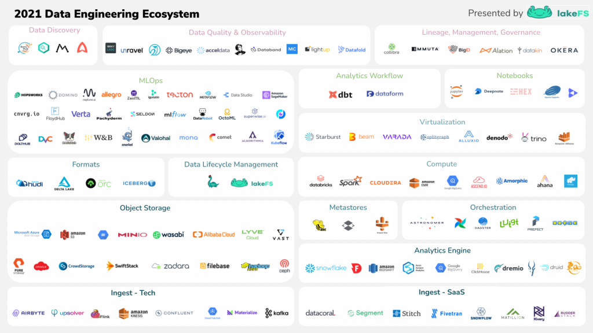

# On-premises vs cloud

First installations were primarily on-premises

* *Installation*: how do I set up a new machine?
* *Networking*: how do I cable dozens of machines?
* *Management*: how do I replace a broken disk?
* *Upgrade*: how do I extend the cluster with new services/machines?
* (energy and cooling, software licenses, insurance...)

Cloud providers are mature and offer comprehensive support for big data ecosystems.

* Forget all that is above

# [Cloud computing](https://w4bo.github.io/AA2526-unibo-bigdataandcloudplatforms/07-computing)

A model for enabling  **minimal management effort** or service provider interaction

* *On-demand self-service* (consume services when you want)
* *Broad network access* (consume services from anywhere)
* *Broad network deployment* (deploy services anywhere)
* *Resource pooling* (infrastructure, virtual platforms, and applications)
* *Rapid elasticity* (enable horizontal scalability)
* *Measured service* (pay for the service you consume as you consume)
* *Reliability* (fault-tolerance handled by the provider)

# Conclusions {background-color="#121011"}

Learned the basis of big data (a summary of the Master's degree course)

* Definitions and motivations
* Main components – focus on storage and processing
* Hardware and software architectures

Up next: an overview of some of the main challenges

* Data Platforms and Polyglot persistence
* Smart Management and the metadata challenge

# References