# Polyglot Persistence

To each application, the appropriate DBMS


# Polyglot Persistence

To each application, the appropriate DBMS: works well for OLTP

- What about OLAP?


# Support multiple models in the same database

How can we meta-model graphs into a relational database?

# Support multiple models in the same database

```sql
CREATE TABLE node (
    node_id        INT PRIMARY KEY,
    created_at     TIMESTAMP
);
CREATE TABLE edge (
    edge_id        INT PRIMARY KEY,
    from_node_id   INT NOT NULL,
    to_node_id     INT NOT NULL,
    edge_type      VARCHAR(255) NOT NULL,
    created_at     TIMESTAMP DEFAULT CURRENT_TIMESTAMP,
    FOREIGN KEY (from_node_id) REFERENCES node(node_id) ON DELETE CASCADE,
    FOREIGN KEY (to_node_id)   REFERENCES node(node_id) ON DELETE CASCADE
);
CREATE TABLE node_label (
    node_id    INT NOT NULL REFERENCES node(node_id) ON DELETE CASCADE,
    label      VARCHAR(255) NOT NULL,
    PRIMARY KEY (node_id, label)
);
CREATE TABLE node_property (
    node_id        INT NOT NULL REFERENCES node(node_id) ON DELETE CASCADE,
    property_key   VARCHAR(255) NOT NULL,
    property_value TEXT,
    PRIMARY KEY (node_id, property_key)
);
CREATE TABLE edge_property (
    edge_id        INT NOT NULL REFERENCES edge(edge_id) ON DELETE CASCADE,
    property_key   VARCHAR(255) NOT NULL,
    property_value TEXT,
    PRIMARY KEY (edge_id, property_key)
);
```

# Support multiple models in the same database

How can we meta-model JSON documents into a relational database?

# Support multiple models in the same database

```sql
CREATE TABLE document (
    document_id INT PRIMARY KEY,
    created_at  TIMESTAMP
);
CREATE TABLE node (
    node_id          INT PRIMARY KEY,
    document_id      INT NOT NULL REFERENCES document(document_id) ON DELETE CASCADE,
    parent_node_id   INT NULL     REFERENCES node(node_id)         ON DELETE CASCADE,
    key              VARCHAR(255) NULL,
    index_in_array   INT NULL,
    node_type        VARCHAR(10) NOT NULL CHECK (node_type IN ('OBJECT','ARRAY','VALUE')),
);
CREATE TABLE node_value (
    node_id       INT PRIMARY KEY REFERENCES node(node_id) ON DELETE CASCADE,
    value_type    VARCHAR(10) NOT NULL CHECK (value_type IN ('STRING','NUMBER','BOOLEAN','NULL')),
    value_string  TEXT NULL,
    value_number  NUMERIC NULL,
    value_boolean BOOLEAN NULL
);
```

# Polyglot Persistence in PostgreSQL

PostgreSQL enables polyglot persistence by blending:
  - **JSON** for semi-structured document data  
  - **Apache AGE** for graph data (Cypher + property graphs)  
  - **TimescaleDB** for time-series and analytical workloads  
  - **PostGIS** for geospatial and GIS operations  

Multiple data models coexist in one engine and one SQL interface  

- Enables hybrid relational/document/graph/time-series/geospatial systems

```sql
CREATE TABLE sensor_event (
    event_id     SERIAL PRIMARY KEY,
    payload      JSONB,                  -- document model
    location     geography(Point, 4326) -- PostGIS
);
```

# Polyglot persistence: main challenges

Data model heterogeneity

* Support multiple models in the same database
* Or integrate data from different databases using different query languages

Inter-collection: different records in **different** collections have different schemas

* Not a new problem: think federated databases, corporate mergers, etc.

Intra-collection: different records in **the same** collection have different schemas

* Emerged with NoSQL databases
* Reconcile inconsistent versions of the same data (inter- or intra-collection)

# Data model heterogeneity

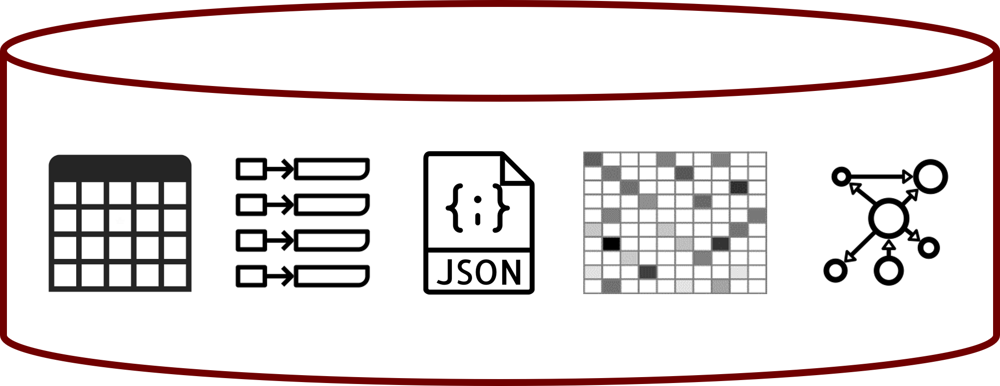

# Basic solutions

Some DBMSs offer multi-model support.

* Extended RDBMSs
    * KV implementable as a table with two fields: a string key, and a blob value
    * Cypher query language on top of a relational implementation of a graph
    * Hstore data type in PostgreSQL for wide-column-like implementation
    * **Scalabilty issue remains**
* Multi-model NoSQL DBMSs
    * ArangoDB, OrientDB
    * **Support all NoSQL data models, but not the relational one**

Some approaches suggest strategies to model everything within RDBMSs

* [@DBLP:conf/sigmod/DiScalaA16]
* [@DBLP:conf/sigmod/TaharaDA14]

# A taxonomy for distributed solutions [@DBLP:conf/bigdataconf/TanCGM17]

Federated database system

* **Homogeneous** data stores, exposes a **single** standard query interface
* Features a mediator-wrapper architecture, employs schema-mapping and entity-merging techniques for integration of relational data

Polyglot system

* **Homogeneous** data stores, exposes **multiple** query interfaces
* Takes advantage of the semantic expressiveness of multiple interfaces (e.g., declarative, procedural)

Multistore system

* **Heterogeneous** data stores, exposes a **single** query interface
* Provides a unified querying layer by adopting ontologies and applying schema-mapping and entity-resolution techniques

Polystore system

* **Heterogeneous** data stores, exposes **multiple** query interfaces
* Choose from a variety of query interfaces to seamlessly query data residing in multiple data stores

# Advanced solutions

The challenge is to balance two often conflicting forces.

* **Location Independence**: A query is written, and the system figures out which storage engine it targets
* **Semantic Completeness**: A query can exploit the full set of features provided by a storage engine

Example of a polystore

* *Island* = a middleware application to support a set of operations on a given data model
* *Shim* = a wrapper to convert from the island's query language to the target DB's query language

![BigDAWG [@DBLP:books/mc/19/MattsonRE14]](img/phdslides_105.png)

# Advanced solutions

BigDAWG middleware consists of

* **Optimizer**: parses the input query and creates a set of viable query plan trees with possible engines for each subquery
* **Monitor**: uses performance data from prior queries to determine the query plan tree with the best engine for each subquery
* **Executor**: figures out how to best join the collections and then executes the query
* **Migrator**: moves data from engine to engine when the plan calls for such data motion


# 

... and of course we have metadata

**Catalog**: stores metadata about the system

* *Databases*: Databases, their engine membership, and connection authentication information.
* *Objects*: Data objects (i.e., tables), field names, and object-to-database membership.


# 

Most notable multistore/polystore proposals

* *BigDAWG*: Focus on the ability to "move" data from one DB to another to improve query efficiency [@DBLP:books/mc/19/MattsonRE14]
* *Estocada*: Focus on taking advantage of possible (consistent) redundancy and previous query results [@DBLP:journals/pvldb/AlotaibiCDLMY20]
* *Awesome*: Focus on supporting common analytical functions [@DBLP:conf/bigdataconf/DasguptaCG16]
* *CloudMdsQL*: Focus on taking advantage of local data store native functionalities [@DBLP:journals/dpd/KolevVBJPP16]

# Beyond data model heterogeneity

**Entity resolution**

* Every approach needs some kind of integrated knowledge
* Ample research from federated database systems
* Usually "out-of-scope"


# Schema heterogeneity

Heterogeneous data stored with variant schemas and structural forms

* Management of **schema heterogeneity** and **data inconsistency**
  * Usually addressed as different problems in the literature
* Missing/additional attributes
* Different names/types of attributes
* Different nested structures

# Schema heterogeneity

Two main problems
  
* Understand the data
* Query the data

# Understanding the data {background-color="#121011"}

# Understanding the data

Early work on XML

* To deal with the widespread lack of DTDs and XSDs
* Extract regular expressions to describe the content of elements in a set of XML documents

Recent work on JSON

* **Concise view**: a single representation for all schema variations
    * Union of all attributes [@DBLP:conf/btw/KlettkeSS15]
    * A _skeleton_ as the smallest set of core attributes according to a frequency-based formula [@DBLP:journals/pvldb/WangHZS15]
* **Comprehensive view**: multiple representations (a different schema for every document) [@DBLP:conf/er/RuizMM15]
* **Schema profile**: _explain why_ there are different schemas [@DBLP:journals/is/GallinucciGR18]

# Schema profiling

Schema profiles explain

* What are the differences between schemas
* When/why is one schema used instead of the other

The problem of schema profiling is quite similar to a classification problem.

* Classifiers are also used to describe the rules for assigning a class to an observation based on the other observation features
* Based on the requirements collected from potential users, **decision trees ** emerged as the most adequate

| **SchemaID** | User | Activity | Weight | Duration | Repetitions |
|:-: |:-: |:-: |:-: |:-: |:-: |
| **S1** | Jack | Run |  | 108 |  |
| **S2** | John | Leg press | 80 | 4 | 23 |
| **S1** | Kate | Walk |  | 42 |  |
| **S3** | John | Push-ups |  | 8 | 40 |

# Schema profiling

The **documents** are the **observations**

The **schema** are the **classes**


# Schema profiling

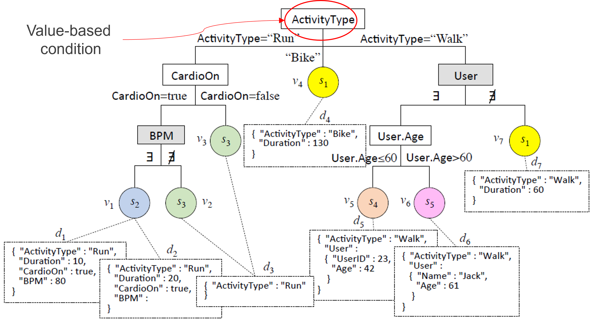

# Schema profiling


# Schema profiling

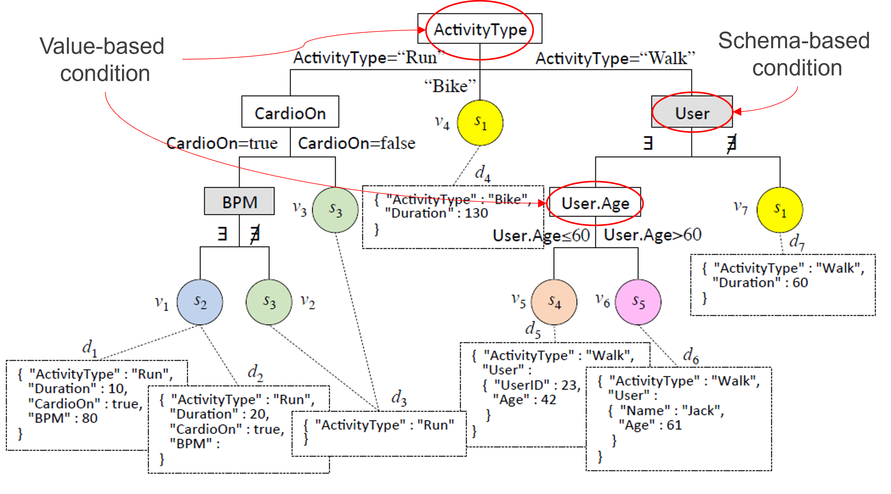

# Preliminary activities

Semi-structured interviews with 5 users

* Application domains: fitness equipment sales, software development
* Understand goals, requirements, and visualization format
* Not one complete/correct dataset description

Definition of schema profile characteristics

* Explicativeness
* Precision
* Conciseness

# Explicativeness

::::{.columns}
:::{.column width="50%"}
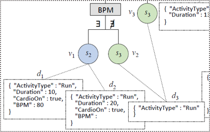
:::
:::{.column width="50%"}
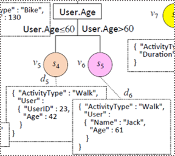
:::
::::

Value-based (VB) conditions are preferred to schema-based (SB) ones

* SB: **acknowledge** a difference between schemas
* VB: **explain** it in terms of the values taken by an attribute

The fewer the SB conditions, the more explicativeness

# Precision

A decision tree is precise if all the leaves are pure.

* A leaf $v_j$ is **pure** if all its observations belong to the **same class** (i.e., $entropy(v_j) = 0$)
* **Entropy** is strictly related to **precision**: divisive approaches typically stop only when the leaves are all pure

::::{.columns}
:::{.column width="50%"}
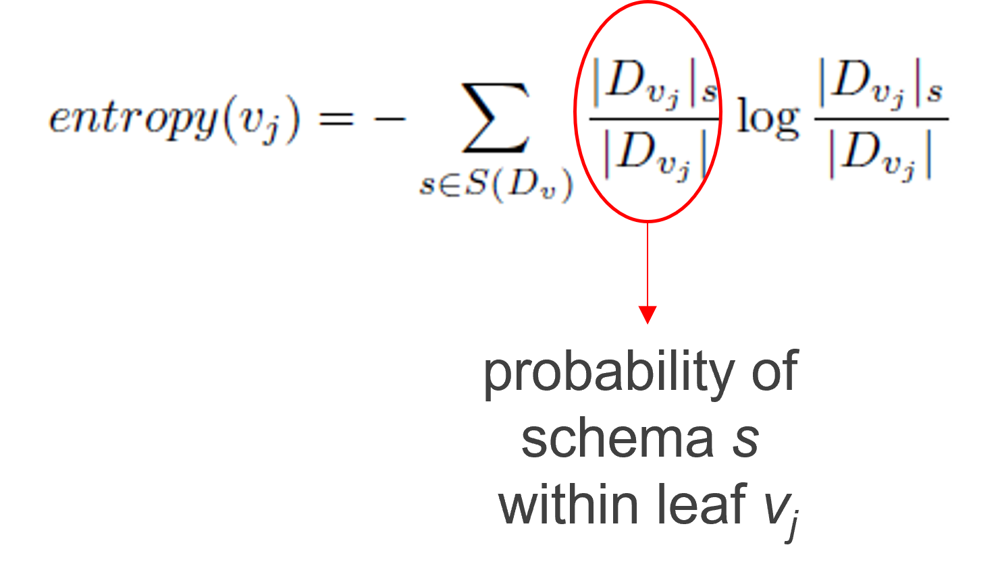
:::
:::{.column width="50%"}

:::
::::

# Precision and conciseness

**Minimization of entropy** often leads to **splitting observations** of the same class **among several leaves**

* Entropy's sole focus is on node purity
* More frequent when the number of classes is high

<div></div>


# Precision and conciseness

Typically, precision is more important than readability.

* In schema profiling, readability is a critical problem.
* **It conflicts with the conciseness requirement**

# Conciseness

A maximally concise schema profile is one where there is *a single rule for each schema*

* Entropy: **a leaf is pure** if it contains only documents with the **same class**
* Schema entropy: **a schema is pure** if all its documents are in the **same leaf**

::::{.columns}
:::{.column width="50%"}

:::
:::{.column width="50%"}

:::
::::

# Conciseness


# Schema profiling example

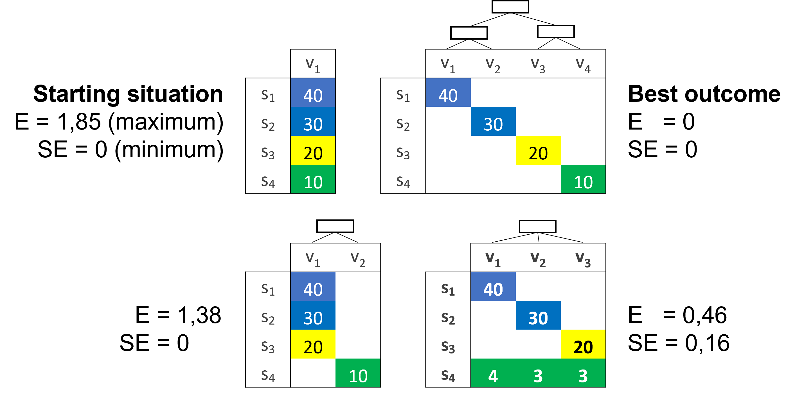

# Schema profiling algorithm

Introduced the notion of _schema entropy loss_


Defined a criterion for comparing two splits in the decision tree

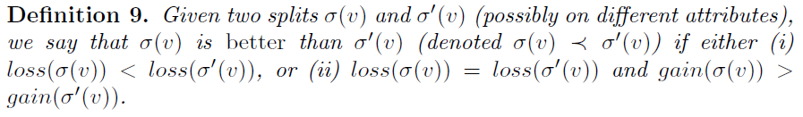

# Query the data {background-color="#121011"}

# Query the data

One thing is understanding the data; another is *enabling querying over heterogeneous data*.

What we need

1. *Integration techniques* to solve schema heterogeneity and produce a global knowledge base
2. *Query rewriting techniques* to translate queries on the global knowledge to queries on the actual schemas

Focus on OLAP queries

# Integration techniques

::::{.columns}
:::{.column width="80%"}
Integration at the intensional level

  * Schema matching and mapping [@DBLP:journals/vldb/RahmB01]
    * A match is a correspondence between attributes
    * A mapping is a function to explain the relationship between attributes
      * E.g., `S1.FullName = CONCAT(S2.FirstName, S2.LastName)`

Integration at the extensional level

  * Entity resolution (a.k.a. record linkage or duplicate detection)
    * Identifying (or linking, or grouping) different records referring to the same real-world entity
    * Aims at removing redundancy and increasing conciseness
  * Data fusion [@mandreoli2019dealing]
    * Fuse records on the same real-world entity into a single record and resolve possible conflicts
    * Aims at increasing correctness of data

:::
:::{.column width="20%"}
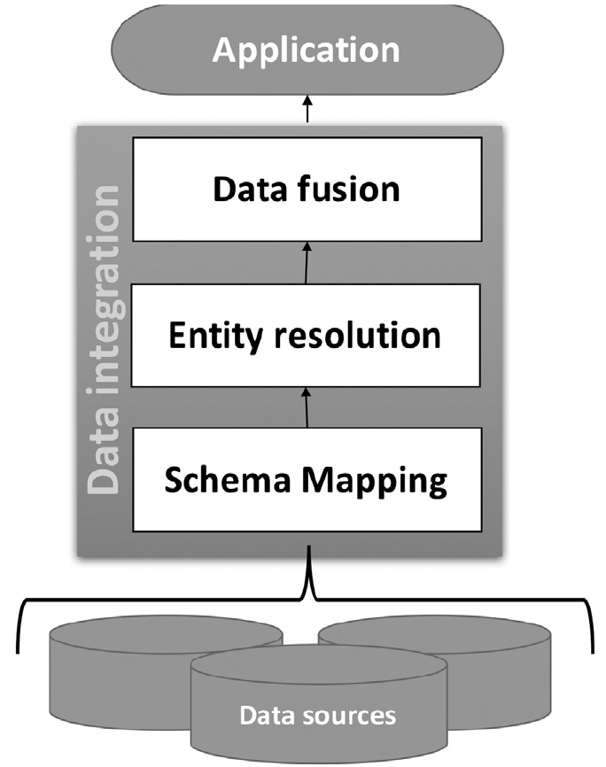
:::
::::

# OLAP querying

A first approach to OLAP on heterogeneous data

::::{.columns}
:::{.column width="50%"}

:::
:::{.column width="50%"}
![[@DBLP:journals/is/GallinucciGR19]](img/phdslides_120.png)
:::
::::

# OLAP querying

Some limitations

  * Expensive querying
    * Does not scale well with the number of schemas
  * Expensive integration
    * High levels of heterogeneity imply complex rewriting rules (requiring knowledge and time)
    * Assuming to be _always_ able to obtain a global schema is a bit pretentious

# 


# New integration techniques

![[@DBLP:books/sp/20/Curry20a]](img/phdslides_122.png)

# Dataspace

Replace the global schema with a _dataspace_ 
[@DBLP:books/sp/20/Curry20a]

> A **dataspace** is a lightweight integration approach providing basic query expressive power on a variety of data sources, bypassing the complexity of traditional integration approaches and possibly returning best-effort or approximate answers [@DBLP:journals/sigmod/FranklinHM05]

Replace traditional integration with a _pay-as-you-go_ approach.

* The system incrementally integrates data over time by asking users to confirm matches as the system runs [@DBLP:conf/sigmod/JefferyFH08]

# Dataspace

Introducing new concepts

  * *Entities*: representation of a real-world entity
    * E.g., `Customers`, `Products`, `Orders`, etc.
  * *Features*: univocal representation of a group of semantically equivalent attributes
    * E.g., `CustomerName = { S1.name, S2.fullname, S3.customer, S4.cName, ... }`
    * Mapping functions must be defined/definable between every couple

The dataspace becomes an abstract view in terms of features and entities.

# New OLAP querying

::::{.columns}
:::{.column width="50%"}
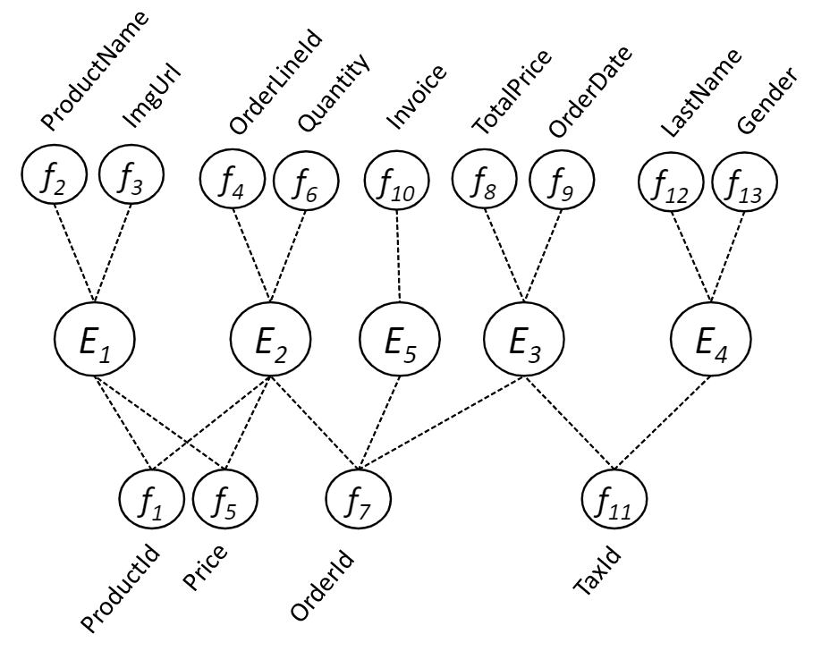
:::
:::{.column width="50%"}
:::{.fragment}
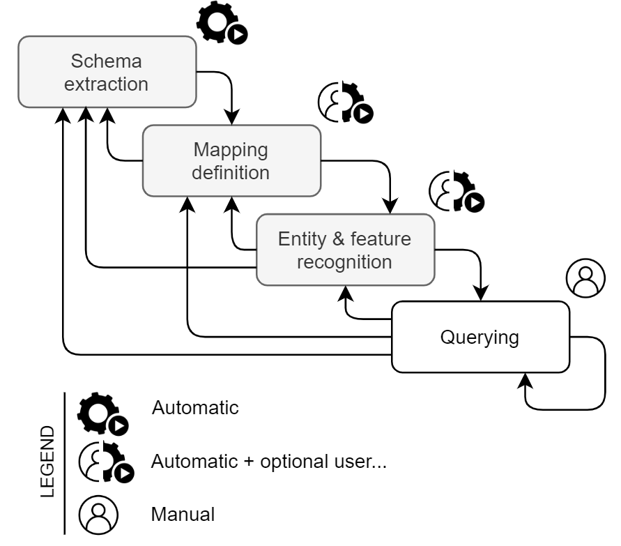
:::
:::
::::

#

::::{.columns}
:::{.column width="60%"}
Previous issues

  * *Expensive querying*
    * Schema heterogeneity solved at query time
    * Requires complex - but feasible - algorithms
  * *Expensive integration*
    * Pay-as-you-go approach is quicker, iterative, and more flexible
    * Dataspace is conceptual, untied to logical data modeling

Now we have a **multistore** dealing with multiple data models and schema heterogeneity

:::
:::{.column width="30%"}
![[@DBLP:journals/vldb/ForresiGGH21]](img/phdslides_125.png)
:::
::::

# Data inconsistency

*Intra-collection*

  * Due to denormalized data modeling

*Inter-collection*

  * Due to analytical data offloading
    * To reduce costs and optimize performance, the historical depth of databases is kept limited
    * After some years, data are offloaded to cheaper/bigger storage, e.g., cloud storage, data lakes
    * Offloading implies a change of data model, a change of schema, and obviously an overlapping of instances with the original data
  * Due to multi-cloud architectures
    * Enables the exploitation of data spread across different providers and architectures, all the while overcoming data silos through data virtualization
    * Typical in the presence of many company branches

Solutions?

  * Traditional ETL
  * Solve inconsistencies on the fly

# Data fusion

*Merge operator*

  * Originally introduced as "full outer join merge" [@DBLP:journals/is/NaumannFL04]
  * Aims to keep as much information as possible when joining the records of two schemas
    * Avoid any loss of records
    * Resolve mappings by providing transcoded output
    * Resolving conflicts whenever necessary

::::{.columns}
:::{.column width="50%"}

:::
:::{.column width="50%"}
:::{.fragment}
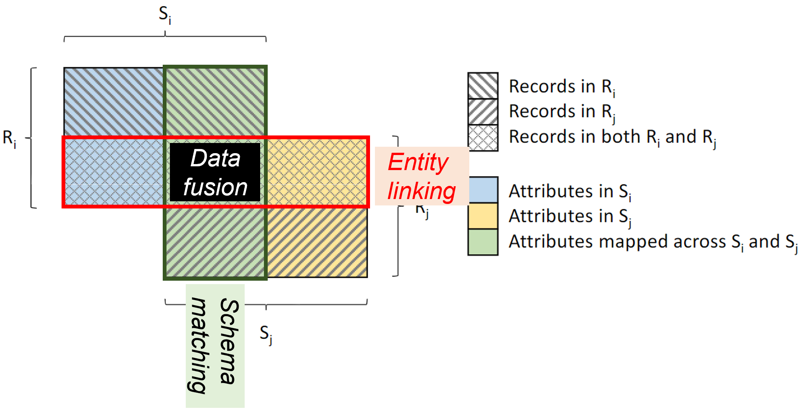
:::
:::
::::

# Merge operator


# On-the-fly data fusion

::::{.columns}
:::{.column width="50%"}
Merge operator in a query plan

* Take the data from heterogeneous sources (in different colors)
* Extract records of the single entities (e.g., customer, products)
* Merge each entity
* Join and produce the final result

Now we have a multistore dealing with multiple data models, schema heterogeneity, and data inconsistency

* Are we done? Not yet!

:::
:::{.column width="50%"}

:::
::::

# On-the-fly data fusion

::::{.columns}
:::{.column width="50%"}

Main issue: performance

* Collections accessed more than once
* Most effort pulled to the middleware

What can we do about it?

* Exploit more the local DBMSs
* Exploit local data modelling
* Carry out multi-entity merges

Issues

* Several query plans could be devised
* Hard to find the most efficient one

:::
:::{.column width="50%"}

:::
::::

# Logical optimization

Logical rules to transform a query plan into a more efficent one

* *Predicate push-down*: applying selection predicates as close to the source as possible
    * Not always feasible (e.g., in the presence of inconsistent data)
* *Column pruning*: extracting the only attributes relevant for the query
    * Not for granted when writing a custom query language
* *Join sequence reordering*: changing the order to do binary joins
    * Not so easy when merges are involved as well
    * Not so easy when data comes from different sources

# Same query, several query plans

::::{.columns}
:::{.column width="50%"}

Consistent representation of customers, orders, and order lines

What is the most efficient solution?

  * Single-entity merge and subsequent joins
  * Nest relational data and multi-merge with documents
  * Join relational data and multi-merge with flattened documents

Depends on several factors

  * On the capabilities of each DBMS/middleware
  * On the presence of indexes and statistics
  * On the resources available to each DBMS/middleware
  * On the number of records involved on each side

... which can change over time

:::
:::{.column width="50%"}
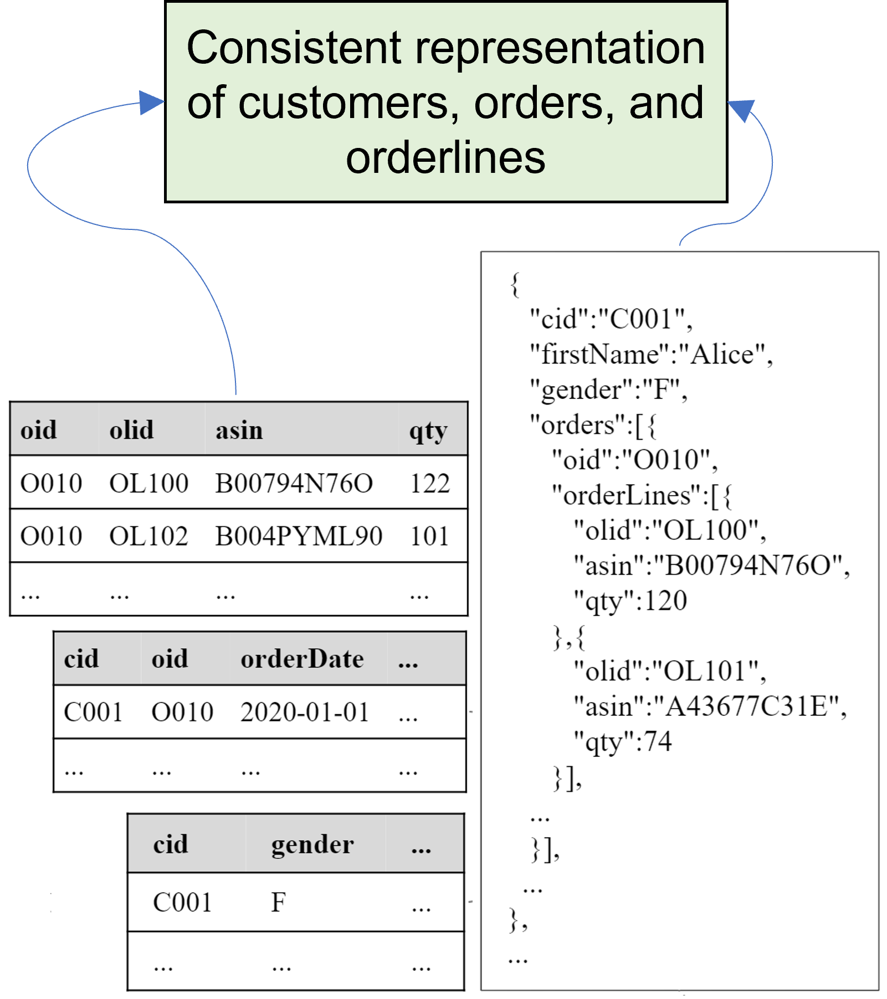
:::
::::

# Cost modelling


*White-box cost modelling*

  * Associate theoretical formulas with each query operator, then build up the cost of a query by summing the cost of each operation
  * Cost can be determined in terms of disk I/O, CPU, and network
  * Requires an enormous effort to effectively model the many factors that contribute to query costs in a heterogeneous multistore

*Black-box cost modelling*

* Hide the behavior of an execution engine within a black-box
    * The known information is mostly limited to the issued queries and the given response times
* Cost is determined in terms of time
* Easily adapts to evolving environments
* Suffers from cold-start

# Cost modelling

White-box cost modelling example [@DBLP:conf/adbis/ForresiFGG21]

::::{.columns}
:::{.column width="50%"}


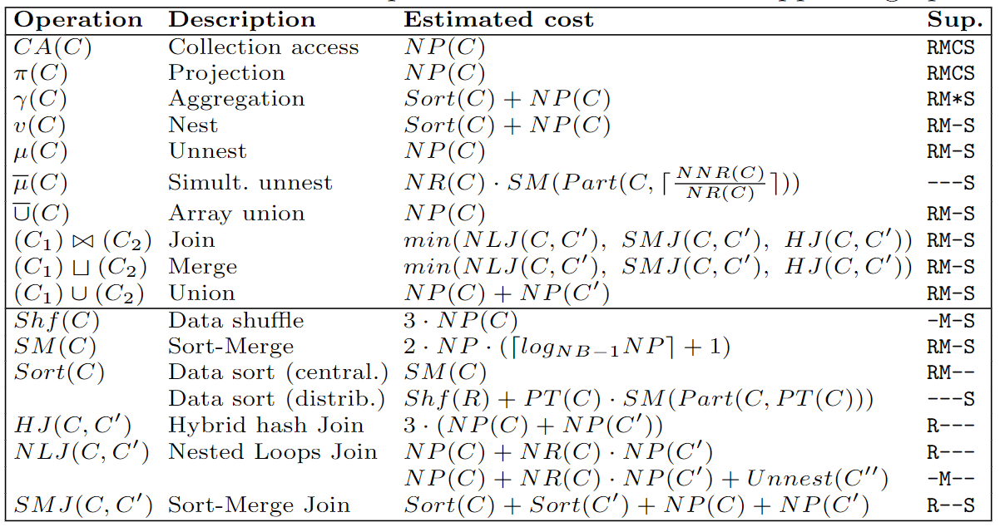
:::
::::

# Cost modelling

Black-box cost modelling example [@DBLP:journals/isf/ForresiFGG23]

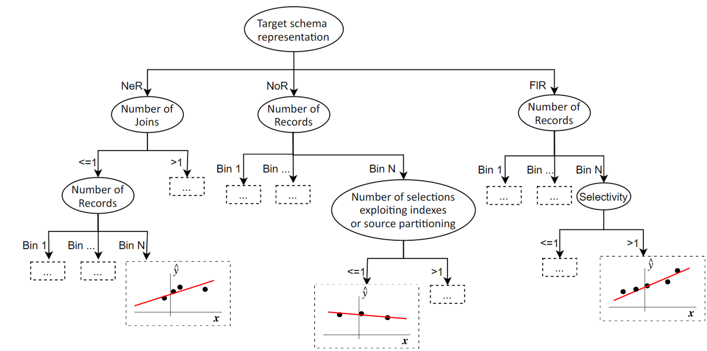

# References