# Metadata Challenges

Lacking smart support to govern the complexity of data and transformations

Data transformations must be governed to prevent DP turning into a swamp

  * Amplified in data science, with data scientists prevailing data architects
  * Leverage descriptive metadata and maintenance to keep control over data

Knowledge representation

  * Which metadata must be captured
  * How should metadata be organized

Knowledge exploitation

  * Which features do metadata enable

# Knowledge representation

A classification of metadata [@sharma2016architecting]

* __Technical__ metadata
    * Capture the form and structure of each dataset
    * E.g.: type of data (text, JSON, Avro); structure of the data (the fields and their types)
* __Operational__ metadata
    * Capture lineage, quality, profile, and provenance of the data
    * E.g.: source and target locations of data, size, number of records, and lineage
* __Business__ metadata
    * Captures what it all means to the user
    * E.g.: business names, descriptions, tags, quality, and masking rules for privacy

#

Another classification of metadata [@DBLP:conf/adbis/SawadogoSFFLD19]

* __Intra-object__ metadata
    * _Properties_ provide a general description of an object in the form of key-value pairs
    * _Summaries and previews_ provide an overview of the content or structure of an object
    * _Semantic metadata_ are annotations that help understand the meaning of data
* __Inter-object__ metadata
    * _Objects groupings_ organize objects into collections, each object being able to belong simultaneously to several collections
    * _Similarity links_ reflect the strength of the similarity between two objects
    * _Parenthood relationships_ reflect the fact that an object can be the result of joining several others
* __Global__ metadata
    * _Semantic resources_ , i.e., knowledge bases (ontologies, taxonomies, thesauri, dictionaries) used to generate other metadata and improve analyses
    * _Indexes_ , i.e., data structures that help find an object quickly
    * _Logs_ , used to track user interactions with the data lake

#

![[@DBLP:conf/adbis/SawadogoSFFLD19]](img/phdslides_154.png)

#

::::{.columns}
:::{.column width="50%"}
![[@DBLP:conf/adbis/SawadogoSFFLD19]](img/phdslides_156.png)
:::
:::{.column width="50%"}
![Constance: [@DBLP:conf/sigmod/HaiGQ16]](img/phdslides_155.png)
:::
::::

- Few details given on metamodel and functionalities.
- No metadata collected on operations.

#

::::{.columns}
:::{.column width="50%"}
![[@DBLP:conf/adbis/SawadogoSFFLD19]](img/phdslides_157.png)
:::
:::{.column width="50%"}
![GEMMS: [@DBLP:conf/caise/QuixHV16]](img/phdslides_158.png)
:::
::::

- No discussion about the functionalities provided.
- No metadata collected on operations and agents.

#

::::{.columns}
:::{.column width="50%"}
![[@DBLP:conf/adbis/SawadogoSFFLD19]](img/phdslides_160.png)
:::
:::{.column width="50%"}
![GOODS: [@DBLP:journals/debu/HalevyKNOPRW16]](img/phdslides_159.png)
:::
::::

- Crawls Google's storage systems to extract basic metadata on datasets and their relationship with other datasets.
- Performs metadata inference, e.g., to determine the schema of a non-self-describing dataset, to trace the provenance of data through a sequence of processing services, or to annotate data with their semantics.
  - Strictly coupled with the Google platform.
  - Mainly focuses on object description and searches.
  - No formal description of the metamodel.

#

::::{.columns}
:::{.column width="50%"}

:::
:::{.column width="50%"}
![Ground: [@DBLP:conf/cidr/HellersteinSGSA17]](img/phdslides_162.png)
:::
::::

- Version graphs represent data versions.
- Model graphs represent application metadata, i.e., how data are interpreted for use.
- Lineage graphs capture usage information.
- Not enough details given to clarify which metadata are actually handled.
- Functionalities are described at a high level.

#

::::{.columns}
:::{.column width="50%"}
![[@DBLP:conf/adbis/SawadogoSFFLD19]](img/phdslides_163.png)
:::
:::{.column width="50%"}
![KAYAK: [@maccioni2018kayak]](img/phdslides_164.png)
![KAYAK: [@maccioni2018kayak]](img/phdslides_165.png)
:::
::::

- Support users in creating and optimizing the data processing pipelines.
- Only goal-related metadata are collected.

# MOSES

![MOSES: [@DBLP:journals/fgcs/FranciaGGLRS21]](img/phdslides_166.png)

Three areas:

- **Technical** (blue)
- **Operational** (green)
- **Business** (red)

#

#

![MOSES: [@DBLP:journals/fgcs/FranciaGGLRS21]](img/meta01.png)

- Not pre-defined
- Domain-independent
- Extensible

#

![MOSES: [@DBLP:journals/fgcs/FranciaGGLRS21]](img/meta02.png)

Tune the trade-off between the level of detail of the functionalities and the required computational effort

#

![MOSES: [@DBLP:journals/fgcs/FranciaGGLRS21]](img/meta03.png)

#

| Functionality           | Supported |
|-------------------------|-----------|
| Semantic enrichment     | Yes       |
| Data indexing           | No        |
| Link generation         | Yes       |
| Data polymorphism       | Yes       |
| Data versioning         | Yes       |
| Usage tracking          | Yes       |

# How would you implement the meta-model?

# The Property Graph Data Model

Born in the database community

  * Meant to be queried and processed
  * _THERE IS NO STANDARD!_

Two main constructs: nodes and edges

  * Nodes represent entities,
  * Edges relate pairs of nodes, and may represent different types of relationships

Nodes and edges might be labeled,
  * and may have a set of properties represented as attributes (key-value pairs)\*\*\*

Further assumptions:

  * Edges are directed,
  * Multi-graphs are allowed

_\*\*\* Note: in _ _some_ _ _ _definitions_ _ (_ _the_ _ _ _least_ _) _ _edges_ _ are _ _not_ _ _ _allowed_ _ to _ _have_ _ _ _attributes_

#

A W3C standard is being developed, but still does not exist.

#

# Formal Definition

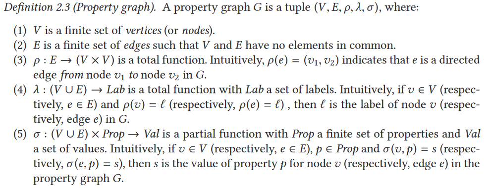

Extracted from: R. Angles et al. Foundations of Modern Query Languages for Graph Databases

#

Total function is just another name for a regular function. It just emphasizes the function is defined for all elements of its domain.
Partial function may only apply to a subset of the elements in the domain

#

# Example of Property Graph

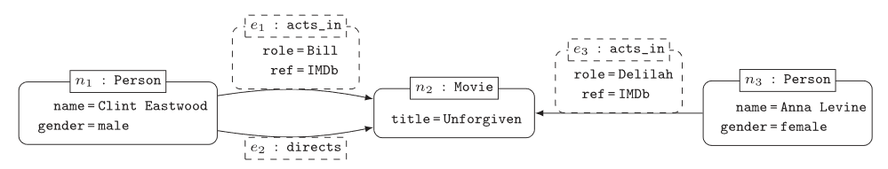

Formal definition:

#

# Traversal Navigation

We define the graph traversal pattern as: "the ability to rapidly traverse structures to an arbitrary depth (e.g., tree structures, cyclic structures) and with an arbitrary path description (e.g. friends that work together, roads below a certain congestion threshold)"  [Marko Rodriguez]

Totally opposite to set theory (on which relational databases are based on)

  * Sets of elements are operated by means of the relational algebra
#

Let them think of it as follows: fix a set of starting points. Explore the graph from there according to the pattern provided
EXAMPLE:
Let's go back to the movies example. Find the actors that acted together in two or more movies.
PATTERN: (actor)-(movie)-(actor2) AND (actor)-(movie2)-(actor2)

Realize that there are three sources of complexity: 
Number of starting points
2) 

#

# Traversing Data in a RDBMS

In the relational theory, it is equivalent to joining data (schema level) and select data (based on a value)

SELECT \*

FROM user u, user_order uo, orders o, items i

WHERE u.user = uo.user AND uo.orderId = o.orderId AND i.lineItemId = i.LineItemId

AND u.user = ‘Alice'

#

Traversing data = navigating data

Join: Schema level
Traverse: Ocurrence level

Formula de DBD de row index join (el numero d'instancies total importa, encara que poques facin join). En relacional el cost depèn de la profunditat (num joins que he de fer) I també del nombre total de tuples de la taula destí.

# Example of data platform: MOSES

Example of a data platform (MOSES)

* Functional architecture
  * Components of MOSES are in orange
  * Others are standard components in charge of producing/consuming, processing, storing, and visualizing data
  * The orchestrator (e.g., Oozie) manages (e.g., schedules) the data transformation processes

Metadata Extractor

Metadata Search

Engine

Provenance Manager

Custom components

Process Interfaces

MOSES Interfaces

Other Interfaces

Workflow Administration

Francia, M., Gallinucci, E., Golfarelli, M., Rizzi, S. et al. (2021). Making data platforms smarter with MOSES. Future Generation Computer Systems, 125, 299-313.

Knowledge exploitation

# Capturing the metadata

Pull strategy

  * The system actively collects new metadata
  * Requires scheduling: when does the system activate itself?
    * Event-based (CRUD)
    * Time-based
  * Requires wrappers: what does the system capture?
    * Based on data type and/or application
    * A comprehensive monitoring is practically unfeasible

Push strategy

  * The system passively receives new metadata
  * Requires an API layer
  * Mandatory for operational metadata

#

# Knowledge representation

A classification of functionalities enabled by metadata

  * Semantic enrichment
    * Generating a description of the context of data, e.g., with tags, to make them more interpretable and understandable
  * Data indexing
    * Data structures to retrieve datasets based on specific characteristics (keywords or patterns)
  * Link generation and conservation
    * Detecting similarity relationships or integrating preexisting links between datasets
  * Data polymorphism
    * Storing multiple representations of the same data to avoid repeating pre-processing and speed up analyses
  * Data versioning
    * Support data changes while conserving previous states
  * Usage tracking
    * Records the interactions between users and the data

Sawadogo, P. N., Scholly, E., Favre, C., Ferey, E., Loudcher, S., & Darmont, J. (2019, September). __Metadata systems for data lakes: models and features.__ In _European conference on advances in databases and information systems _ (pp. 440-451). Springer, Cham.

# Managing data platforms

  * Data provenance
  * Compression
  * Data profiling
  * Entity resolution
  * Data versioning
  * …

# Data profiling

Data profiling

  * A broad range of methods to efficiently analyze a given data set
  * E.g., in a  **functional dependencies** and association rules

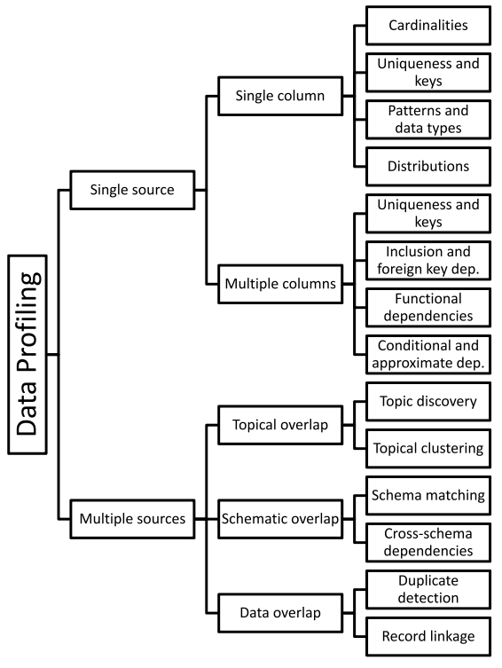

Naumann, Felix. "Data profiling revisited." _ACM SIGMOD Record_ 42.4 (2014): 40-49.

Use cases

  * **Query optimization**
    * Performed by DBMS to support query optimization with statistics about tables and columns
    * Profiling results can be used to estimate the selectivity of operators and the cost of a query plan
  * **Data cleansing** (typical use case is profiling data)
    * Prepare a cleansing process by revealing errors (e.g., in formatting), missing values or outliers
  * **Data integration and analytics**

Challenges?

Naumann, Felix. "Data profiling revisited." _ACM SIGMOD Record_ 42.4 (2014): 40-49.

| a | b | c | d |
|:-: |:-: |:-: |:-: |
| 1 | 1 | 2 | 2 |
| 1 | 2 | 1 | 4 |

Challenges

  * The results of data profiling are  **computationally complex**  to discover
    * E.g., discovering keys/dependencies usually involves some sorting step for each considered column
  * Verification of  **complex constraints on column combinations** in a database
    * What is the complexity of this task?

Naumann, Felix. "Data profiling revisited." _ACM SIGMOD Record_ 42.4 (2014): 40-49.

Knowledge exploitation

# Object profiling and search

Discoverability is a key requirement for data platforms

  * Simple searches to let users locate "known" information
  * Data exploration to let users uncover "unknown" information
  * Common goal: identification and description of Objects

Two levels of querying

  * Metadata level (most important)
  * Data level (can be coupled with the first one)

Knowledge exploitation

Basic search

  * MATCH (o:Object)-[]-(:Project {name:"ABC"})RETURN o
    * Return all objects of a given project
  * MATCH (o:Object)-[]-(d:DataLakeArea)WHERE d.name = "Landing" AND o.name LIKE "2021_%"AND o.size < 100.000RETURN o
    * Return small objects with a given name pattern in the landing area

#

100000 kb = 100 mb

Knowledge exploitation

Schema-driven search

  * MATCH (o:Object)-[]-(:Schema)-[]-(a:Attribute),   (a)-[]-(:Domain {name: "FiscalCode"})RETURN o
    * Return objects that contain informationreferring to a given Domain

#

100000 kb = 100 mb

Knowledge exploitation

Provenance-driven search

  * MATCH (obj1:Object)-[:readsFrom]-(o:Operation)-[:writesTo]-(obj2:Object)CREATE (obj1)-[:ancestorOf]->(obj2)
  * MATCH (:Object {id:123})-[:ancestorOf\*]-(obj:Object)RETURN obj
    * Discover objects obtained from a given ancestor
  * MATCH (obj:Object)-[:ancestorOf\*]-(:Object {id:123})RETURN obj
    * Discover object(s) from which another has originated
  * Example: a ML team wants to use datasets that were publicized as _canonical _ for certain domains, but they find these datasets being too "groomed" for ML
    * Provenance links can be used to browse upstream and identify the less-groomed datasets that were used to derive the canonical datasets

#

100000 kb = 100 mb

Knowledge exploitation

Similarity-driven search

  * MATCH (:Object {id:123})-[r:similarTo]-(o:Object)WHERE r.similarityType="affinity"RETURN o
    * Discover datasets to be merged in a certain query
  * MATCH (:Object {id:123})-[r:similarTo]-(o:Object)WHERE r.similarityType="joinability"RETURN o
    * Discover datasets to be joined in a certain query
  * Group similar objects and enrich the search results
    * List the main objects from each group
    * Restrict the search to the objects of a single group

#

100000 kb = 100 mb

Knowledge exploitation

Semantics-driven search

  * MATCH (o:Object)-[:isDescribedBy]-(:OntologyTerm {uri:"http://..."})RETURN o
  * MATCH (o:Object)-[\*]-(any),   (any)-[:isDescribedBy]-(:OntologyTerm {uri:"http://..."})RETURN o
    * Search objects without having any knowledge of theirphysical or intensional properties, but simply exploitingtheir traceability to a certain semantic concept

#

100000 kb = 100 mb

Knowledge exploitation

Profiling

  * MATCH (o:Object)-[]-(:OntologyType {name:"Table"}),   (o)-[]-(s:Schema)-[]-(a:Attribute),   (o)-[r:similarTo]-(o2:Object),   (o)-[:ancestorOf]-(o3:Object),   (o4:Object)-[:ancestorOf]-(o)RETURN o, s, a, r, o2, o3, o4
    * Shows an object's properties, list the relationships with other objects in terms of similarity and provenance
    * Compute a representation of the intensional features that mostly characterize a group of objects(see slides on schema heterogeneity)

#

100000 kb = 100 mb

Knowledge exploitation

# Provenance and versioning

Provenance: metadata pertaining to the history of a data item

  * Any information that describes the production process of an end product
  * Encompasses meta-data about entities, data, processes, activities, and persons involved in the production process
  * Essentially, it describes a transformation pipeline, including the origin of objects and the operations they are subject to

J.Wang, D. Crawl, S. Purawat, M. H. Nguyen, I. Altintas, __Big data provenance: Challenges, state of the art and opportunities__ , in: _Proc. _ _BigData_ , Santa Clara, CA, USA, 2015, pp. 2509–2516.

M. Herschel, R. Diestelk¨amper, H. Ben Lahmar, __A survey on provenance: What for? What form? What from?__ , _VLDB J._ 26 (6) (2017) 881–906.

#

100000 kb = 100 mb

# Data provenance

Provenance (also referred to as lineage, pedigree, parentage, genealogy)

  * The description of the origins of data and the process by which it arrived at the database
  * Not only data products (e.g., tables, files), but also the processes that created them

Use cases

  * Business domain. _Users traditionally work with an _ **_need to be identified _** _and corrected to avoid costly errors in business forecasting._
  * Scientific/research domain.  **_copyright_** _ of data are significant when using third-party data in such a loosely connected network._

Simmhan, Yogesh L., Beth Plale, and Dennis Gannon. "A survey of data provenance techniques." _Computer Science Department, Indiana University, Bloomington IN_ 47405 (2005): 69.

Astronomers are creating an international Virtual Observatory

  * A  **provision of the computational resources** needed to exploit the data scientifically
  * Astronomy changed from being an individualistic to a  **collective enterprise**
  * Telescope time is devoted/allocated to systematic sky surveys and analysis is performed using data from the archives
  * Astronomers are  **increasingly relying on data that they did not take themselves**
  * Raw data bear  **many instrumental signatures that must be removed** in the process of generating data products

Mann, Bob. "Some data derivation and provenance issues in astronomy." _Workshop on Data Derivation and Provenance, Chicago_ . 2002.[https://www.esa.int/Science_Exploration/Space_Science/Webb/Webb_inspects_the_heart_of_the_Phantom_Galaxy](https://www.esa.int/Science_Exploration/Space_Science/Webb/Webb_inspects_the_heart_of_the_Phantom_Galaxy) (accessed 2022-08-01)

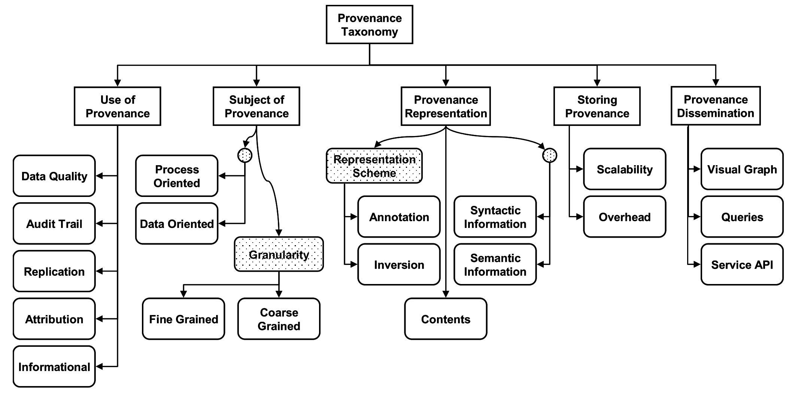

Simmhan, Yogesh L., Beth Plale, and Dennis Gannon. "A survey of data provenance techniques." _Computer Science Department, Indiana University, Bloomington IN_ 47405 (2005): 69.

Granularity

  * **Fine-grained**  (instance level): tracking data items (e.g., a tuple in a dataset) transformations
  * **Coarse-grained**  (schema-level): tracking dataset transformations

Queries

  * **Where**  provenance: given some output, which inputs did the output come from?
  * **How**  provenance: given some output, how were the inputs manipulated?
  * **Why**  provenance: given some output, why was data generated?
    * E.g., in the form of a proof tree that locates source data items contributing to its creation

Simmhan, Yogesh L., Beth Plale, and Dennis Gannon. "A survey of data provenance techniques." _Computer Science Department, Indiana University, Bloomington IN_ 47405 (2005): 69.Ikeda, Robert, and Jennifer Widom. _Data lineage: A survey_ . Stanford InfoLab, 2009.

Knowledge exploitation

# Provenance and versioning

An important aspect is the granularity of provenance

  * Fine-grained provenance is typically used for single vertical applications
    * It requires to collect huge amounts of detailed information to enable a very detailed tracing
  * Coarse-grained provenance is appropriate to ensure a broad coverage of highly heterogeneous transformations possibly involving several applications and datasets

Choosing a granularity is the result of a trade-off between accuracy and computational effort

  * Storing only the name and the version of a clustering algorithm enables an approximate reproducibility of the results
  * Storing all its parameters makes this functionality much more accurate

# Data provenance

Data provenance, an example of data management

  * Metadata pertaining to the history of a data item
  * Pipeline including the origin of objects and operations they are subjected to
  * We have a standard: [https://www.w3.org/TR/prov-dm/](https://www.w3.org/TR/prov-dm/)

[https://www.w3.org/TR/prov-dm/](https://www.w3.org/TR/prov-dm/)

**Entity**

  * Physical/conceptual things

**Activity**

  * Dynamic aspects of the world, such as actions
  * How entities come into existence, often making use of previously existing entities

**Agent**

  * A person, a piece of software
  * Takes a role in an activity such that the agent can be assigned some degree of responsibility for the activity taking place

[https://www.w3.org/TR/2013/NOTE-prov-primer-20130430/](https://www.w3.org/TR/2013/NOTE-prov-primer-20130430/)

Knowledge exploitation

# Provenance and versioning

PROV: a standard for provenance modeling

  * Several tools exists for managing PROV metadata
    * [https://openprovenance.org/services/view/translator](https://openprovenance.org/services/view/translator)
    * [https://lucmoreau.github.io/ProvToolbox/](https://lucmoreau.github.io/ProvToolbox/)
    * [https://prov.readthedocs.io/en/latest/](https://prov.readthedocs.io/en/latest/)
  * Compliance with PROV ensures integration with existing tools for querying and visualization

L. Moreau, P. T. Groth, __Provenance: An Introduction to PROV__ , _Synthesis Lectures on the Semantic Web: Theory and Technology_ , Morgan & Claypool Publishers, 2013.

#

https://www.openphactsfoundation.org/wp/wp-content/uploads/2016/05/140609_Cologne_IPAW-2014_Paul-Groth_Provenance.pdf

Knowledge exploitation

Provenance functionalities (activated by metadata)

  * __Data quality__
    * Monitoring accuracy, precision, and recall of produced objects to notify the data scientist when a transformation pipeline is not behaving as expected
  * __Debugging__
    * Inferring the cause of pipeline failures is challenging and requires an investigation of the overall processing history, including input objects and the environmental settings
  * __Reproducibility__
    * Re-execution of all or part of the operations belonging to a pipeline
  * __Trustworthiness__
    * Help data scientists to trust the objects produced by tracing them back to their sources and storing the agents who operated on those objects
  * __Versioning__
    * Marking a generated object and its versions (e.g., due to changes in a database schema) helps in identifying relevant objects along with their semantic versions, and to operate with legacy objects

Knowledge exploitation

# Graph DB and Centrality Measures

Measures of centrality

  * __Betweenness centrality (A)__
    * Number of shortest paths between two nodes that pass from a certain node
  * __Closeness centrality (B)__
    * Sum of distances to all other nodes.
  * __Eigenvector centrality (C)__
    * The score of a node is influenced by score of adjacent nodes (Page rank)
  * __Degree centrality (D)__
    * Number of adjacent nodes

Knowledge exploitation

# Provenance and versioning

Some current research directions

  * Expand PROV to better suite big data scenarios
    * Y. Gao, X. Chen and X. Du, __A Big Data Provenance Model for Data Security Supervision Based on PROV-DM Model__ , in _IEEE Access_ , vol. 8, pp. 38742-38752, 2020.
  * Define provenance-based approaches to measure the quality of big data
    * Taleb, I., Serhani, M.A., Bouhaddioui, C. et al. __Big data quality framework: a holistic approach to continuous quality management__ . _J Big Data _ 8, 76 (2021).
  * An outline of the challenges, including granularity identification, integration, security concerns
    * A. Chacko and S. D. Madhu Kumar, __Big data provenance research directions__ ,  _TENCON 2017 - 2017 IEEE Region 10 Conference_ , 2017, pp. 651-656, doi: 10.1109/TENCON.2017.8227942.
  * Blockchain-based provenance systems
    * Dang, T. K., & Duong, T. A. (2021). __An effective and elastic blockchain-based provenance preserving solution for the open data__ .  _International Journal of Web Information Systems_ .
    * Ruan, P., Dinh, T. T. A., Lin, Q., Zhang, M., Chen, G., & Ooi, B. C. (2021). __LineageChain__ __: a fine-grained, secure and efficient data provenance system for blockchains__ .  _The VLDB Journal_ ,  _30_ (1), 3-24.

Knowledge exploitation

# Orchestration support

The orchestrator is the component in charge of controlling the execution of computation activities

  * Either through a regular scheduling of the activities
  * Or by triggering a process in response to a certain event

Several entities (either processes or human beings) can cover this role to activate some data processes

#

100000 kb = 100 mb

Knowledge exploitation

Orchestration functionalities (activated by metadata)

  * Dynamic/condition-based behavior
    * Decide _what_ data process should be activated under different conditions
    * Decide _how_ to tune the parameters in case of parametric data processes
  * Triggering
    * Decide _when_ to trigger a certain data process
  * Scoping
    * Assess the trustworthiness of objects to decide _if_ a certain data process should be activated or not
  * Resource estimation/prediction
    * Decide the optimal amount of resources required to terminate successfully while leaving sufficient resources to the other concurrent process, based on previous executions and current settings
    * Negotiate the resources with the cluster's resource manager
#

100000 kb = 100 mb

Knowledge exploitation

Orchestration requirements & challenges

Barika, M., Garg, S., Zomaya, A. Y., Wang, L., Moorsel, A. V., & Ranjan, R. (2019). __Orchestrating big data analysis workflows in the cloud: research challenges, survey, and future directions__ .  _ACM Computing Surveys (CSUR)_ ,  _52_ (5), 1-41.

#

100000 kb = 100 mb

Knowledge exploitation

Orchestration requirements

  * R1 Compute/CPU resource provisioning
    * Determine the right amount of resources
    * Continuously monitor and manage them in a dynamic execution environment
  * R2 Storage
    * Choose the right cloud storage resource, data location, and format (if the application is parametric)
  * R3 Data movement
    * Dynamically transfer large datasets between compute and storage resources
  * R4 Synchronization and asynchronization
    * Manage the control and data flow dependencies across analytics tasks

Barika, M., Garg, S., Zomaya, A. Y., Wang, L., Moorsel, A. V., & Ranjan, R. (2019). __Orchestrating big data analysis workflows in the cloud: research challenges, survey, and future directions__ .  _ACM Computing Surveys (CSUR)_ ,  _52_ (5), 1-41.

#

100000 kb = 100 mb

Knowledge exploitation

Orchestration requirements

  * R5 Analytic task scheduling and execution
    * Scheduling and coordinating the execution of workflow tasks across diverse sets of big data programming models
    * Tracking and capturing provenance of data
  * R6 Service Level Agreement
    * Executions may need to meet user-defined QoS requirements (e.g., a strict execution deadline)
  * R7 Security
    * Beyond standard encryption approaches: private (anonymous) computation, verification of outcomes in multi-party settings, placement of components according to security policies
  * R8 Monitoring and Failure-Tolerance
    * Ensure that everything is streamlined and executed as anticipated
    * As failures could happen at any time, handle those failures when they occur or predicting them before they happen

Barika, M., Garg, S., Zomaya, A. Y., Wang, L., Moorsel, A. V., & Ranjan, R. (2019). __Orchestrating big data analysis workflows in the cloud: research challenges, survey, and future directions__ .  _ACM Computing Surveys (CSUR)_ ,  _52_ (5), 1-41.

#

100000 kb = 100 mb

Knowledge exploitation

Orchestration challenges

  * Cloud Platform Heterogeneity
    * __Integration__ (different APIs, virtualization formats, pricing policies, hardware/software configurations)
    * __Workflow Migration __ (e.g., to aspire to specific QoS features in the target cloud or better price)
  * Cloud Resource Management
    * __Resource Provisioning __ (selecting the right configuration of virtual resources; the resource configuration search space grows exponentially, and the problem is often NP-complete)
    * __Resource-based Big Data Programming Frameworks Management __ (automatically select the configurations for both IaaS-level resource and PaaS-level framework to consistently accomplish the anticipated workflow-level SLA requirements, while maximizing the utilization of cloud datacenter resources)
    * __Resource Volatility __ (at different levels: VM-level, big data progressing framework-level and workflow task-level)

Barika, M., Garg, S., Zomaya, A. Y., Wang, L., Moorsel, A. V., & Ranjan, R. (2019). __Orchestrating big data analysis workflows in the cloud: research challenges, survey, and future directions__ .  _ACM Computing Surveys (CSUR)_ ,  _52_ (5), 1-41.

#

100000 kb = 100 mb

Knowledge exploitation

Orchestration challenges

  * Data-related
    * __Storage__ (where the data will be residing, which data format will be used)
    * __Movement__ (minimize transfer rates, exploit _data locality _ in task-centric or worker-centric way)
    * __Provenance__ (trade-off expressiveness with overhead)
    * __Indexing__ (which dataset is worth indexing and how)
    * __Security and Privacy __ (cryptography, access control, integrity, masking, etc.)

Barika, M., Garg, S., Zomaya, A. Y., Wang, L., Moorsel, A. V., & Ranjan, R. (2019). __Orchestrating big data analysis workflows in the cloud: research challenges, survey, and future directions__ .  _ACM Computing Surveys (CSUR)_ ,  _52_ (5), 1-41.

Knowledge exploitation

Orchestration challenges

  * Workflow-related
    * __Specification Language __ (devising a high level, technology-/cloud-independent workflow language)
    * __Initialization__ (subdivision into fragments considering dependencies, constraints, etc.)
    * __Parallelization and Scheduling __ (with super-workflows defined at application and task level)
    * __Fault-Tolerance__ (thing can go wrong at workflow-, application-, and cloud-level)
    * __Security__ (securing workflow logic and computation)

Barika, M., Garg, S., Zomaya, A. Y., Wang, L., Moorsel, A. V., & Ranjan, R. (2019). __Orchestrating big data analysis workflows in the cloud: research challenges, survey, and future directions__ .  _ACM Computing Surveys (CSUR)_ ,  _52_ (5), 1-41.

#

100000 kb = 100 mb

# Compression

Summarization / compression

  * Present a concise representation of a dataset in a comprehensible and informative manner

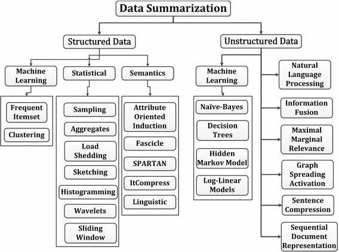

Ahmed, Mohiuddin. "Data summarization: a survey." _Knowledge and Information Systems_ 58.2 (2019): 249-273.

# Entity resolution

Entity resolution

  * (also known as entity matching, linking)
  * Find records that refer to the same entity across different data sources (e.g., data files, books, websites, and databases)

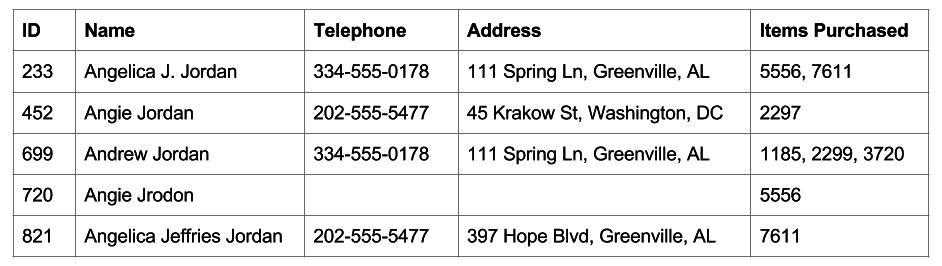

Papadakis, George, et al. "Blocking and filtering techniques for entity resolution: A survey." _ACM Computing Surveys (CSUR)_ 53.2 (2020): 1-42.

# Data versioning

Version control

  * A class of systems responsible for managing changes to computer programs, documents, or data collections
  * Changes are identified by a number/letter code, termed the revision/version number

However, data pipelines are not only about code bult also about

  * Model Version control
  * Data Version Control
  * Model Parameter Tracking
  * Model Performance Comparison

Support CRUD (Create, Read, Update, Delete) operations with versions

E.g., on AWS (PUT, GET, DELETE), what about update?

[https://docs.aws.amazon.com/AmazonS3/latest/userguide/versioning-workflows.html](https://docs.aws.amazon.com/AmazonS3/latest/userguide/versioning-workflows.html) (accessed 2022-08-01)

# Tuning Data Pipelines

# CRISP-DM

The  __CR__ oss  __I__ ndustry  __S__ tandard  __P__ rocess for  __D__ ata  __M__ ining ( _CRISP-DM_ ) is a process model that serves as the base for a [data science process](https://www.datascience-pm.com/data-science-process/). It has six sequential phases:

  * Business understanding – What does the business need?
  * Data understanding – What data do we have / need? Is it clean?
  * Data preparation – How do we organize the data for modeling?
  * Modeling – What modeling techniques should we apply?
  * Evaluation – Which model best meets the business objectives?
  * Deployment – How do stakeholders access the results?

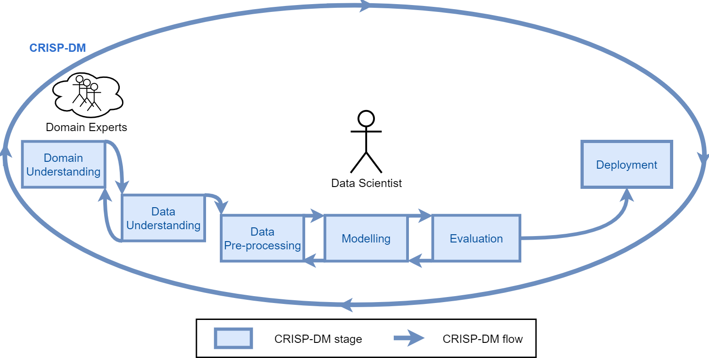

# Pipelines for ML tasks

Tuning pipelines is hard

  * At each __step__ , a technique must be selected
  * For each technique, a set of __hyper-parameters__ must be set
  * Each __hyper-parameter has its own search space__

# AutoML

AutoML aims at automating the ML pipeline instantiation:

  * it is difficult to consider all the constraints together;
  * it is not transparent;
  * it doesn't allow a proper knowledge augmentation.

Thornton, et al. Auto-WEKA: Combined selection and hyperparameter optimization of classification algorithms. In Proceedings of the 19th ACM SIGKDD international conference on Knowledge discovery and data mining (pp. 847-855).Feurer, Matthias, et al. "Auto-sklearn 2.0: Hands-free automl via meta-learning." The Journal of Machine Learning Research 23.1 (2022): 11936-11996.

# HAMLET

[HAMLET](https://github.com/QueueInc/HAMLET): Human-centric AutoML via Logic and Argumentation

HAMLET leverages:

  * Logic to give a structure to the knowledge;
  * Argumentation to deal with inconsistencies,  and revise the results.

[https://github.com/QueueInc/HAMLET](https://github.com/QueueInc/HAMLET) Francia M., Giovanelli J., and Pisano P. "HAMLET: A framework for Human-centered AutoML via Structured Argumentation." Future Generation Computer Systems 142 (2023): 182-194.

The LogicalKB enables:

  * the Data Scientist to structure the ML constraints;
  * the AutoML tool to encode the explored results

The Problem Graph allows to:

  * consider all the ML constraints together;
  * set up the AutoML search space;
  * discuss and argument about the results.

The Data Scientist iterates on:

  * editing the LogicalKB;
  * consulting the Problem Graph;
  * running the AutoML tool;
  * discussing the AutoML insights.

# KB and Problem Graph

**pipeline**

**).**

**.**

**).**

**algorithms**

**).**

**).**

**pipeline**

**).**

**).**

**).**

**algorithms**

**).**

**).**

\# Forbid Normalization when using DT

c1: ⇒   forbidden(⟨N ⟩, Dt).

**pipeline**

**).**

**).**

**).**

**algorithms**

**).**

**).**

\# Forbid Normalization when using DT

c1: ⇒   forbidden(⟨N ⟩, Dt).

\# Mandatory Normalization in Classification Pipelines

c2: ⇒   mandatory(⟨N ⟩, Cl).

**pipeline**

**).**

**).**

**).**

**algorithms**

**).**

**).**

\# Forbid Normalization when using DT

c1: ⇒   forbidden(⟨N ⟩, Dt).

\# Mandatory Normalization in Classification Pipelines

c2: ⇒   mandatory(⟨N ⟩, Cl).

**pipeline**

**).**

**).**

**).**

**algorithms**

**).**

**).**

\# Forbid Normalization when using DT

c1: ⇒   forbidden(⟨N ⟩, Dt).

\# Mandatory Normalization in Classification Pipelines

c2: ⇒   mandatory(⟨N ⟩, Cl).

\# Resolve conflict between c1 and c2sup (c1, c2).

# Evaluation

Settings:

  * __Baseline__: 1 optimization it. of 60 mins;
  * __PKB__ (Preliminary Knowledge Base):  1 optimization it. of 60 mins with non-empty LogicalKB;
  * __IKA__ (Iterative Knowledge Augmentation): 4 optimization it. of 15 mins with empty LogicalKB;
  * __PKB \+ IKA: __ 4 optimization it. of 15 mins  with non-empty LogicalKB.

Settings:

  * __Baseline__: 1 optimization it. of 60 mins;
  * __PKB__ (Preliminary Knowledge Base):  1 optimization it. of 60 mins with non-empty LogicalKB;
  * __IKA__ (Iterative Knowledge Augmentation): 4 optimization it. of 15 mins with empty LogicalKB;
  * __PKB \+ IKA: __ 4 optimization it. of 15 mins  with non-empty LogicalKB.

Comparison with AutoML tools

# HAMLET

Key features:

  * knowledge injection;
  * representation via an human- and
  * machine-readable medium;
  * insight discovery;
  * dealing with possible arising  inconsistencies.

Future directions:

  * make constraints fuzzy;
  * improve recommendation algorithm;
  * enhance HAMLET with meta-learning;
  * manage cross-cutting constraints  (e.g., ethic, legal).

# Advanced Analytics

Applications and Challenges

High availability and accessibility attract new data scientists

  * **High**  competence in business domain
  * **Low**  competence in computer science

Since the '70s, relational queries to retrieve data

  * Comprehension of formal languages and DBMS
  * **Advanced analytics (semi-automatic transformation)**
    * "Information" and "Knowledge" levels

**Wisdom**

**(Decisions)**

**analytics**

**Knowledge**

**(Data Mining)**

Hand-free scenarios

**Information**

**(Data Warehouse, OLAP)**

**Data**

**(Operational DB, OLTP)**

Many problems to address:

  * Query recommendation based on contextual data
    * E.g., augmented reality and digital twins
  * Definition of interest
  * Diversification
  * Compression
  * Natural Language and Vocalization

# Application scope

Enable analytics through augmented reality [1]

  * E.g., an inspector analyzing production rates

Sense the context through augmented devices

  * E.g., smart glasses
  * Detect interaction and  **engagement**  [1]

Produce analytical reports

  * **Relevant** to the sensed context
  * Cardinality  **constraint**
  * **Near real-time**

Analytical Reports

[1] Francia, Matteo, Matteo Golfarelli, and Stefano Rizzi. "A-BI\+: a framework for Augmented Business Intelligence." _Information Systems_ 92 (2020): 101520.[2] Yu-Chuan Su, Kristen Grauman: Detecting Engagement in Egocentric Video. ECCV (5) 2016: 454-471

#

Sistemi come recommender system di Amazon possono usare dati contestuali (e.g, la posizione), tuttavia
Ci sono differenze sia differenze di «metodo» / «framework» che di «recommendation»
«Metodo»
- Amazon si basa su verità «più storiche», noi interpretiamo e «mixiamo» un contesto real-time costituito da più oggetti interessanti rilevati (e/o ingaggiati) dal sistema
- Il nostro sistema è «end-to-end», cioè riguarda anche la gestione e linking dei dati per la costruzione delle query

«Recommendation», formalmente noi usiamo un approccio ibrido (mentre i classici sono item-based o collaborative)
- Mix di conoscenza real-time con storica: Non siamo strettamente log-based (i.e., il contesto ci serve per un cold-start problem). Mentre il consiglio di amazon è «altri utenti hanno acquistato/visualizzato anche…»- Cardinalità del risultato per fare fit di un device augmented- Diversification di query diverse, non di una singola query

# Is AOLAP out of reach?Object recognition (YOLO [5])Egocentric computer vision [6]

[5] Redmon, J., & Farhadi, A. (2017). YOLO9000: better, faster, stronger. In _Proceedings of the IEEE conference on computer vision and pattern recognition_ (pp. 7263-7271).

[6] Fathi, A., Farhadi, A., & Rehg, J. M. (2011, November). Understanding egocentric activities. In 2011 International Conference on Computer Vision (pp. 407-414). IEEE.

# Augmented OLAP

Augmented OLAP, a 3D marriage

  * Augmented reality
    * Real-time information [2]
  * Business intelligence
    * OLAP: get data facts
  * Recommendation
    * Pick relevant data facts

Augmented Reality

(real-time)

Inputs

Output

Query Log

(experience)

Data Mart

& Mappings

(a-priori)

[2] Angelo Croatti, Alessandro Ricci: Towards the Web of Augmented Things. ICSA Workshops 2017: 80-87

# What can we sense?

Data Mart: repository of multidimensional cubes

  * Cubes representing business facts

**Data dictionary**

  * What we can recognize (i.e., md-elements)
  * **Context**: subset of md-elements

**Mappings**  to sets of md-elements

  * A-priori interest

<Object, Seat> _dist_ = 1m

<Object, BikeExcite> _dist_ = 2m

<Location, RoomA.1>

<Date, 16/10/2018>

<Role, Controller>

Quantity

Revenues

AssembledItems

AssemblyTime

# Recommendation

Context interpretation

  * Given context _T_ over the data dictionary
  * Project _ T_ to an  **image of fragments** _I_ through mappings
    * **Fragment**: intuitively a "small" query

Add the log

  * Get queries with positive feedback from _similar_ contexts
    * Enrich _I_ to _I\*_ with _unperceived_ elements from _T_
  * Each fragment has _contextual and log relevance_

Query generation

  * Cannot directly translate _I\*_  into a well-formed query
  * High cardinality _I\*_ = hardly interpretable "monster query"

Analytical Reports

_recommended_ _queries_

_relevant queries_

<Object, Seat> _dist_ = 1m

<Object, BikeExcite> _dist_ = 2m

<Location, RoomA.1>

<Date, 16/10/2018>

<Role, Controller>

Query generation

# Query generation

Generate queries from image _I\* _ of fragments

  * Each fragment is a query
  * Depth-first exploration with pruning rules
    * **Query cardinality can only increase**
    * **Some queries are redundant**

{Month,Part,Product},

{(Product=BikeExcite)},

{Quantity,AssembledItems}

{Month,Part,Product},

{(Product=BikeExcite)},

{Quantity,AssembledItems}

**},**

**)},**

****

{Year,Part,Product},

{(Product=BikeExcite)},

{Quantity,AssembledItems}

{Product},

{(Product=BikeExcite)},

{Quantity}

{Month,Product},

{(Product=BikeExcite)},

{Quantity,AssembledItems}

{Month,Product},

{(Product=BikeExcite)},

{Quantity,AssembledItems}

{Year,Product},

{(Product=BikeExcite)},

{Quantity,AssembledItems}

{Part,Type},

{(Type=Bike)},

{}

{Month,Part,Type},

{(Type=Bike)},

{AssembledItems}

{Month,Part,Type},

{(Type=Bike)},

{AssembledItems}

{Month},

{},

{AssembledItems}

{Year,Part,Type},

{(Type=Bike)},

{AssembledItems}

**},**

**{},**

****

{Year},

{},

{AssembledItems}

# Query selection

Given \#queries ( _rq_ ), maximize the covered fragments and minimize their overlapping

    * E.g., given two queries  **_q'_**
    * **_(q') _** _– _ _sim(q, q') \* (_ _rel_ _(q) \+ _ _rel_ _(q')) / 2_
  * Weighted Maximum Coverage Problem (NP-hard)
  * Greedy: iteratively pick query maximizing _rel_ _T_
    * Only a few query are retrieved, not expensive

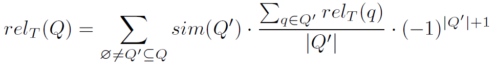

# Effectiveness

_|T| = 12, _ _rq_ _ = 4_

  * Best query (with user exp.)
  * After 2 visits: 0.95, 4 visits: 0.98
  * Best query (no user exp.)

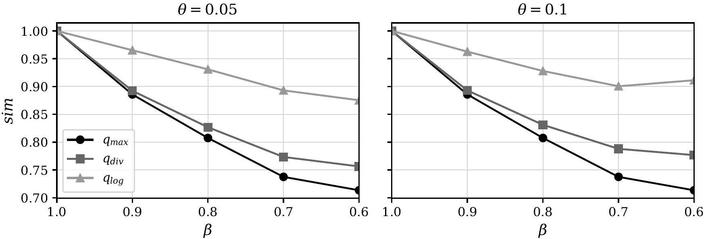

# Efficiency

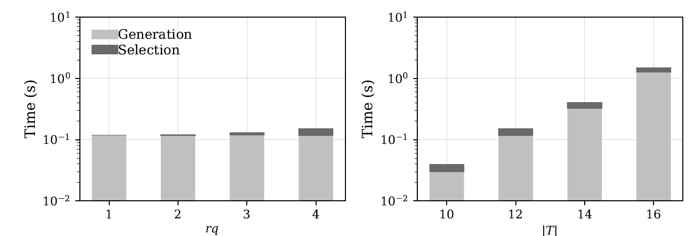

# Research directions

Analytics in  **augmented reality**

  * Support analytical queries in hand-free scenarios
  * **Recommend relevant data facts** from a real-world context

Research directions

  * Provide (fast) query previews
    * Estimate the execution time of each query
    * Address query caching and multi-query optimization issues
  * Correlate context-awareness to  **data quality** [3]
    * Relevance, amount, and completeness [4]

[3] Stephanie Watts, Ganesan Shankaranarayanan, Adir Even: Data quality assessment in context: A cognitive perspective. Decis. Support Syst. 48(1): 202-211 (2009)

[4] Diane M. Strong, Yang W. Lee, Richard Y. Wang: Data Quality in Context. Commun. ACM 40(5): 103-110 (1997)

# Motivation

Enable analytics through  **natural language**

OLAP provides  **low-level**  operators [1]

  * Users need to have knowledge on the multidimensional model…
  * … or even programming skills

We introduce COOL (COnversational OLap) [3]

  * **Translate**  natural language into formal queries

[1] Panos Vassiliadis, Patrick Marcel, Stefano Rizzi: Beyond roll-up's and drill-down's: An intentional analytics model to reinvent OLAP. __Inf__ __ormation__ __ Systems__ . (2019)

[2] Matteo Francia, Matteo Golfarelli, Stefano Rizzi: A-BI\+: A framework for Augmented Business Intelligence. __Inf__ __ormation__ __ Systems__ . (2020)

[3] Matteo Francia, Enrico Gallinucci, Matteo Golfarelli: COOL: A Framework for Conversational OLAP. __Inf__ __ormation__ __ Systems__ . (2021)

#

DIFF: [17] returns tuples that maximize difference between cells of a cube given as input
Profile user exploration to recommend which unvisited parts of the cube
RELAXoperator allows toverify whether a pattern observed at a certain level of detail ispresent at a coarser level of detail too [19]
Alternative operators have also been proposed in theCinecubes method [7,8]. The goal of this effort is to facilitateautomated reporting, given an original OLAP query as input.To achieve this purpose two operators (expressed asacts) areproposed, namely, (a)put-in-context, i.e., compare the result ofthe original query to query results over similar, sibling values;and (b)give-details, where drill-downs of the original query'sgroupers are performed.

# COOL: architecture

Metadata

& values

Automatic

KB feeding

Manual KB enrichment

#

DIFF: [17] returns tuples that maximize difference between cells of a cube given as input
Profile user exploration to recommend which unvisited parts of the cube
RELAXoperator allows toverify whether a pattern observed at a certain level of detail ispresent at a coarser level of detail too [19]
Alternative operators have also been proposed in theCinecubes method [7,8]. The goal of this effort is to facilitateautomated reporting, given an original OLAP query as input.To achieve this purpose two operators (expressed asacts) areproposed, namely, (a)put-in-context, i.e., compare the result ofthe original query to query results over similar, sibling values;and (b)give-details, where drill-downs of the original query'sgroupers are performed.

_Sales by Customer and Month_

Annotated parse forest

Disambiguation

& Enhancement

Execution & Visualization

Metadata

& values

Automatic

KB feeding

Manual KB enrichment

# COOL: interpretation

⟨GPSJ⟩::= ⟨MC⟩⟨GC⟩⟨SC⟩

⟨MC⟩  ::= (⟨Agg⟩⟨Mea⟩ | ⟨Cnt⟩⟨Fct⟩)\+

⟨GC⟩  ::= "𝑔𝑟𝑜𝑢𝑝 𝑏𝑦" ⟨Attr⟩\+⟨SC⟩  ::= "𝑤ℎ𝑒𝑟𝑒" ⟨SCA⟩⟨SCA⟩ ::= ⟨SCN⟩ "𝑎𝑛𝑑" ⟨SCA⟩ | ⟨SCN⟩⟨SCN⟩ ::= "𝑛𝑜𝑡" ⟨SSC⟩ | ⟨SSC⟩⟨SSC⟩ ::= ⟨Attr⟩⟨Cop⟩⟨Val⟩ | ⟨Attr⟩⟨Val⟩ | ⟨Val⟩⟨Cop⟩ ::= "=" | "<>" | ">" | "<" | "≥" | "≤"⟨Agg⟩ ::= "𝑠𝑢𝑚" | "𝑎𝑣𝑔" | "𝑚𝑖𝑛" | "𝑚𝑎𝑥"⟨Cnt⟩ ::= "𝑐𝑜𝑢𝑛𝑡" | "𝑐𝑜𝑢𝑛𝑡 𝑑𝑖𝑠𝑡𝑖𝑛𝑐𝑡"⟨Fct⟩ ::= Domain-specific facts⟨Mea⟩ ::= Domain-specific measures⟨Attr⟩::= Domain-specific attributes⟨Val⟩ ::= Domain-specific values

_T_ _ = _ _«return the average sales in 2019 per store region»_

Why grammars?

  * In the OLAP domain, GPSJ queries do not have very complex structures
    * Our grammar can support the translation without apriori training or external ontologies
    * Grammar produces "explainable" trees
  * Data cubes can contain data from highly-specific domains for which
    * We could not have a big corpus of data to train (deep) machine learning models
    * We could not have (open) ontologies to support translation
  * We also tried Dependency Trees from Stanford NLP
    * However, the structure of the tree is highly variable
    * (Empirically) Using n-grams enables good flexibility and robustness for COOL

Tokenization

  * Our \`tokenization and mapping\` does not leverage stemming or lemmatization
    * We assume that even if users are not expert on the OLAP paradigm, they know the business domain

#

Jagadish: The linguistic parse trees in our system are dependency parse trees, in which each node is a word/phrase specified by the user while each edge is a linguistic dependency relationship be- tween two words/phrases. The

_[https://corenlp.run/](https://corenlp.run/)_ _ _

_return the average of the sales_

_return the average sales_

#

Jagadish: The linguistic parse trees in our system are dependency parse trees, in which each node is a word/phrase specified by the user while each edge is a linguistic dependency relationship be- tween two words/phrases. The

Given _T_ _ = _ _«return, the, average, sales, in, 2019, per, store, region»_

_Example of mappings_

_T = «return, the, average, sales,            in,     2019, per,          store, region»_

_M_ _1_ _ = «select,      avg,       _ _UnitSales_ _, where, 2019, group by, region»_

_T = «return, the, average, sales,            in,     2019, per,          store,          region»_

_M_ _2_ _ = «select,      avg,       _ _UnitSales_ _, where, 2019, group by, _ _StoreSales_ _, region»_

#

Jagadish: The linguistic parse trees in our system are dependency parse trees, in which each node is a word/phrase specified by the user while each edge is a linguistic dependency relationship be- tween two words/phrases. The

# Effectiveness

40 users with heterogeneous OLAP skills

  * Asked to translate (Italian) analytic goals into English
  * Users provided good feedback on the interface...
  * ... as well as on the interpretation accuracy

|  | __Full Query__ |  | __OLAP operator__ |  |
|:-: |:-: |:-: |:-: |:-: |
| __OLAP Familiarity__ | __Accuracy__ | __Time (s)__ | __Accuracy__ | __Time (s)__ |
| Low | 0.91 | 141 | 0.86 | 102 |
| High | 0.91 | 97 | 0.92 | 71 |

# Efficiency

# COOL in Action!

[3] Matteo Francia, Enrico Gallinucci, Matteo Golfarelli: Conversational OLAP in Action. __EDBT (best demo award)__ 2021: 646-649

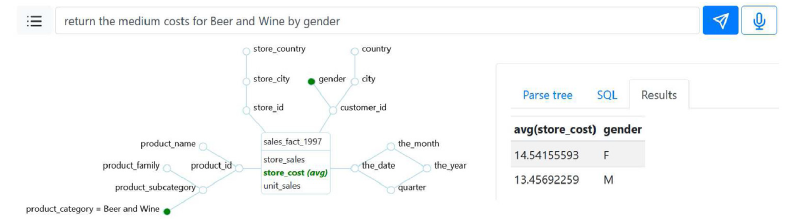

# Research directions

COOL (Conversational OLAP)

  * Support the translation of a natural language conversation into an OLAP session
  * Analyze data without requiring technological skills
    * Add conversational capabilities to Augmented OLAP

Towards an end-to-end conversational solution

  * Create  **query summaries**  that can be returned as short vocal messages
  * Identify  **insights**  out of a large amount of data
  * Identify the "right"  **storytelling**  and user-system interaction

# References