# Data lake

* " _If you think of a _  _datamart_  _ as a store of bottled water – cleansed and packaged and structured for easy consumption – the data lake is a large body of water in a more natural state._ ”
    * [James Dixon](https://jamesdixon.wordpress.com/2010/10/14/pentaho-hadoop-and-data-lakes/), 2010
* " _A large storage system for raw, heterogeneous data, fed by multiple data sources, and that allows users to explore, extract and analyze the data._ ”
    * Sawadogo, P., Darmont, J.  __On data lake architectures and metadata management__ .  _J _  _Intell_  _ Inf Syst_  56, 97–120 (2021)
* " _A data lake is a central location that holds a large amount of data in its native, raw format.”_
    * [Databricks](https://databricks.com/discover/data-lakes/introduction), 2021
#

Data lakes were developed in response to the limitations of data warehouses. While data warehouses provide businesses with highly performant and scalable analytics, they are expensive, proprietary and can't handle the modern use cases most companies are looking to address. Data lakes are often used to consolidate all of an organization's data in a single, central location, where it can be saved "as is,” without the need to impose a schema (i.e. a formal structure for how the data is organized) up front like a data warehouse does. Data in all stages of the refinement process can be stored in a data lake: raw data can be ingested and stored right alongside an organization's structured, tabular data sources (like database tables), as well as intermediate data tables generated in the process of refining raw data. Unlike most databases and data warehouses, data lakes can process all data types — including unstructured and semi-structured data like images, video, audio and documents — which are critical for today's machine learning and advanced analytics use cases.

* The data lake started with the Apache Hadoop movement, using the Hadoop File System (HDFS) for cheap storage
  * _Schema-on-read_  architecture
  * Agility of storing any data at low cost
  * Eludes the problems of quality and governance
* A two-tier data lake \+ warehouse architecture is dominant in the industry
  * HDFS replaced by cloud data lakes (e.g., S3, ADLS, GCS)
  * Data lake data directly accessible to a wide range of analytics engines
  * A subset of data is "ETL-ed" to a data warehouse for important decision support and BI apps

Armbrust, M., Ghodsi, A., Xin, R., & Zaharia, M. (2021).  __Lakehouse: A New Generation of Open Platforms that Unify Data Warehousing and Advanced Analytics__ .  _CIDR_ .

* Downsides of data lakes
  * Security
    * All the data is stored and managed as files
    * No fine-grained access control on the contents of files, but only coarse-grained access governing who can access what files or directories
  * Quality
    * Hard to prevent data corruption and manage schema changes
    * Challenging to ensure atomic operations when writing a group of files
    * No roll-back mechanism
  * Query performance
    * Formats are not optimized for fast access
* It is often said that the  _lake_  easily turns into a  _swamp_

# Data platform: DWH vs Data Lake

| **__Data lake__** |
| :-: | :-: | :-: |
| __Data__ | **Non-relational and relational** |
| __Schema__ | Designed prior to implementation  **(schema-on-read)** |
| __Price/__  __performance__ | Fastest query results using higher cost storage | Query results getting faster using low-cost storage |
| __Data quality__ | **Any data** , which may or may not be curated (e.g., raw data) |
| __Users__ | **Data scientists** , data developers, and business analysts (using curated data) |
| __Analytics__ | **Machine learning** , predictive analytics, data discovery, and profiling. |

# Data platform

* Data lakes have increasingly taken the role of data hubs
  * Eliminate up-front costs of ingestion and ETL since data are stored in original format
  * Once in DL, data are available for analysis by everyone in the organization
* Drawing a sharp line been storage/computation/analysis is hard
  * Is a database just storage?
  * What about SQL/OLAP?
* Blurring of the architectural borderlines
  * DL is often replaced by "data platform” or "data ecosystem”
  * Encompass systems supporting data-intensive storage, computation, analysis

# Example of data platform: Hadoop-based

* A data platform on the Hadoop stack requires several tools
* How many levels of complexity are hidden here?
* How do you provision it?
  * Manual provisioning on-premises
  * Semi-automatic provisioning on-premises
  * Automatic provisioning in the cloud

Storage   .

Resources   .

Application   .

GUI   .

Messaging   .

Orchestration   .

Map Reduce

Batch

Flink

real-time

# Data Lakehouse

* Data warehouse architecture as we know today will replaced by a new
* architectural pattern, the Lakehouse
  * Based on open direct-access data formats, such as Apache Parquet
  * Have first-class support for machine learning and data science
  * Offer state-of-the-art performance
* Old architectures typically coupled compute and storage into an on-premises appliance
  * This forced enterprises to provision and pay for the peak of user load and data under management
    * Very costly as datasets grew
  * More and more datasets were completely unstructured, e.g., video, audio, and text documents, which data warehouses could not store and query at all

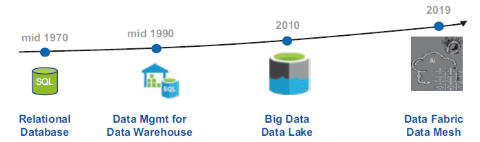

Data Fabric and Data Mesh Approaches with AI ([https://doi.org/10.1007/978-1-4842-9253-2](https://doi.org/10.1007/978-1-4842-9253-2))

* Data warehouse architecture as we know today will replaced by a new
* architectural pattern, the Lakehouse
* The data lakehouse enables storing all your data once in a data lake and efficiently doing AI and BI on that data directly at a massive scale
  * ACID transaction support
  * Schema enforcement
  * Data governance
    * All processes ensuring that data meet high quality standards throughout the whole lifecycles
    * Including availability, usability, consistency, integrity, security
  * Support for diverse workloads (e.g., data science, ML, SQL, analytics)

[https://databricks.com/blog/2020/01/30/what-is-a-data-lakehouse.html](https://databricks.com/blog/2020/01/30/what-is-a-data-lakehouse.html)

#

http://cidrdb.org/cidr2021/papers/cidr2021_paper17.pdf
Data lakes were developed in response to the limitations of data warehouses. While data warehouses provide businesses with highly performant and scalable analytics, they are expensive, proprietary and can't handle the modern use cases most companies are looking to address. Data lakes are often used to consolidate all of an organization's data in a single, central location, where it can be saved "as is,” without the need to impose a schema (i.e. a formal structure for how the data is organized) up front like a data warehouse does. Data in all stages of the refinement process can be stored in a data lake: raw data can be ingested and stored right alongside an organization's structured, tabular data sources (like database tables), as well as intermediate data tables generated in the process of refining raw data. Unlike most databases and data warehouses, data lakes can process all data types — including unstructured and semi-structured data like images, video, audio and documents — which are critical for today's machine learning and advanced analytics use cases.

* Combine the key benefits of data lakes and data warehouses:
  * Low-cost storage in an open format accessible by a variety of systems from the former
  * Powerful management and optimization features from the latter
    * ACID transactions, data versioning, auditing, indexing, caching, and query optimization.
* Key question: can we combine these benefits in an effective way?
  * Direct access means that they  __give up some aspects of data independence__ , which has been a cornerstone of relational DBMS design
  * __Lakehouses__  __ are an especially good fit for cloud environments with separate compute and storage__ : different computing applications can run on-demand on completely separate computing nodes (e.g., a GPU cluster for ML) while directly accessing the same storage data

# Data Independence

  * Data independence can be explained using the three-schema architecture
  * Data independence refers characteristic of being able to modify the schema at one level of the database system without altering the schema at the next higher level

# Data Lakehouse

* __1__  __st__  __ generation systems__ : data warehousing started with helping business leaders get analytical insights
  * Data in these warehouses would be written with  **schema-on-write** , which ensured that the data model was optimized for downstream BI consumption
  * Several challenges
    * They typically coupled compute and storage into an on-premises appliance
      * This forced enterprises to provision and pay for the peak of user load and data under management, very costly
    * More and more datasets were completely unstructured, which DWHs could not store and query at all

Armbrust, Michael, et al. "Lakehouse: a new generation of open platforms that unify data warehousing and advanced analytics."  _CIDR_ . 2021.

#

https://dl.acm.org/doi/fullHtml/10.1145/3524284

* __2__  __nd__  __ generation__ : offloading all the raw data into data lakes
  * The data lake is  **schema-on-read**  and stores any data at low cost, but on the other hand, punted the problem of data quality and governance
  * In this architecture, a small subset of data in the lake would later be ETLed to a downstream data warehouse
  * The use of open formats also made data lake data directly accessible to a wide range of other analytics engines, such as machine learning systems
  * From 2015 onwards, cloud data lakes, such as S3, ADLS and GCS, started replacing HDFS
    * Superior durability (often >10 nines), geo-replication, and most importantly, extremely low cost

* While the cloud data lake and warehouse architecture is ostensibly cheap, a two-tier architecture is highly complex for users
  * Data is first ETLed into lakes, and then again ELTed into warehouses
  * Enterprise use cases now include advanced analytics such as machine learning, for which neither data lakes nor warehouses are ideal
  * (Some) main problems:
    * __Reliability__ . Keeping the data lake and warehouse consistent is difficult and costly
    * Data  __staleness__ . The data in the warehouse is stale compared to that of the data lake, with new data frequently taking days to load
    * __Limited support for advanced analytics__ . Businesses want to ask predictive questions using their warehousing data, e.g., "which customers should I offer discounts to?” None of the leading machine learning systems directly work well on top of warehouses
      * Process large datasets using complex non-SQL code

# Dataset Search for Data Discovery, Augmentation, and Explanation

* Is there a real need for many unstructured and integrated dataset?
  * Recent years have seen an explosion in our ability to collect and catalog immense amounts of data about our environment, society, and populace
  * Governments, and organizations are increasingly making structured data available on the Web and in various repositories and data lakes
  * __This opportunity is often missed due to a central technical barrier__ : it is currently nearly impossible for domain experts to weed through the vast amount of available information to discover datasets that are needed for their specific application

Juliana Freire, keynote @ EDBT 2023

# Data Lakehouse

* Main features
  * __Store data in a low-cost object store__  using a standard file format such as Apache Parquet
  * __Implement a transactional metadata layer__  on top of the object store that defines which objects are part of a table version
  * __Implement management features __ within the metadata layer
* Challenges:
  * The metadata layer is insufficient to achieve good SQL performance
    * __Data warehouses use several techniques to get state-of-the-art performance__
      * Storing hot data on fast devices such as SSDs, maintaining statistics, building efficient indexes, etc.
    * __In a Lakehouse it is not possible to change the format__ , but it is possible to implement other optimizations that leave the data files unchanged

# Delta Lake

* __Challenges__ :
  * Most  __cloud object stores are merely key-value stores__ , with no cross-key consistency
  * __Multi-object updates are not atomic__ , there is no isolation between queries
    * If a query needs to update multiple objects in the table readers will see partial updates as the query updates each object individually
  * For large tables with millions of objects,  __metadata operations are expensive__ . The latency of cloud object stores is so much higher that these data skipping checks can take longer than the actual query

Armbrust, Michael, et al. "Delta lake: high-performance ACID table storage over cloud object stores." Proceedings of the VLDB Endowment 13.12 (2020): 3411-3424.

* Delta Lake uses a  __transaction log __ that is compacted  __into Apache Parquet __ for significantly faster metadata operations for large tabular datasets
  * E.g., quickly search billions of table partitions for those relevant to a query
  * The log is stored in the  _____  __delta_log__  subdirectory within the table
  * It contains
    * Sequence of JSON objects with increasing, zero-padded numerical IDs to store the log records
    * Occasional checkpoints for specific log objects that summarize the log up to that point

* Each log record object (e.g., 000003.json) contains an array of actions to apply to the previous version of the table to generate the next one
* Examples of actions are:
  * Change Metadata
  * Add or Remove Files
* It is necessary to compress the log periodically into checkpoints
  * Checkpoints store all the non-redundant actions in the table's log up to a certain log record ID, in Parquet format
  * Some sets of actions are redundant and can be removed Read the _last_checkpoint object in the table's log directory, if it exists, to obtain a recent checkpoint ID.

* Example of a write transaction
  * Identify a log record ID (i.e., looking forward from the last checkpoint ID). The transaction will then read the data at table version r (if needed) and attempt to write log record r \+ 1
  * Read data at table version r, if required combine previous checkpoint and further log records
  * Write any new data objects that the transaction aims to add to the table into new files in the correct data directories, generating the object names using GUIDs.
    * This step can happen in parallel
    * At the end, these objects are ready to reference in a new log record.
  * Attempt to write the transaction's log record into the r \+ 1 .json log object, if no other client has written this object.  __This step needs to be atomic__ . If the step fails, the transaction can be retried; depending on the query's semantics
  * Optionally, write a new .parquet checkpoint for log record r \+ 1
* Creating the r \+ 1 .json record, needs to be atomic: only 1 client should succeed. Not all large-scale storage systems have an atomic put operation
  * Google Cloud Storage and Azure Blob Store support atomic put-if-absent operations
  * HDFS, we use atomic renames to rename a temporary file to the target name
  * Amazon S3 need ad-hoc protocols

# Lakehouse

  * Metadata over data lake storage that can raise its abstraction level to implement ACID transactions and other management features
  * Data lake storage systems such as S3 or HDFS only provide a low-level object store or filesystem interface where even simple operations, such as updating a table that spans multiple files, are not atomic
  * Organizations soon began designing richer data management layers over these systems, starting with Apache Hive ACID, which tracks which data files are part of a Hive table at a given table version using an OLTP DBMS and allows operations to update this set transactionally
  * Databricks began developing Delta Lake [ 10 ], which stores the information about which objects are part of a table in the data lake itself as a transaction log in Parquet format, enabling it to scale to billions of objects per table. Apache Iceberg [ 7 ], which started at Netflix, uses a similar design and supports both Parquet and ORC storage.
  * Experience with these systems has shown that they generally provide similar or better performance to raw Parquet/ORC data lakes, while adding highly useful management features such as transactions, zero-copy coning and time travel to past versions of a table
  * For example, Delta Lake can convert an existing directory of Parquet files into a Delta Lake table with zero copies just by adding a transaction log that starts with an entry that references all the existing files

* (SQL) Format-independent optimizations are
  * __Caching__ : When using a transactional metadata layer such as Delta Lake, it is safe for a Lakehouse system to cache files from the cloud object store on faster storage devices such as SSDs and RAM on the processing nodes
  * __Auxiliary data__ : maintain column min-max statistics for each data file in the table within the same Parquet file used to store the transaction log, which enables data skipping optimizations when the base data is clustered by particular columns
  * __Data layout__ :
    * Record ordering: which records are clustered together and hence easiest to read together, e.g. ordering records using individual dimensions or space-filling curves such as Z-order
    * Compression strategies differently for various groups of records, or other strategies
* Offer a declarative version of the DataFrame APIs which maps data preparation computations into Spark SQL query plans and can benefit from logical optimizations

# Data lakehouse

* __Data __  __lakehouse__
  * Data management architecture that combines the flexibility, cost-efficiency, and scale of data lakes with the data management and ACID transactions of data warehouses, enabling business intelligence (BI) and machine learning (ML) on all data
  * Vendor lock in

[https://www.databricks.com/glossary/data-lakehouse](https://www.databricks.com/glossary/data-lakehouse)

|  | __Data warehouse__ | __Data lake__ | __Data lake__  __house__ |
| :-: | :-: | :-: | :-: |
| __Data format__ | Closed, proprietary format | __Open format__  (e.g., Parquet) | Open format |
| __Types of data__ | Structured data, with limited support for semi-structured data | __All types__ : Structured data, semi-structured data, textual data, unstructured (raw) data | All types: Structured data, semi-structured data, textual data, unstructured (raw) data |
| __Data access__ | SQL-only, no direct access to file | __Open APIs __ for direct access to files with SQL, R, Python and other languages | Open APIs for direct access to files with SQL, R, Python and other languages |
| __Reliability__ | __High quality__ , reliable data with ACID transactions | Low quality, data swamp | High quality, reliable data with ACID transactions |
| __Governance and security__ | __Fine-grained__  security and governance for row/columnar level for tables | Poor governance as security needs to be applied to files | Fine-grained security and governance for row/columnar level for tables |
| __Performance__ | __High__ | Low | High |
| __Scalability__ | Scaling becomes exponentially more expensive | __Scales__  to hold any amount of data at low cost, regardless of type | Scales to hold any amount of data at low cost, regardless of type |
| __Use case support__ | Limited to BI, SQL applications and decision support | Limited to machine learning | One data architecture for BI, SQL and machine learning |

* Key technologies used to implement open source Data Lakehouses
  * Databricks' Delta Lake
  * Apache Hudi
  * Apache Iceberg

[https://databricks.com/blog/2021/05/19/evolution-to-the-data-lakehouse.html](https://databricks.com/blog/2021/05/19/evolution-to-the-data-lakehouse.html)

# Polyglot Persistence

Polyglot persistence

To each application the appropriate DBMS

#

A key-value data store could be used to store the shopping cart data before the order is confirmed by the customer and also store the session data so that the RDBMS is not used for this transient data. Key-value stores make sense here since the shopping cart is usually accessed by user ID and, once confirmed and paid by the customer, can be saved in the RDBMS. Similarly, session data is keyed by the session ID. If we need to recommend products to customers when they place products into their shopping carts—for example, " your friends also bought these products” or " your friends bought these accessories for this product”—then introducing a graph data store in the mix becomes relevant.

Even using specialized relational databases for different purposes, such as data warehousing appliances or analytics appliances within the same application, can be viewed as polyglot persistence

Polyglot persistence

To each application the appropriate DBMS - works well for OLTP

What about OLAP?

OLAP application

#

A key-value data store could be used to store the shopping cart data before the order is confirmed by the customer and also store the session data so that the RDBMS is not used for this transient data. Key-value stores make sense here since the shopping cart is usually accessed by user ID and, once confirmed and paid by the customer, can be saved in the RDBMS. Similarly, session data is keyed by the session ID. If we need to recommend products to customers when they place products into their shopping carts—for example, " your friends also bought these products” or " your friends bought these accessories for this product”—then introducing a graph data store in the mix becomes relevant.

Even using specialized relational databases for different purposes, such as data warehousing appliances or analytics appliances within the same application, can be viewed as polyglot persistence

# Polyglot persistence: main challenges

* Data model heterogeneity
  * Support multiple models in the same database
  * Or integrate data from different databases using different query languages
* Schema heterogeneity
  * Inter-collection: different records in  __different__  collections have different schemas
    * Not a new problem: think federated databases, corporate mergers, etc.
  * Intra-collection: different records in  __the same __ collection have different schemas
    * Emerged with NoSQL databases
* Data inconsistency
  * Reconcile inconsistent versions of the same data (inter- or intra-collection)

#

Data model heterogeneity is a problem for OLAP
Schema het is a problem for OLAP
Data inc is a problem for OLAP

# Data model heterogeneity

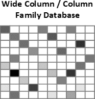

DM heterogeneity

# Basic solutions

* Some DBMSs offer multi-model support
  * Extended RDBMSs
    * KV implementable as a table with two fields: a string key, and a blob value
    * Cypher query language on top of a relational implementation of a graph
    * Hstore data type in PostgreSQL for wide-column-like implementation
    * __Scalabilty__  __ issue remains__
  * Multi-model NoSQL DBMSs
    * ArangoDB, OrientDB
    * __Support all NoSQL data models, but not the relational one__
* Some approaches suggest strategies to model everything within RDBMSs
    * DiScala, M., Abadi, D.J.:  __Automatic generation of normalized relational schemas from nested key-value data__ . In:  _2016 ACM SIGMOD Int. Conf. on Management of Data_ , pp. 295-310. ACM (2016)
    * Tahara, D., Diamond, T., Abadi, D.J.:  __Sinew: a SQL system for multi-structured data__ . In:  _2014 ACM SIGMOD Int. Conf. on Management of Data_ , pp. 815-826. ACM (2014)

DM heterogeneity

# A taxonomy for distributed solutions

* Federated database system
    * __Homogeneous__  data stores, exposes a  __single__  standard query interface
    * Features a mediator-wrapper architecture, employs schema-mapping and entity-merging techniques for integration of relational data
* Polyglot system
    * __Homogeneous__  data stores, exposes  __multiple__  query interfaces
    * Takes advantage of the semantic expressiveness of multiple interfaces (e.g., declarative, procedural)
* Multistore system
    * __Heterogeneous__  data stores, exposes a  __single__  query interface
    * Provides a unified querying layer by adopting ontologies and applying schema-mapping and entity-resolution techniques
* Polystore system
    * __Heterogeneous__  data stores, exposes  __multiple__  query interfaces
    * Choose from a variety of query interfaces to seamlessly query data residing in multiple data stores

R. Tan, R. Chirkova, V. Gadepally and T. G. Mattson, " __Enabling query processing across heterogeneous data models: A survey,__ "  _2017 IEEE International Conference on Big Data (Big Data)_ , 2017, pp. 3211-3220.

DM heterogeneity

# Advanced solutions

* The challenge is to balance two often conflicting forces.
  * __Location Independence__ : A query is written and the system figures out which storage engine it targets
  * __Semantic Completeness__ : A query can exploit the full set of features provided by a storage engine
* Example of a polystore
  * Island = a middleware application to support a set of operations on a given data model
  * Shim = a wrapper to convert from the island's query language to the target DB's query language

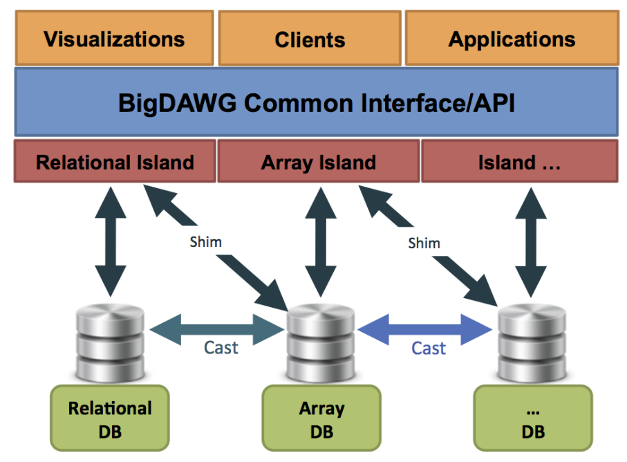

Vijay Gadepally, Kyle O'Brien, Adam Dziedzic, Aaron J. Elmore, Jeremy Kepner, Samuel Madden, Tim Mattson, Jennie Rogers, Zuohao She, Michael Stonebraker: Version 0.1 of the BigDAWG Polystore System. CoRR abs/1707.00721 (2017)

DM heterogeneity

* BigDAWG middleware consists of
  * __Optimizer__ : parses the input query and creates a set of viable query plan trees with possible engines for each subquery
  * __Monitor__ : uses performance data from prior queries to determine the query plan tree with the best engine for each subquery
  * __Executor__ : figures out how to best join the collections and then executes the query
  * __Migrator__ : moves data from engine to engine when the plan calls for such data motion
* … and of course we have metadata
  * __Catalog__ : stores metadata about the system
    * Databases: Databases, their engine membership, and connection authentication information.
    * Objects: Data objects (i.e., tables), field-names, and object-to-database membership.

Vijay Gadepally, Kyle O'Brien, Adam Dziedzic, Aaron J. Elmore, Jeremy Kepner, Samuel Madden, Tim Mattson, Jennie Rogers, Zuohao She, Michael Stonebraker: Version 0.1 of the BigDAWG Polystore System. CoRR abs/1707.00721 (2017)

DM heterogeneity

* Most notable multistore/polystore proposals
  * BigDAWG
    * Focus on the ability to "move” data from one DB to another to improve query efficiency
      * V. Gadepally et al.  __Version 0.1 of the __  __BigDAWG__  __ __  __Polystore__  __ System__ .  _CoRR_  _ abs/1707.00721 _ (2017)
  * Estocada
    * Focus on taking advantage of possible (consistent) redundancy and previous query results
      * R. Alotaibi et al.  __ESTOCADA: Towards Scalable __  __Polystore__  __ Systems__ .  _Proc. VLDB Endow_ . 13(12): 2949-2952 (2020)
  * Awesome
    * Focus on supporting common analytical functions
      * S. Dasgupta.  __Analytics-driven data ingestion and derivation in the AWESOME __  __polystore__ .  _IEEE _  _BigData_  _ 2016_ : 2555-2564
  * CloudMdsQL
    * Focus on taking advantage of local data store native functionalities
      * B. Kolev et al.  __CloudMdsQL__  __: querying heterogeneous cloud data stores with a common language__  _. Distributed Parallel Databases _ 34(4): 463-503 (2016)

# Beyond data model heterogeneity

* What else is there?
* __Entity resolution__
  * Every approach needs some kind of integrated knowledge
  * Ample research from federated database systems
  * Usually "out-of-scope”
* Management of  __schema heterogeneity __ and  __data inconsistency__
  * Usually addressed as different problems in the literature

# Schema heterogeneity

* Heterogeneous data stored with variant schemata and structural forms
  * Missing/additional attributes
  * Different names/types of attributes
  * Different nested structures
* Two main problems
  * Understand the data
  * Query the data

Schema heterogeneity

# Understanding the data

* Early work on XML
  * To deal with the widespread lack of DTDs and XSDs
  * Extract regular expressions to described the content of elements in a set of XML documents
* Recent work on JSON
  * __Concise view__ : a single representation for all schema variations
    * Union of all attributes
      * M. Klettke et al.  __Schema extraction and structural outlier detection for JSON-based NoSQL data stores__ ., in:  _Proc. BTW, volume 2105_ , 2015, pp. 425-444.
    * A  _skeleton _ as the smallest set of core attributes according to a frequency-based formula
      * L. Wang et al.  __Schema management for document stores__ ,  _Proc. VLDB Endowment _ 8 (2015) 922-933.
  * __Comprehensive view__ : multiple representations (a different schema for every document)
      * D. S. Ruiz, et al __. Inferring versioned schemas from NoSQL databases and its applications__ , in:  _Proc. ER_ ,  _2015_ , pp. 467-480.
  * __Schema profile__ :  _explain why _ there are different schemas
      * E. Gallinucci et al.  __Schema profiling of document-oriented databases__ .  _Inf. Syst_ . 75: 13-25 (2018)

Schema heterogeneity

# Schema profiling

* Schema profiles explain
  * What are the differences between schemas
  * When/why is one schema used instead of the other
* The problem of schema profiling is quite similar to a classification problem
  * Classifiers are also used to describe the rules for assigning a class to an observation based on the other observation features
  * Based on the requirements collected from potential users,  __decision trees __ emerged as the most adequate

| **SchemaID** | User | Activity | Weight | Duration | Repetitions |
| :-: | :-: | :-: | :-: | :-: | :-: |
| **S1** | Jack | Run |  | 108 |  |
| **S2** | John | Leg press | 80 | 4 | 23 |
| **S1** | Kate | Walk |  | 42 |  |
| **S3** | John | Push-ups |  | 8 | 40 |

Documents / Observations

Schema heterogeneity

The  __documents__  are the  **observations**

The  __schema__  are the  **classes**

Schema heterogeneity

Value-based condition

Schema heterogeneity

Schema-based condition

Value-based condition

‘CardioOn': false

Schema heterogeneity

Schema-based condition

Value-based condition

Schema heterogeneity

# Preliminary activities

* Semi-structured interviews with 5 users
  * Application domains: fitness equipment sales, software development
  * Understand goals, requirements, visualization format
  * Not one complete/correct dataset description
* Definition of schema profile characteristics
  * Explicativeness
  * Precision
  * Conciseness

Schema heterogeneity

# Explicativeness

* Value-based (VB) conditions are preferred to schema-based (SB) ones
  * SB:  __acknowledge__  a difference between schemata
  * VB:  __explain__  it in terms of the values taken by an attribute
* The less SB conditions, the more explicativeness

Schema heterogeneity

# Precision

* A decision tree is precise if all the leaves are pure
  * A leaf is  __pure__  if all its observations belong to the  __same class__
  * Leaf vj is pure if  _entropy(_  _v_  _j_  _) = 0_
* __Entropy __ is strictly related to  __precision__
  * Divisive approaches typically stop only when the leaves are all pure

probability of schema  _s_  within leaf  _v_  _j_

Schema heterogeneity

# Precision and conciseness

* __Minimization of entropy __ often leads to  __splitting observations __ of the same class __ among several leaves__
  * Entropy's sole focus is on node purity
  * More frequent when the number of classes is high
* Typically, precision is more important than readability
* In schema profiling, this is a critical problem
  * __It conflicts with the conciseness requirement__
#

In generic classification problems

Schema heterogeneity

# Conciseness

* A maximally concise schema profile is one where there is  __a single rule for each schema__
* **__Schema entropy__** : inverts the original definition of entropy, relating it to the  __purity of the schemata __ instead of the purity of the leaves
  * Entropy: __a leaf is pure__  if it contains only documents with the  __same class__
  * Schema entropy:  __a schema is pure __ if all its documents are in the  __same leaf__

#

In generic classification problems

Schema heterogeneity

* A maximally concise schema profile is one where there is  __a single rule for each schema__
* **__Schema entropy__** : inverts the original definition of entropy, relating it to the  __purity of the schemata __ instead of the purity of the leaves
  * Entropy: __a leaf is pure__  if it contains only documents with the  __same class__
  * Schema entropy:  __a schema is pure __ if all its documents are in the  __same leaf__
#

In generic classification problems

Schema heterogeneity

# Schema profiling example

|  | **4** |
| :-: | :-: | :-: | :-: | :-: | :-: | :-: | :-: |
| **** |
| **** |
| **** |
| **** | 10 |

__Starting situation__

E = 1,85 (maximum)

SE = 0 (minimum)

__Best outcome__

E   = 0

SE = 0

|  | **__3__** |
| :-: | :-: | :-: | :-: | :-: | :-: | :-: | :-: |
| **__ __** |
| **__ __** |
| **__20__** |
| **__4__** | __4__ | __3__ | __3__ |

E   = 0,46

SE = 0,16

E = 1,38

SE = 0

Schema heterogeneity

# Schema profiling algorithm

Introduced the notion of  _schema entropy loss_

Defined a criterion for comparing two splits in the decision tree

Schema heterogeneity

# Querying the data

* One thing is understanding the data, another thing is enabling querying over heterogeneous data
* What we need
  * Integration techniques to solve schema heterogeneity and produce a global knowledge
  * Query rewriting techniques to translate queries on the global knowledge to queries on the actual schemas
* (Focus on OLAP queries)

Schema heterogeneity

# Integration techniques

* Integration at the intensional level
  * Schema matching and mapping
    * A match is a correspondence between attributes
    * A mapping is a function to explain the relationship between attributes
      * E.g., S1.FullName = CONCAT(S2.FirstName, S2.LastName)
* Integration at the extensional level
  * Entity resolution (a.k.a. record linkage or duplicate detection)
    * Identifying (or linking, or grouping) different records referring to the same real-world entity
    * Aims at removing redundancy and increasing conciseness
  * Data fusion
    * Fuse records on the same real-world entity into a single record and resolve possible conflicts
    * Aims at increasing correctness of data

E. Rahm, P.A. Bernstein,  __A survey of approaches to automatic schema matching__ ,  _VLDB J._  10 (4) (2001)

Mandreoli, F., & Montangero, M. (2019).  __Dealing__  __ with data __  __heterogeneity__  __ in a data fusion __  __perspective__  __: __  __models__  __, __  __methodologies__  __, and __  __algorithms__ . In  _Data Handling in Science and Technology_  (Vol. 31, pp. 235-270). Elsevier.

Schema heterogeneity

# OLAP querying

A first approach to OLAP on heterogeneous data

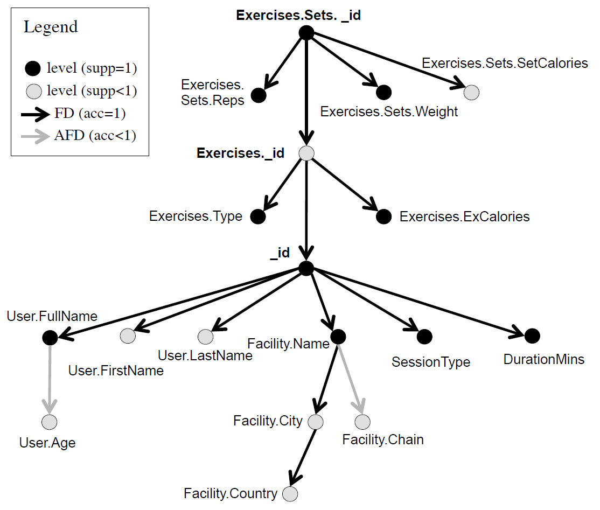

Gallinucci, E., Golfarelli, M., & Rizzi, S. (2019).  __Approximate OLAP of document-oriented databases: A variety-aware approach__  _. Information Systems_ , 85, 114-130.

Schema heterogeneity

* Some limitations
  * Expensive querying
    * Does not scale well with the number of schemas
  * Expensive integration
    * High levels of heterogeneity imply complex rewriting rules (requiring knowledge and time)
    * Assuming to be  _always _ able to obtain a global schema is a bit pretentious

Schema heterogeneity

* Some limitations
  * Expensive querying
    * Does not scale well with the number of schemas
  * Expensive integration
    * High levels of heterogeneity imply complex rewriting rules (requiring knowledge and time)
    * Assuming to be  _always _ able to obtain a global schema is a bit pretentious
      * _"One does not simply define a global schema”_

Schema heterogeneity

# New integration techniques

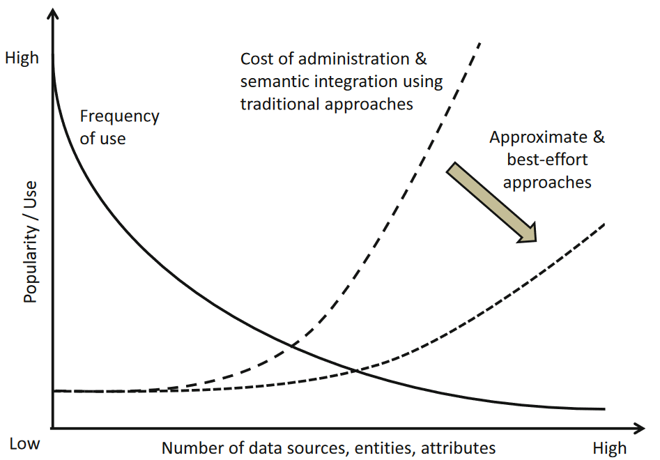

Curry, E. (2020). Dataspaces: Fundamentals, Principles, and Techniques.  _Real-time Linked Dataspaces: Enabling Data Ecosystems for Intelligent Systems_ , 45-62.

Schema heterogeneity

* Replace the global schema with a  _dataspace_
  * A dataspace is a lightweight integration approach providing basic query expressive power on a variety of data sources, bypassing the complexity of traditional integration approaches and possibly returning best-effort or approximate answers
    * Franklin, M., Halevy, A., & Maier, D. (2005).  __From databases to dataspaces: a new abstraction for information management__ .  _ACM _  _Sigmod_  _ Record_ ,  _34_ (4), 27-33.
* Replace traditional integration with a  _pay-as-you-go_  approach
  * The system incrementally understands and integrates the data over time by asking users to confirm matches as the system runs
    * Jeffery, S. R., Franklin, M. J., & Halevy, A. Y. (2008, June).  __Pay-as-you-go user feedback for dataspace systems__ . In  _Proceedings of the 2008 ACM SIGMOD international conference on Management of data _ (pp. 847-860).

Curry, E. (2020). Dataspaces: Fundamentals, Principles, and Techniques.  _Real-time Linked Dataspaces: Enabling Data Ecosystems for Intelligent Systems_ , 45-62.

Schema heterogeneity

* Introducing new concepts
  * Entities: representation of a real-world entity
    * E.g., customers, products, orders, etc.
  * Features: univocal representation of a group of semantically equivalent attributes
    * E.g., CustomerName = { S1.name, S2.fullname, S3.customer, S4.cName, … }
    * Mapping functions must be defined/definable between every couple
* The dataspace becomes an abstract view in terms of features and entities

Schema heterogeneity

# New OLAP querying

What it looks like

Forresi, C., Gallinucci, E., Golfarelli, M., & Hamadou, H. B. (2021).  __A __  __dataspace-based__  __ __  __framework__  __ for OLAP __  __analyses__  __ in a high-__  __variety__  __ __  __multistore__ .  _The VLDB Journal_ ,  _30_ (6), 1017-1040.

Schema heterogeneity

* Previous issues
  * Expensive querying
    * Schema heterogeneity solved at query time
    * Requires complex - but feasible - algorithms
  * Expensive integration
    * Pay-as-you-go approach is quicker, iterative, and more flexible
    * Dataspace is conceptual, untied to logical data modeling
* Now we have a multistore dealing with multipledata models and schema heterogeneity

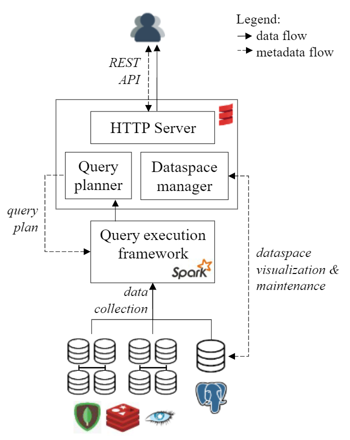

Forresi, C., Gallinucci, E., Golfarelli, M., & Hamadou, H. B. (2021).  __A __  __dataspace-based__  __ __  __framework__  __ for OLAP __  __analyses__  __ in a high-__  __variety__  __ __  __multistore__ .  _The VLDB Journal_ ,  _30_ (6), 1017-1040.

# Data inconsistency

* Intra-collection
  * Due to denormalized data modeling
* Inter-collection
  * Due to analytical data offloading
    * To reduce costs and optimize performance, the historical depth of databases is kept limited
    * After some years, data are offloaded to cheaper/bigger storages, e.g., cloud storages, data lakes
    * Offloading implies a change of data model, a change of schema, and obviously an overlapping of instances with the original data
  * Due to multi-cloud architectures
    * Enables the exploitation of data spread across different providers and architectures, all the while overcoming data silos through data virtualization
    * Typical in presence of many company branches
* Solutions?
  * Traditional ETL
  * Solve inconsistencies on-the-fly

Data inconsistency

# Data fusion

* Merge operator
  * Originally introduced as "full outer join merge”
    * Naumann, F., Freytag, J. C., & Leser, U. (2004).  __Completeness of integrated information sources__ .  _Information Systems_ ,  _29_ (7), 583-615.
  * Aims to keep as much information as possible when joining the records of two schemas
    * Avoid any loss of records
    * Resolve mappings by providing transcoded output
    * Resolving conflicts whenever necessary

Data inconsistency

* Merge operator
  * Originally introduced as "full outer join merge”
    * Naumann, F., Freytag, J. C., & Leser, U. (2004).  __Completeness of integrated information sources__ .  _Information Systems_ ,  _29_ (7), 583-615.
  * Aims to keep as much information as possible when joining the records of two schemas
    * Avoid any loss of records
    * Resolve mappings by providing transcoded output
    * Resolving conflicts whenever necessary

_Schema _

_matching_

Data inconsistency

Data inconsistency

# On-the-fly data fusion

* Merge operator in a query plan
  * Take the data from heterogeneoussources (in different colors)
  * Extract records of the single entites(e.g., customer, products)
  * Merge each entity
  * Join and produce the final result
* Now we have a multistore dealing with multiple data models,schema heterogeneity, and datainconsistency
  * Are we done? Not yet!

* Main issue: performance
  * Collections accessed more than once
  * Most effort pulled to the middleware
* What can we do about it?
  * Exploit more the local DBMSs
  * Exploit local data modelling
  * Carry out multi-entity merges
* Issues
  * Several query plans could be devised
  * Hard to find the most efficient one

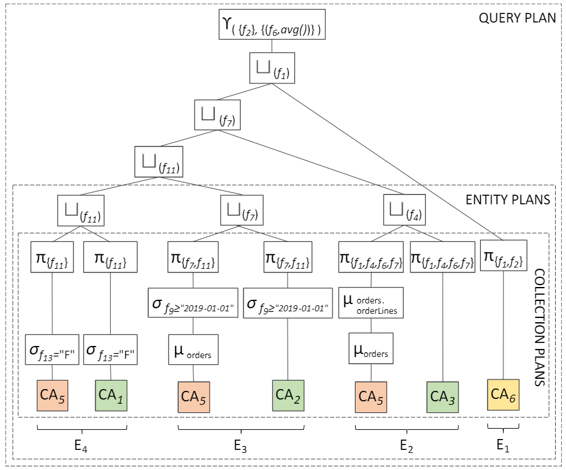

Query optimization

# Logical optimization

* Logical rules to transform a query plan into a more efficent one
  * Predicate push-down: applying selection predicates as close to the source as possible
    * Not always feasible (e.g., in presence of inconsistent data)
  * Column pruning: extracting the only attributes relevant for the query
    * Not for granted when writing a custom query language
  * Join sequence reordering: changing the order to do binary joins
    * Not so easy when merges are involved as well
    * Not so easy when data comes from different sources

Query optimization

# Same query, several query plans

Consistent representation of customers, orders, and orderlines

* What is the most efficient solution?
  * Single-entity merge and subsequent joins
  * Nest relational data and multi-merge with documents
  * Join relational data and multi-merge with flattened documents
* Depends on several factors
  * On the capabilities of each DBMS/middleware
  * On the presence of indexes and statistics
  * On the resources available to each DBMS/middleware
  * On the number of records involved on each side
* … which can change over time

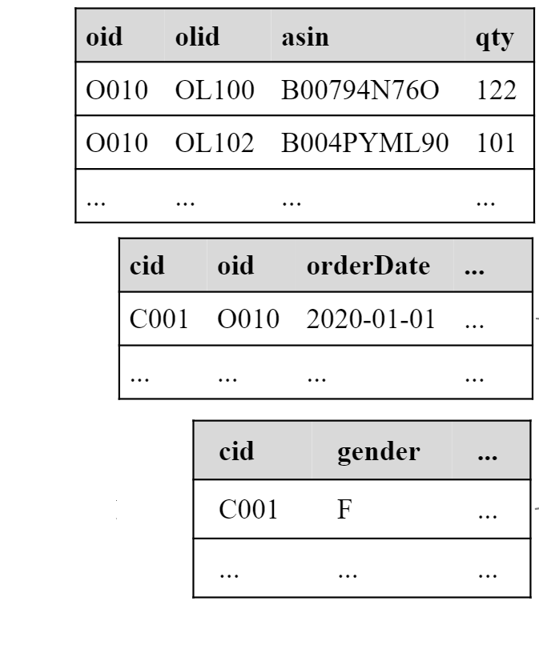

Query optimization

# Cost modelling

* Cost-based evaluation of different plans
  * White-box cost modelling
    * Associate theoretical formulas to each query operators, then build up the cost of a query by summing the cost of each operation
    * Cost can be determined in terms of disk I/O, CPU, network
    * Requires an enormous effort to effectively model the many factors that contribute to query costs in a complex and heterogeneous environment like a multistore
  * Black-box cost modelling
    * Hide the behavior of an execution engine within a black-box, where the known information is mostly limited to the issued queries and the given response times
    * Cost is determined in terms of time
    * Easily adapts to evolving environments
    * Suffers from cold-start

Query optimization

White-box cost modellingexample

Forresi, C., Francia, M., Gallinucci, E., & Golfarelli, M. (2021). Optimizing execution plans in a multistore. In Advances in Databases and Information Systems: 25th European Conference, ADBIS 2021.

Query optimization

Black-box cost modellingexample

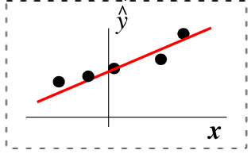

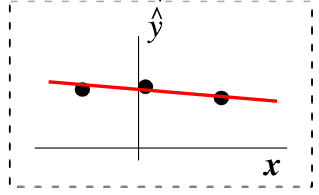

Forresi, C., Francia, M., Gallinucci, E., & Golfarelli, M. (2022). Cost-based Optimization of Multistore Query Plans. Information Systems Frontiers, 1-27.

# Smart Data Platform Management

Challenges and Applications

# Data platform

* We have services
  * To transform data
  * To support the transformation
* The (DIKW) pyramid abstracts many techniques and algorithms
  * Standardization
  * Integration
  * Orchestration
  * Accessibility through APIs

**Supporting services**

**Serve (deciding/consume)**

**BI tools (e.g., Tableau)**

**Analytics (analyzing/process)**

**Networking, etc.**

**Machine learning**

**Ingestion (acquiring/collect)**

# Data platform: related job positions

* **Data platform engineer**
  * Orchestrate the successful implementation of cloud technologies within the data infrastructure of their business
  * Solid understanding of impact database types and implementation
  * Responsible for purchasing decisions for cloud services and approval of data architectures
* **Data architect**
  * Team members who understand all aspects of a data platform's architecture
  * Work closely with the data platform engineers to create data workflows
  * Responsible for designing and testing new database architectures and planning both data and architecture migrations
* **Data pipeline engineer**
  * Responsible for planning, architecting, and building large-scale data processing systems
* **Data analyst**
  * Analyze data systems, creating automated systems for retrieving data from the data platform
  * Cloud data analysts are more commonly members of the business user population
* **Data scientist**
  * Analyze and interpret complex digital data
  * Work with new technologies (e.g., machine learning) to deepen the business' understanding and gain new insights

# From DevOps…

__DevOps__  combines development and operations to increase the efficiency, speed, and security of software development and delivery compared to traditional processes.

DevOps practices enable software development (dev) and operations (ops) teams to accelerate delivery through automation, collaboration, fast feedback, and iterative improvement

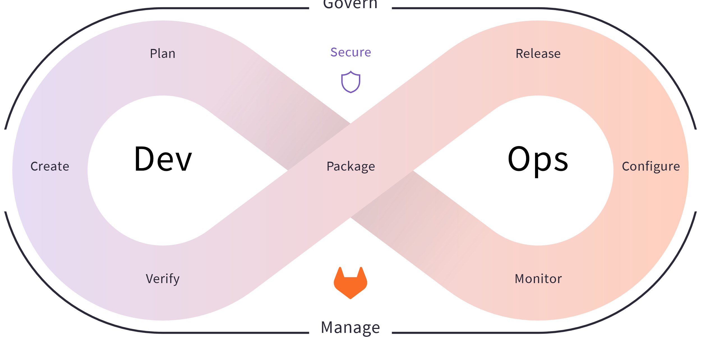

[https://about.gitlab.com/topics/devops/](https://about.gitlab.com/topics/devops/) (accessed 2023-06-03)

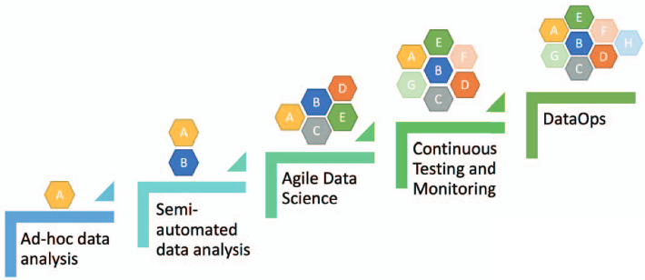

# … to DataOps

__DataOps__  refers to a general process aimed to shorten the end-to-end data analytic life-cycle time by introducing automation in the data collection, validation, and verification process

Munappy, A. R., Mattos, D. I., Bosch, J., Olsson, H. H., & Dakkak, A. (2020, June). From ad-hoc data analytics to dataops. In  _Proceedings of the International Conference on Software and System Processes_  (pp. 165-174).

# DataOps

* From DevOps to DataOps
  * _"A collaborative data management practice focused on improving the _  _communication, integration and automation of data flows between _  _data managers and data consumers across an organization”_
  * Data analytics improved in terms of velocity, quality, predictability and scale of software engineering and deployment
* Some key rules
  * Establish progress and performance measurements at every stage
  * Automate as many stages of the data flow as possible
  * Establish governance discipline ( _governance-as-code_ )
  * Design process for growth and extensibility

Gartner, 2020 [https://www.gartner.com/smarterwithgartner/how-dataops-amplifies-data-and-analytics-business-value](https://www.gartner.com/smarterwithgartner/how-dataops-amplifies-data-and-analytics-business-value)Andy Palmer, 2015 [https://www.tamr.com/blog/from-devops-to-dataops-by-andy-palmer/](https://www.tamr.com/blog/from-devops-to-dataops-by-andy-palmer/) William Vorhies, 2017 [https://www.datasciencecentral.com/profiles/blogs/dataops-it-s-a-secret](https://www.datasciencecentral.com/profiles/blogs/dataops-it-s-a-secret)

# Data fabric

* "vision for data management […] that seamlessly connects different clouds, whether they are private, public, or hybrid environments.” (2016)
* Frictionless access and sharing of data in a distributed data environment
  * Enables a  __single and consistent data management framework__ , which allows seamless data access and processing by design across otherwise siloed storage
  * Leverages  __human and machine capabilities to access data __ in place or support its consolidation where appropriate
  * __Continuously identifies and connects data __ from disparate applications to discover unique, business-relevant relationships between the available data points
* It is a unified architecture with an integrated set of technologies and services
  * Designed to deliver integrated and enriched data – at the right time, in the right method, and to the right data consumer – in support of both operational and analytical workloads
  * Combines key data management technologies – such as  __data catalog__ ,  __data governance__ ,  __data integration__ ,  __data pipelining__ , and  __data orchestration__

[https://cloud.netapp.com/hubfs/Data-Fabric/Data%20Fabric%20WP%20April%202017.pdf](https://cloud.netapp.com/hubfs/Data-Fabric/Data%20Fabric%20WP%20April%202017.pdf) (accessed 2023-06-23)Gartner, 2019 [https://www.gartner.com/en/newsroom/press-releases/2019-02-18-gartner-identifies-top-10-data-and-analytics-technolo](https://www.gartner.com/en/newsroom/press-releases/2019-02-18-gartner-identifies-top-10-data-and-analytics-technolo) Gartner, 2021 [https://www.gartner.com/smarterwithgartner/data-fabric-architecture-is-key-to-modernizing-data-management-and-integration](https://www.gartner.com/smarterwithgartner/data-fabric-architecture-is-key-to-modernizing-data-management-and-integration) K2View Whitepaper: What is a Data Fabric? The Complete Guide, 2021

# Data Fabric

  * __Catalog all your data__ : including business glossary and design-time and runtime metadata
  * __Enable self-service capabilities__ : data discovery, profiling, exploration, quality assessment, consumption of data-as-a-product
  * __Provide a knowledge graph__ : Visualizing how data, people, processes, systems, etc. are interconnected, deriving additional actionable insight
  * __Provide intelligent (smart) information integration__ : Supporting IT staff and business users alike in their data integration and transformation, data virtualization, and federation tasks
  * __Derive insight from metadata__ : Orchestrating and automating tasks and jobs for data integration, data engineering, and data governance end to end
  * __Enforce local and global data rules/policies__ : Including AI/ML-based automated generation, adjustments, and enforcement of rules and policies
  * __Manage an end-to-end unified lifecycle__ : Implementing a coherent and consistent lifecycle end to end of all Data Fabric tasks across various platforms, personas, and organizations
  * __Enforce data and AI governance__ : Broadening the scope of traditional data governance to include AI artefacts, for example, AI models, pipelines

Is this brand new?

# Data fabric

* __It is a design concept__
  * It optimizes data management by automating repetitive tasks
  * According to Gartner estimates, 25% of data management vendors will provide a complete framework for data fabric by 2024 – up from 5% today

Gartner, 2021 [https://www.gartner.com/smarterwithgartner/data-fabric-architecture-is-key-to-modernizing-data-management-and-integration](https://www.gartner.com/smarterwithgartner/data-fabric-architecture-is-key-to-modernizing-data-management-and-integration)

K2View, 2021 [https://www.k2view.com/top-data-fabric-vendors](https://www.k2view.com/top-data-fabric-vendors)

#

Top Players 
https://solutionsreview.com/data-management/the-best-data-fabric-tools-and-software/ 
https://em360tech.com/top-10/data-modelling-fabric 
Predictions
https://live-datastaxd8.pantheonsite.io/sites/default/files/2021-02/Predicts_2021_Data__735776_ndx.pdf

[https://www.irion-edm.com/data-management-insights/gartner-data-summit-irion-representative-vendor-for-data-fabric-technology/](https://www.irion-edm.com/data-management-insights/gartner-data-summit-irion-representative-vendor-for-data-fabric-technology/)

Gartner, 2021 [https://www.gartner.com/smarterwithgartner/data-fabric-architecture-is-key-to-modernizing-data-management-and-integration](https://www.gartner.com/smarterwithgartner/data-fabric-architecture-is-key-to-modernizing-data-management-and-integration)

# Data mesh

* Distributed data architecture, under centralized governance and standardization for interoperability, enabled by a shared and harmonized self-serve data infrastructure
  * Domain-oriented decentralized data ownership
    * Decentralization and distribution of responsibility to people who are closest to the data, in order to support continuous change and scalability
    * Each domain exposes its own op/analytical APIs
  * __Data as a product __ ( _quantum_ )
    * Products must be discoverable, addressable, trustworthy, self-describing, secure
  * Self-serve data infrastructure as a platform
    * High-level abstraction of infrastructure to provision and manage the lifecycle of data products
  * Federated computational governance
    * A governance model that embraces decentralization and domain self-sovereignty, interoperability through global standardization, a dynamic topology, automated execution of decisions by the platform

Zhamak Dehghani, 2019 [https://martinfowler.com/articles/data-monolith-to-mesh.html](https://martinfowler.com/articles/data-monolith-to-mesh.html)Zhamak Dehghani, 2020 [https://martinfowler.com/articles/data-mesh-principles.html](https://martinfowler.com/articles/data-mesh-principles.html)

#

https://www.youtube.com/watch?v=_bmYXWCxF_Q

* Data Mesh organizes data around  __business domain owners __ and transforms relevant data assets (data sources) to  __data products__  that can be consumed by distributed business users from various business domains or functions
  * Data products are created, governed, and used in an  __autonomous, decentralized__ , and self-service manner
  * __Self-service capabilities__ , which we have already referenced as a Data Fabric capability, enable business organizations to entertain a data marketplace with shopping-for-data characteristics

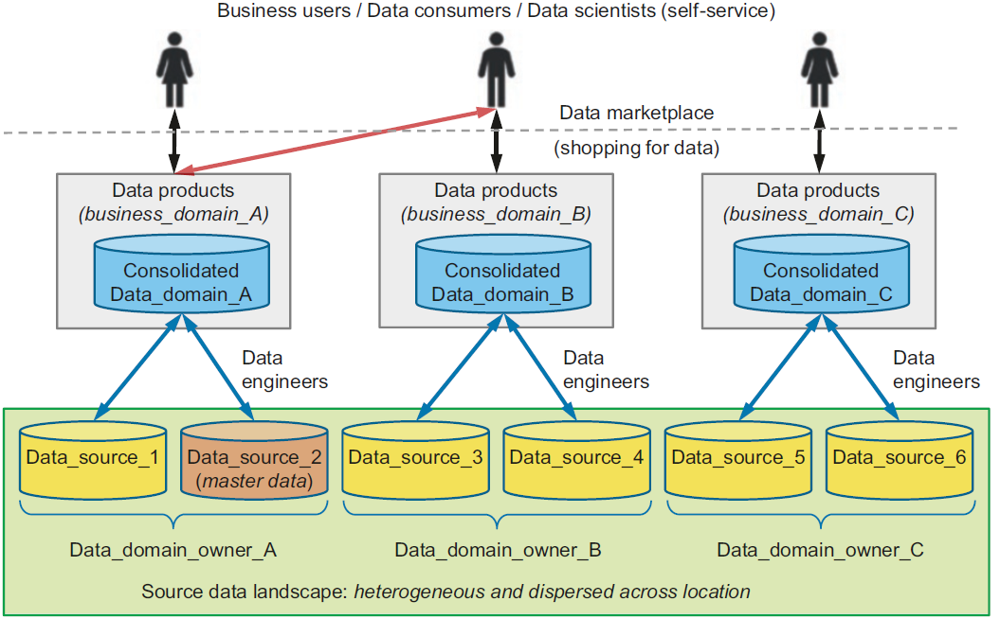

# What makes data a product?

* A  __data product __ is raw data transformed into a business context
  * Data products are registered in  __knowledge catalog __ through specifications (XML, JSON, etc.)
  * Main features
    * __Data product description__ : The data product needs to be well described
    * __Access methods__ : for example, REST APIs, SQL, NoSQL, etc., and where to find the data asset
    * __Policies and rules__ : who is allowed to consume the data product for what purpose
    * __SLAs__ : agreements regarding the data product availability, performance characteristics, functions, cost of data product usage
    * __Defined format__ : A data product needs to be described using a defined format
    * __Cataloged__ : All data products need to be registered in the knowledge catalog. Data products need to be searchable and discoverable by potential data product consumers and business user
  * Data products themselves are not stored in the knowledge catalog

# Data mesh vs data fabric

* They are design concepts, not things
  * They are not mutually exclusive
  * They are architectural frameworks, not architectures
    * The frameworks must be adapted and customized to your needs, data, processes, and terminology
    * Gartner estimates 25% of data management vendors will provide a complete data fabric solution by 2024 – up from 5% today

Alex Woodie, 2021 [https://www.datanami.com/2021/10/25/data-mesh-vs-data-fabric-understanding-the-differences/](https://www.datanami.com/2021/10/25/data-mesh-vs-data-fabric-understanding-the-differences/) Dave Wells, 2021 [https://www.eckerson.com/articles/data-architecture-complex-vs-complicated](https://www.eckerson.com/articles/data-architecture-complex-vs-complicated)

* Both provide an architectural framework to access data across multiple technologies and platforms
  * __Data fabric__
    * Attempts to centralize and coordinate data management
    * Tackles the complexity of data and metadata in a smart way that works well together
    * Focus on the architectural, technical capabilities, and intelligent analysis to produce active metadata supporting a smarter, AI-infused system to orchestrate various data integration styles
  * __Data mesh__
    * Emphasis on decentralization and data domain autonomy
    * Focuses on organizational change; it is more about people and process
    * Data are primarily organized around domain owners who create business-focused data products, which can be aggregated and consumed across distributed consumers

Alex Woodie, 2021 [https://www.datanami.com/2021/10/25/data-mesh-vs-data-fabric-understanding-the-differences/](https://www.datanami.com/2021/10/25/data-mesh-vs-data-fabric-understanding-the-differences/) Dave Wells, 2021 [https://www.eckerson.com/articles/data-architecture-complex-vs-complicated](https://www.eckerson.com/articles/data-architecture-complex-vs-complicated)

* Data Fabric and Mesh are the results from the data architecture evolution
  * __Many capabilities were in existence already long before__  the terms were coined
* Take away:
  * Abstract the "building blocks” of such platforms
  * Let them evolve according to scalability and flexibility requirements

# (Some) References

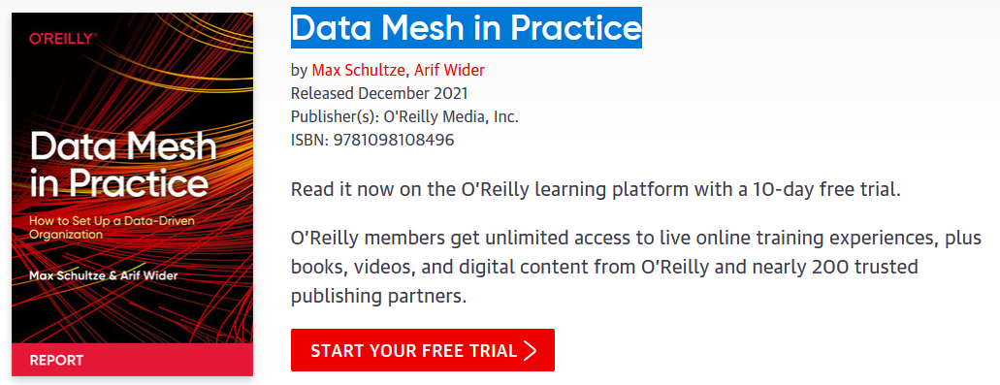

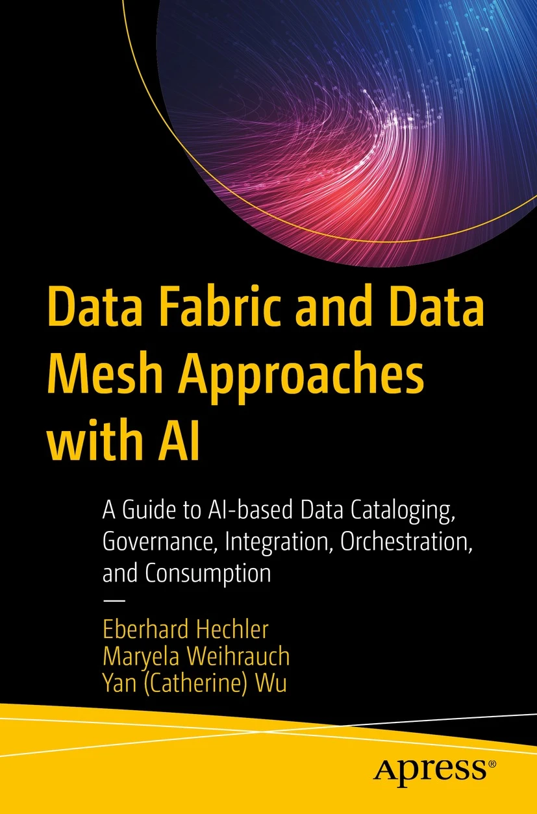

# Metadata Challenges

  * Lacking smart support to govern the complexity of data and transformations
  * Data transformations must be governed to prevent DP turning into a swamp
    * Amplified in data science, with data scientists prevailing data architects
    * Leverage descriptive metadata and maintenance to keep control over data

* Knowledge representation
  * Which metadata must be captured
  * How should metadata be organized
* Knowledge exploitation
  * Which features do metadata enable

Knowledge representation

# Knowledge representation

* A classification of metadata
  * __Technical__  metadata
    * Capture the form and structure of each dataset
    * E.g.: type of data (text, JSON, Avro); structure of the data (the fields and their types)
  * __Operational__  metadata
    * Capture lineage, quality, profile, and provenance of the data
    * E.g.: source and target locations of data, size, number of records, and lineage
  * __Business__  metadata
    * Captures what it all means to the user
    * E.g.: business names, descriptions, tags, quality, and masking rules for privacy

A. LaPlante, B. Sharma,  __Architecting Data Lakes__ ,  _O'Reilly Media_ , Sebastopol, 2018.

Knowledge representation

* Another classification of metadata
  * __Intra-object __ metadata
    * _Properties_  provide a general description of an object in the form of key-value pairs
    * _Summaries and previews _ provide an overview of the content or structure of an object
    * _Semantic metadata_  are annotations that help understand the meaning of data
  * __Inter-object__  metadata
    * _Objects groupings_  organize objects into collections, each object being able to belong simultaneously to several collections
    * _Similarity links _ reflect the strength of the similarity between two objects
    * _Parenthood relationships _ reflect the fact that an object can be the result of joining several others
  * __Global__  metadata
    * _Semantic resources_ , i.e., knowledge bases (ontologies, taxonomies, thesauri, dictionaries) used to generate other metadata and improve analyses
    * _Indexes_ , i.e., data structures that help find an object quickly
    * _Logs_ , used to track user interactions with the data lake

Sawadogo, P. N., Scholly, E., Favre, C., Ferey, E., Loudcher, S., & Darmont, J. (2019, September).  __Metadata systems for data lakes: models and features__ . In _ European conference on advances in databases and information systems _ (pp. 440-451). Springer, Cham.

Sawadogo, P. N., Scholly, E., Favre, C., Ferey, E., Loudcher, S., & Darmont, J. (2019, September).  __Metadata systems for data lakes: models and features__ . In  _European conference on advances in databases and information systems_  (pp. 440-451). Springer, Cham.

Knowledge representation

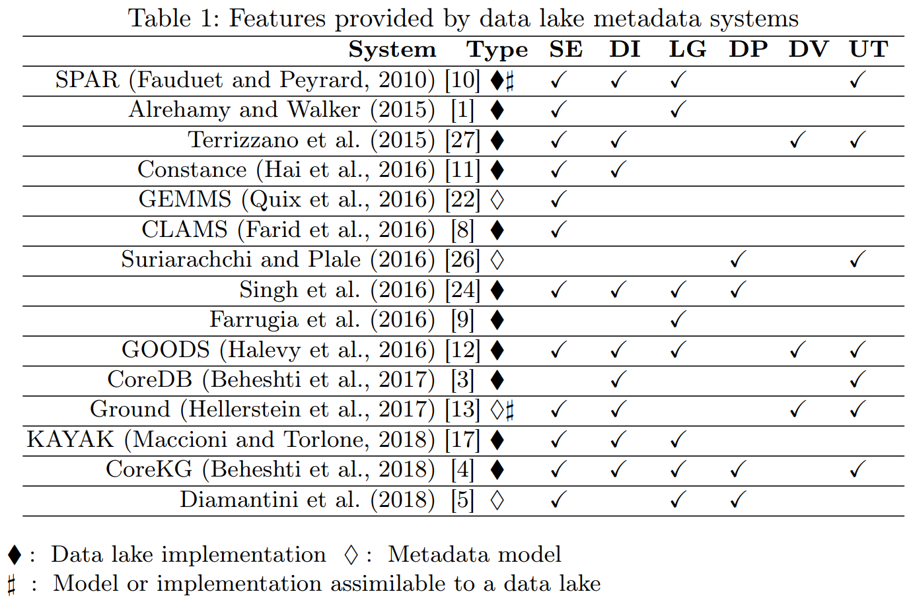

Few details given on metamodel and functionalities.

No metadata collected on operations.

Hai, R., Geisler, S., & Quix, C. (2016, June).  __Constance: An intelligent data lake system__ . In  _Proceedings of the 2016 international conference on management of data_  (pp. 2097-2100).

Knowledge representation

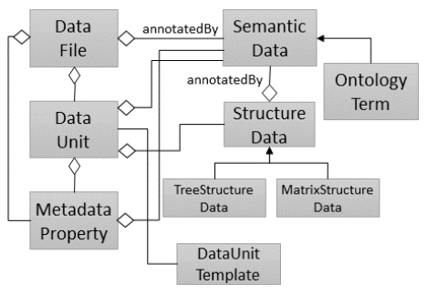

No discussion about the functionalities provided.

No metadata collected on operations and agents.

Quix, C., Hai, R., & Vatov, I. (2016).  __GEMMS: A Generic and Extensible Metadata Management System for Data Lakes__ . In  _CAiSE_  _ forum_  (Vol. 129).

Knowledge representation

Crawls Google's storage systems to extract basic metadata on datasets and their relationship with other datasets.

Performs metadata inference, e.g., to determine the schema of a non-self-describing dataset, to trace the provenance of data through a sequence of processing services, or to annotate data with their semantics.

Strictly coupled with the Google platform.

Mainly focuses on object description and searches.

No formal description of the metamodel.

Halevy, A. Y., Korn, F., Noy, N. F., Olston, C., Polyzotis, N., Roy, S., & Whang, S. E. (2016).  __Managing Google's data lake: an overview of the Goods system__ .  _IEEE Data Eng. Bull._ ,  _39_ (3), 5-14.

Knowledge representation

Version graphs represent data versions.

Model graphs represent application metadata, i.e., how data are interpreted for use.

Lineage graphs capture usage information.

Not enough details given to clarify which metadata are actually handled.

Functionalities are described at a high level.

Hellerstein, J. M., Sreekanti, V., Gonzalez, J. E., Dalton, J., Dey, A., Nag, S., ... & Sun, E. (2017, January).  __Ground: A Data Context Service__ . In  _CIDR_ .

Knowledge representation

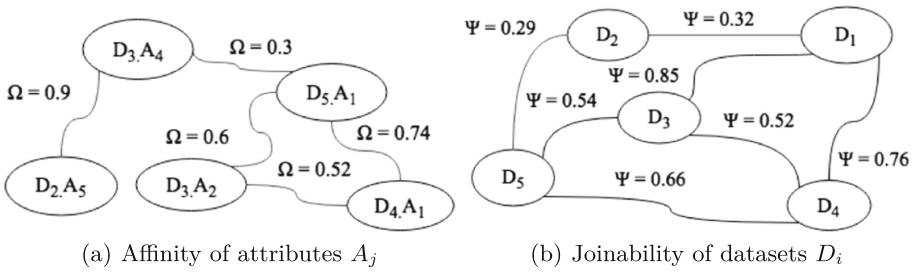

Support users in creating and optimizing the data processing pipelines.

Only goal-related metadata are collected.

Maccioni, A., & Torlone, R. (2018, June).  __KAYAK: a framework for just-in-time data preparation in a data lake__ . In  _International Conference on Advanced Information Systems Engineering_  (pp. 474-489). Springer, Cham.

Knowledge representation

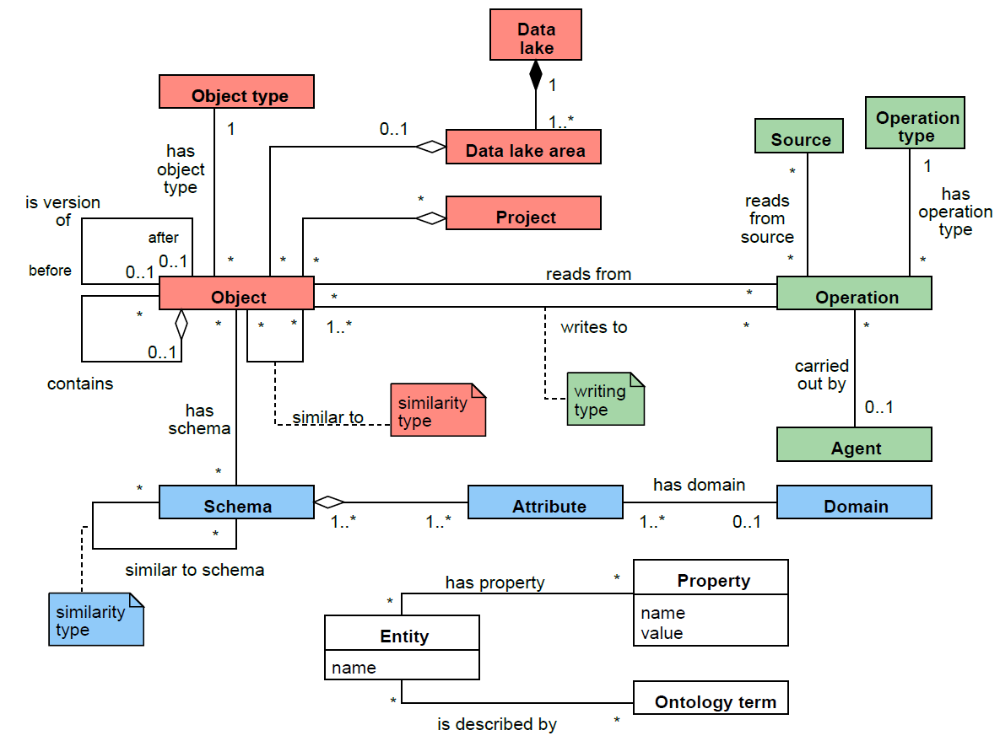

**Technical**

_Operational_

**Business**

Francia, M., Gallinucci, E., Golfarelli, M., Leoni, A. G., Rizzi, S., & Santolini, N. (2021).  __Making data platforms smarter with MOSES__ .  _Future Generation Computer Systems_ , 125, 299-313.

Knowledge representation

Francia, M., Gallinucci, E., Golfarelli, M., Leoni, A. G., Rizzi, S., & Santolini, N. (2021).  __Making data platforms smarter with MOSES__ .  _Future Generation Computer Systems_ , 125, 299-313.

Knowledge representation

Not pre-defined

Domain-independent,

extensible

Francia, M., Gallinucci, E., Golfarelli, M., Leoni, A. G., Rizzi, S., & Santolini, N. (2021).  __Making data platforms smarter with MOSES__ .  _Future Generation Computer Systems_ , 125, 299-313.

Knowledge representation

Tune the trade-off between the level of detail of the functionalities and the required computational effort

Francia, M., Gallinucci, E., Golfarelli, M., Leoni, A. G., Rizzi, S., & Santolini, N. (2021).  __Making data platforms smarter with MOSES__ .  _Future Generation Computer Systems_ , 125, 299-313.

Knowledge representation

Francia, M., Gallinucci, E., Golfarelli, M., Leoni, A. G., Rizzi, S., & Santolini, N. (2021).  __Making data platforms smarter with MOSES__ .  _Future Generation Computer Systems_ , 125, 299-313.

Knowledge representation

Functionalities

Semantic enrichment

Data indexing

Link generation

Data polymorphism

Data versioning

Usage tracking

Francia, M., Gallinucci, E., Golfarelli, M., Leoni, A. G., Rizzi, S., & Santolini, N. (2021).  __Making data platforms smarter with MOSES__ .  _Future Generation Computer Systems_ , 125, 299-313.

Knowledge representation

How would you implement the meta-model?

Knowledge representation

# The Property Graph Data Model

* Born in the database community
  * Meant to be queried and processed
  * _THERE IS NO STANDARD!_
* Two main constructs: nodes and edges
  * Nodes represent entities,
  * Edges relate pairs of nodes, and may represent different types of relationships
* Nodes and edges might be labeled,
* and may have a set of properties represented as attributes (key-value pairs)\*\*\*
* Further assumptions:
  * Edges are directed,
  * Multi-graphs are allowed
* _\*\*\* Note: in _  _some_  _ _  _definitions_  _ (_  _the_  _ _  _least_  _) _  _edges_  _ are _  _not_  _ _  _allowed_  _ to _  _have_  _ _  _attributes_
#

A W3C standard is being developed, but still does not exist.

Knowledge representation

# Formal Definition

Extracted from: R. Angles et al. Foundations of Modern Query Languages for Graph Databases

#

Total function is just another name for a regular function. It just emphasizes the function is defined for all elements of its domain.
Partial function may only apply to a subset of the elements in the domain

Knowledge representation

# Example of Property Graph

Formal definition:

Knowledge representation

# Traversal Navigation

* We define the graph traversal pattern as: "the ability to rapidly traverse structures to an arbitrary depth (e.g., tree structures, cyclic structures) and with an arbitrary path description (e.g. friends that work together, roads below a certain congestion threshold)”  [Marko Rodriguez]
* Totally opposite to set theory (on which relational databases are based on)
  * Sets of elements are operated by means of the relational algebra
#

Let them think of it as follows: fix a set of starting points. Explore the graph from there according to the pattern provided
EXAMPLE:
Let's go back to the movies example. Find the actors that acted together in two or more movies.
PATTERN: (actor)-(movie)-(actor2) AND (actor)-(movie2)-(actor2)

Realize that there are three sources of complexity: 
Number of starting points
2) 

Knowledge representation

# Traversing Data in a RDBMS

In the relational theory, it is equivalent to joining data (schema level) and select data (based on a value)

SELECT \*

FROM user u, user_order uo, orders o, items i

WHERE u.user = uo.user AND uo.orderId = o.orderId AND i.lineItemId = i.LineItemId

AND u.user = ‘Alice'

#

Traversing data = navigating data

Join: Schema level
Traverse: Ocurrence level

Formula de DBD de row index join (el numero d'instancies total importa, encara que poques facin join). En relacional el cost depèn de la profunditat (num joins que he de fer) I també del nombre total de tuples de la taula destí.

# Example of data platform: MOSES

* Example of a data platform (MOSES)
* Functional architecture
  * Components of MOSES are in orange
  * Others are standard components in charge of producing/consuming, processing, storing, and visualizing data
  * The orchestrator (e.g., Oozie) manages (e.g., schedules) the data transformation processes

Metadata Extractor

Metadata Search

Engine

Provenance Manager

Custom components

Process Interfaces

MOSES Interfaces

Other Interfaces

Workflow Administration

Francia, M., Gallinucci, E., Golfarelli, M., Rizzi, S. et al. (2021). Making data platforms smarter with MOSES. Future Generation Computer Systems, 125, 299-313.

Knowledge exploitation

# Capturing the metadata

* Pull strategy
  * The system actively collects new metadata
  * Requires scheduling: when does the system activate itself?
    * Event-based (CRUD)
    * Time-based
  * Requires wrappers: what does the system capture?
    * Based on data type and/or application
    * A comprehensive monitoring is practically unfeasible
* Push strategy
  * The system passively receives new metadata
  * Requires an API layer
  * Mandatory for operational metadata

Knowledge representation

# Knowledge representation

* A classification of functionalities enabled by metadata
  * Semantic enrichment
    * Generating a description of the context of data, e.g., with tags, to make them more interpretable and understandable
  * Data indexing
    * Data structures to retrieve datasets based on specific characteristics (keywords or patterns)
  * Link generation and conservation
    * Detecting similarity relationships or integrating preexisting links between datasets
  * Data polymorphism
    * Storing multiple representations of the same data to avoid repeating pre-processing and speed up analyses
  * Data versioning
    * Support data changes while conserving previous states
  * Usage tracking
    * Records the interactions between users and the data

Sawadogo, P. N., Scholly, E., Favre, C., Ferey, E., Loudcher, S., & Darmont, J. (2019, September).  __Metadata systems for data lakes: models and features.__  In  _European conference on advances in databases and information systems _ (pp. 440-451). Springer, Cham.

# Managing data platforms

  * Data provenance
  * Compression
  * Data profiling
  * Entity resolution
  * Data versioning
  * …

# Data profiling

* Data profiling
  * A broad range of methods to efficiently analyze a given data set
  * E.g., in a  **functional dependencies** and association rules

Naumann, Felix. "Data profiling revisited."  _ACM SIGMOD Record_  42.4 (2014): 40-49.

* Use cases
  * **Query optimization**
    * Performed by DBMS to support query optimization with statistics about tables and columns
    * Profiling results can be used to estimate the selectivity of operators and the cost of a query plan
  * **Data cleansing** (typical use case is profiling data)
    * Prepare a cleansing process by revealing errors (e.g., in formatting), missing values or outliers
  * **Data integration and analytics**
* Challenges?

Naumann, Felix. "Data profiling revisited."  _ACM SIGMOD Record_  42.4 (2014): 40-49.

| a | b | c | d |
| :-: | :-: | :-: | :-: |
| 1 | 1 | 2 | 2 |
| 1 | 2 | 1 | 4 |

* Challenges
  * The results of data profiling are  **computationally complex**  to discover
    * E.g., discovering keys/dependencies usually involves some sorting step for each considered column
  * Verification of  **complex constraints on column combinations** in a database
    * What is the complexity of this task?

Naumann, Felix. "Data profiling revisited."  _ACM SIGMOD Record_  42.4 (2014): 40-49.

Knowledge exploitation

# Object profiling and search

* Discoverability is a key requirement for data platforms
  * Simple searches to let users locate "known” information
  * Data exploration to let users uncover "unknown” information
  * Common goal: identification and description of Objects
* Two levels of querying
  * Metadata level (most important)
  * Data level (can be coupled with the first one)

Knowledge exploitation

* Basic search
  * MATCH (o:Object)-[]-(:Project {name:"ABC"})RETURN o
    * Return all objects of a given project
  * MATCH (o:Object)-[]-(d:DataLakeArea)WHERE d.name = "Landing" AND o.name LIKE "2021_%"AND o.size < 100.000RETURN o
    * Return small objects with a given name pattern in the landing area

#

100000 kb = 100 mb

Knowledge exploitation

* Schema-driven search
  * MATCH (o:Object)-[]-(:Schema)-[]-(a:Attribute),   (a)-[]-(:Domain {name: "FiscalCode"})RETURN o
    * Return objects that contain informationreferring to a given Domain

#

100000 kb = 100 mb

Knowledge exploitation

* Provenance-driven search
  * MATCH (obj1:Object)-[:readsFrom]-(o:Operation)-[:writesTo]-(obj2:Object)CREATE (obj1)-[:ancestorOf]->(obj2)
  * MATCH (:Object {id:123})-[:ancestorOf\*]-(obj:Object)RETURN obj
    * Discover objects obtained from a given ancestor
  * MATCH (obj:Object)-[:ancestorOf\*]-(:Object {id:123})RETURN obj
    * Discover object(s) from which another has originated
  * Example: a ML team wants to use datasets that were publicized as  _canonical _ for certain domains, but they find these datasets being too "groomed” for ML
    * Provenance links can be used to browse upstream and identify the less-groomed datasets that were used to derive the canonical datasets

#

100000 kb = 100 mb

Knowledge exploitation

* Similarity-driven search
  * MATCH (:Object {id:123})-[r:similarTo]-(o:Object)WHERE r.similarityType="affinity"RETURN o
    * Discover datasets to be merged in a certain query
  * MATCH (:Object {id:123})-[r:similarTo]-(o:Object)WHERE r.similarityType="joinability"RETURN o
    * Discover datasets to be joined in a certain query
  * Group similar objects and enrich the search results
    * List the main objects from each group
    * Restrict the search to the objects of a single group

#

100000 kb = 100 mb

Knowledge exploitation

* Semantics-driven search
  * MATCH (o:Object)-[:isDescribedBy]-(:OntologyTerm {uri:"http://..."})RETURN o
  * MATCH (o:Object)-[\*]-(any),   (any)-[:isDescribedBy]-(:OntologyTerm {uri:"http://..."})RETURN o
    * Search objects without having any knowledge of theirphysical or intensional properties, but simply exploitingtheir traceability to a certain semantic concept

#

100000 kb = 100 mb

Knowledge exploitation

* Profiling
  * MATCH (o:Object)-[]-(:OntologyType {name:"Table"}),   (o)-[]-(s:Schema)-[]-(a:Attribute),   (o)-[r:similarTo]-(o2:Object),   (o)-[:ancestorOf]-(o3:Object),   (o4:Object)-[:ancestorOf]-(o)RETURN o, s, a, r, o2, o3, o4
    * Shows an object's properties, list the relationships with other objects in terms of similarity and provenance
    * Compute a representation of the intensional features that mostly characterize a group of objects(see slides on schema heterogeneity)

#

100000 kb = 100 mb

Knowledge exploitation

# Provenance and versioning

* Provenance: metadata pertaining to the history of a data item
  * Any information that describes the production process of an end product
  * Encompasses meta-data about entities, data, processes, activities, and persons involved in the production process
  * Essentially, it describes a transformation pipeline, including the origin of objects and the operations they are subject to

J.Wang, D. Crawl, S. Purawat, M. H. Nguyen, I. Altintas,  __Big data provenance: Challenges, state of the art and opportunities__ , in:  _Proc. _  _BigData_ , Santa Clara, CA, USA, 2015, pp. 2509–2516.

M. Herschel, R. Diestelk¨amper, H. Ben Lahmar,  __A survey on provenance: What for? What form? What from?__ ,  _VLDB J._  26 (6) (2017) 881–906.

#

100000 kb = 100 mb

# Data provenance

* Provenance (also referred to as lineage, pedigree, parentage, genealogy)
  * The description of the origins of data and the process by which it arrived at the database
  * Not only data products (e.g., tables, files), but also the processes that created them
* Use cases
  * Business domain.  _Users traditionally work with an _  **_need to be identified _**  _and corrected to avoid costly errors in business forecasting._
  * Scientific/research domain.  **_copyright_**  _ of data are significant when using third-party data in such a loosely connected network._

Simmhan, Yogesh L., Beth Plale, and Dennis Gannon. "A survey of data provenance techniques."  _Computer Science Department, Indiana University, Bloomington IN_  47405 (2005): 69.

* Astronomers are creating an international Virtual Observatory
  * A  **provision of the computational resources** needed to exploit the data scientifically
  * Astronomy changed from being an individualistic to a  **collective enterprise**
  * Telescope time is devoted/allocated to systematic sky surveys and analysis is performed using data from the archives
  * Astronomers are  **increasingly relying on data that they did not take themselves**
  * Raw data bear  **many instrumental signatures that must be removed** in the process of generating data products

Mann, Bob. "Some data derivation and provenance issues in astronomy."  _Workshop on Data Derivation and Provenance, Chicago_ . 2002.[https://www.esa.int/Science_Exploration/Space_Science/Webb/Webb_inspects_the_heart_of_the_Phantom_Galaxy](https://www.esa.int/Science_Exploration/Space_Science/Webb/Webb_inspects_the_heart_of_the_Phantom_Galaxy) (accessed 2022-08-01)

Simmhan, Yogesh L., Beth Plale, and Dennis Gannon. "A survey of data provenance techniques."  _Computer Science Department, Indiana University, Bloomington IN_  47405 (2005): 69.

* Granularity
  * **Fine-grained**  (instance level): tracking data items (e.g., a tuple in a dataset) transformations
  * **Coarse-grained**  (schema-level): tracking dataset transformations
* Queries
  * **Where**  provenance: given some output, which inputs did the output come from?
  * **How**  provenance: given some output, how were the inputs manipulated?
  * **Why**  provenance: given some output, why was data generated?
    * E.g., in the form of a proof tree that locates source data items contributing to its creation

Simmhan, Yogesh L., Beth Plale, and Dennis Gannon. "A survey of data provenance techniques."  _Computer Science Department, Indiana University, Bloomington IN_  47405 (2005): 69.Ikeda, Robert, and Jennifer Widom.  _Data lineage: A survey_ . Stanford InfoLab, 2009.

Knowledge exploitation

# Provenance and versioning

* An important aspect is the granularity of provenance
  * Fine-grained provenance is typically used for single vertical applications
    * It requires to collect huge amounts of detailed information to enable a very detailed tracing
  * Coarse-grained provenance is appropriate to ensure a broad coverage of highly heterogeneous transformations possibly involving several applications and datasets
* Choosing a granularity is the result of a trade-off between accuracy and computational effort
  * Storing only the name and the version of a clustering algorithm enables an approximate reproducibility of the results
  * Storing all its parameters makes this functionality much more accurate

# Data provenance

* Data provenance, an example of data management
  * Metadata pertaining to the history of a data item
  * Pipeline including the origin of objects and operations they are subjected to
  * We have a standard: [https://www.w3.org/TR/prov-dm/](https://www.w3.org/TR/prov-dm/)

[https://www.w3.org/TR/prov-dm/](https://www.w3.org/TR/prov-dm/)

* **Entity**
  * Physical/conceptual things
* **Activity**
  * Dynamic aspects of the world, such as actions
  * How entities come into existence, often making use of previously existing entities
* **Agent**
  * A person, a piece of software
  * Takes a role in an activity such that the agent can be assigned some degree of responsibility for the activity taking place

[https://www.w3.org/TR/2013/NOTE-prov-primer-20130430/](https://www.w3.org/TR/2013/NOTE-prov-primer-20130430/)

Knowledge exploitation

# Provenance and versioning

* PROV: a standard for provenance modeling
  * Several tools exists for managing PROV metadata
    * [https://openprovenance.org/services/view/translator](https://openprovenance.org/services/view/translator)
    * [https://lucmoreau.github.io/ProvToolbox/](https://lucmoreau.github.io/ProvToolbox/)
    * [https://prov.readthedocs.io/en/latest/](https://prov.readthedocs.io/en/latest/)
  * Compliance with PROV ensures integration with existing tools for querying and visualization

L. Moreau, P. T. Groth,  __Provenance: An Introduction to PROV__ ,  _Synthesis Lectures on the Semantic Web: Theory and Technology_ , Morgan & Claypool Publishers, 2013.

#

https://www.openphactsfoundation.org/wp/wp-content/uploads/2016/05/140609_Cologne_IPAW-2014_Paul-Groth_Provenance.pdf

Knowledge exploitation

* Provenance functionalities (activated by metadata)
  * __Data quality__
    * Monitoring accuracy, precision, and recall of produced objects to notify the data scientist when a transformation pipeline is not behaving as expected
  * __Debugging__
    * Inferring the cause of pipeline failures is challenging and requires an investigation of the overall processing history, including input objects and the environmental settings
  * __Reproducibility__
    * Re-execution of all or part of the operations belonging to a pipeline
  * __Trustworthiness__
    * Help data scientists to trust the objects produced by tracing them back to their sources and storing the agents who operated on those objects
  * __Versioning__
    * Marking a generated object and its versions (e.g., due to changes in a database schema) helps in identifying relevant objects along with their semantic versions, and to operate with legacy objects

Knowledge exploitation

# Graph DB and Centrality Measures

* Measures of centrality
  * __Betweenness centrality (A)__
    * Number of shortest paths between two nodes that pass from a certain node
  * __Closeness centrality (B)__
    * Sum of distances to all other nodes.
  * __Eigenvector centrality (C)__
    * The score of a node is influenced by score of adjacent nodes (Page rank)
  * __Degree centrality (D)__
    * Number of adjacent nodes

Knowledge exploitation

# Provenance and versioning

* Some current research directions
  * Expand PROV to better suite big data scenarios
    * Y. Gao, X. Chen and X. Du,  __A Big Data Provenance Model for Data Security Supervision Based on PROV-DM Model__ , in  _IEEE Access_ , vol. 8, pp. 38742-38752, 2020.
  * Define provenance-based approaches to measure the quality of big data
    * Taleb, I., Serhani, M.A., Bouhaddioui, C. et al.  __Big data quality framework: a holistic approach to continuous quality management__ .  _J Big Data _ 8, 76 (2021).
  * An outline of the challenges, including granularity identification, integration, security concerns
    * A. Chacko and S. D. Madhu Kumar,  __Big data provenance research directions__ ,  _TENCON 2017 - 2017 IEEE Region 10 Conference_ , 2017, pp. 651-656, doi: 10.1109/TENCON.2017.8227942.
  * Blockchain-based provenance systems
    * Dang, T. K., & Duong, T. A. (2021).  __An effective and elastic blockchain-based provenance preserving solution for the open data__ .  _International Journal of Web Information Systems_ .
    * Ruan, P., Dinh, T. T. A., Lin, Q., Zhang, M., Chen, G., & Ooi, B. C. (2021).  __LineageChain__  __: a fine-grained, secure and efficient data provenance system for blockchains__ .  _The VLDB Journal_ ,  _30_ (1), 3-24.

Knowledge exploitation

# Orchestration support

* The orchestrator is the component in charge of controlling the execution of computation activities
  * Either through a regular scheduling of the activities
  * Or by triggering a process in response to a certain event
* Several entities (either processes or human beings) can cover this role to activate some data processes
#

100000 kb = 100 mb

Knowledge exploitation

* Orchestration functionalities (activated by metadata)
  * Dynamic/condition-based behavior
    * Decide  _what_  data process should be activated under different conditions
    * Decide  _how_  to tune the parameters in case of parametric data processes
  * Triggering
    * Decide  _when_  to trigger a certain data process
  * Scoping
    * Assess the trustworthiness of objects to decide  _if_  a certain data process should be activated or not
  * Resource estimation/prediction
    * Decide the optimal amount of resources required to terminate successfully while leaving sufficient resources to the other concurrent process, based on previous executions and current settings
    * Negotiate the resources with the cluster's resource manager
#

100000 kb = 100 mb

Knowledge exploitation

* Orchestration requirements & challenges

Barika, M., Garg, S., Zomaya, A. Y., Wang, L., Moorsel, A. V., & Ranjan, R. (2019).  __Orchestrating big data analysis workflows in the cloud: research challenges, survey, and future directions__ .  _ACM Computing Surveys (CSUR)_ ,  _52_ (5), 1-41.

#

100000 kb = 100 mb

Knowledge exploitation

* Orchestration requirements
  * R1 Compute/CPU resource provisioning
    * Determine the right amount of resources
    * Continuously monitor and manage them in a dynamic execution environment
  * R2 Storage
    * Choose the right cloud storage resource, data location, and format (if the application is parametric)
  * R3 Data movement
    * Dynamically transfer large datasets between compute and storage resources
  * R4 Synchronization and asynchronization
    * Manage the control and data flow dependencies across analytics tasks

Barika, M., Garg, S., Zomaya, A. Y., Wang, L., Moorsel, A. V., & Ranjan, R. (2019).  __Orchestrating big data analysis workflows in the cloud: research challenges, survey, and future directions__ .  _ACM Computing Surveys (CSUR)_ ,  _52_ (5), 1-41.

#

100000 kb = 100 mb

Knowledge exploitation

* Orchestration requirements
  * R5 Analytic task scheduling and execution
    * Scheduling and coordinating the execution of workflow tasks across diverse sets of big data programming models
    * Tracking and capturing provenance of data
  * R6 Service Level Agreement
    * Executions may need to meet user-defined QoS requirements (e.g., a strict execution deadline)
  * R7 Security
    * Beyond standard encryption approaches: private (anonymous) computation, verification of outcomes in multi-party settings, placement of components according to security policies
  * R8 Monitoring and Failure-Tolerance
    * Ensure that everything is streamlined and executed as anticipated
    * As failures could happen at any time, handle those failures when they occur or predicting them before they happen

Barika, M., Garg, S., Zomaya, A. Y., Wang, L., Moorsel, A. V., & Ranjan, R. (2019).  __Orchestrating big data analysis workflows in the cloud: research challenges, survey, and future directions__ .  _ACM Computing Surveys (CSUR)_ ,  _52_ (5), 1-41.

#

100000 kb = 100 mb

Knowledge exploitation

* Orchestration challenges
  * Cloud Platform Heterogeneity
    * __Integration__  (different APIs, virtualization formats, pricing policies, hardware/software configurations)
    * __Workflow Migration __ (e.g., to aspire to specific QoS features in the target cloud or better price)
  * Cloud Resource Management
    * __Resource Provisioning __ (selecting the right configuration of virtual resources; the resource configuration search space grows exponentially, and the problem is often NP-complete)
    * __Resource-based Big Data Programming Frameworks Management __ (automatically select the configurations for both IaaS-level resource and PaaS-level framework to consistently accomplish the anticipated workflow-level SLA requirements, while maximizing the utilization of cloud datacenter resources)
    * __Resource Volatility __ (at different levels: VM-level, big data progressing framework-level and workflow task-level)

Barika, M., Garg, S., Zomaya, A. Y., Wang, L., Moorsel, A. V., & Ranjan, R. (2019).  __Orchestrating big data analysis workflows in the cloud: research challenges, survey, and future directions__ .  _ACM Computing Surveys (CSUR)_ ,  _52_ (5), 1-41.

#

100000 kb = 100 mb

Knowledge exploitation

* Orchestration challenges
  * Data-related
    * __Storage__  (where the data will be residing, which data format will be used)
    * __Movement__  (minimize transfer rates, exploit  _data locality _ in task-centric or worker-centric way)
    * __Provenance__  (trade-off expressiveness with overhead)
    * __Indexing__  (which dataset is worth indexing and how)
    * __Security and Privacy __ (cryptography, access control, integrity, masking, etc.)

Barika, M., Garg, S., Zomaya, A. Y., Wang, L., Moorsel, A. V., & Ranjan, R. (2019).  __Orchestrating big data analysis workflows in the cloud: research challenges, survey, and future directions__ .  _ACM Computing Surveys (CSUR)_ ,  _52_ (5), 1-41.

Knowledge exploitation

* Orchestration challenges
  * Workflow-related
    * __Specification Language __ (devising a high level, technology-/cloud-independent workflow language)
    * __Initialization__  (subdivision into fragments considering dependencies, constraints, etc.)
    * __Parallelization and Scheduling __ (with super-workflows defined at application and task level)
    * __Fault-Tolerance__  (thing can go wrong at workflow-, application-, and cloud-level)
    * __Security__  (securing workflow logic and computation)

Barika, M., Garg, S., Zomaya, A. Y., Wang, L., Moorsel, A. V., & Ranjan, R. (2019).  __Orchestrating big data analysis workflows in the cloud: research challenges, survey, and future directions__ .  _ACM Computing Surveys (CSUR)_ ,  _52_ (5), 1-41.

#

100000 kb = 100 mb

# Compression

* Summarization / compression
  * Present a concise representation of a dataset in a comprehensible and informative manner

Ahmed, Mohiuddin. "Data summarization: a survey."  _Knowledge and Information Systems_  58.2 (2019): 249-273.

# Entity resolution

* Entity resolution
  * (also known as entity matching, linking)
  * Find records that refer to the same entity across different data sources (e.g., data files, books, websites, and databases)

Papadakis, George, et al. "Blocking and filtering techniques for entity resolution: A survey."  _ACM Computing Surveys (CSUR)_  53.2 (2020): 1-42.

# Data versioning

* Version control
  * A class of systems responsible for managing changes to computer programs, documents, or data collections
  * Changes are identified by a number/letter code, termed the revision/version number
* However, data pipelines are not only about code bult also about
  * Model Version control
  * Data Version Control
  * Model Parameter Tracking
  * Model Performance Comparison

Support CRUD (Create, Read, Update, Delete) operations with versions

E.g., on AWS (PUT, GET, DELETE), what about update?

[https://docs.aws.amazon.com/AmazonS3/latest/userguide/versioning-workflows.html](https://docs.aws.amazon.com/AmazonS3/latest/userguide/versioning-workflows.html) (accessed 2022-08-01)

# Tuning Data Pipelines

# CRISP-DM

* The  __CR__ oss  __I__ ndustry  __S__ tandard  __P__ rocess for  __D__ ata  __M__ ining ( _CRISP-DM_ ) is a process model that serves as the base for a [data science process](https://www.datascience-pm.com/data-science-process/). It has six sequential phases:
  * Business understanding – What does the business need?
  * Data understanding – What data do we have / need? Is it clean?
  * Data preparation – How do we organize the data for modeling?
  * Modeling – What modeling techniques should we apply?
  * Evaluation – Which model best meets the business objectives?
  * Deployment – How do stakeholders access the results?

# Pipelines for ML tasks

* Tuning pipelines is hard
  * At each  __step__ , a technique must be selected
  * For each technique, a set of  __hyper-parameters__  must be set
  * Each  __hyper-parameter has its own search space__

# AutoML

* AutoML aims at automating the ML pipeline instantiation:
  * it is difficult to consider all the constraints together;
  * it is not transparent;
  * it doesn't allow a proper knowledge augmentation.

Thornton, et al. Auto-WEKA: Combined selection and hyperparameter optimization of classification algorithms. In Proceedings of the 19th ACM SIGKDD international conference on Knowledge discovery and data mining (pp. 847-855).Feurer, Matthias, et al. "Auto-sklearn 2.0: Hands-free automl via meta-learning." The Journal of Machine Learning Research 23.1 (2022): 11936-11996.

# HAMLET

* [HAMLET](https://github.com/QueueInc/HAMLET): Human-centric AutoML via Logic and Argumentation
* HAMLET leverages :
  * Logic to give a structure to the knowledge;
  * Argumentation to deal with inconsistencies,  and revise the results.

[https://github.com/QueueInc/HAMLET](https://github.com/QueueInc/HAMLET) Francia M., Giovanelli J., and Pisano P. ”HAMLET: A framework for Human-centered AutoML via Structured Argumentation.” Future Generation Computer Systems 142 (2023): 182-194.

* The LogicalKB enables:
  * the Data Scientist to structure the ML constraints;
  * the AutoML tool to encode the explored results

* The Problem Graph allows to:
  * consider all the ML constraints together;
  * set up the AutoML search space;
  * discuss and argument about the results.

* The Data Scientist iterates on:
  * editing the LogicalKB;
  * consulting the Problem Graph;
  * running the AutoML tool;
  * discussing the AutoML insights.

# KB and Problem Graph

**pipeline**

**).**

**.**

**).**

**algorithms**

**).**

**).**

**pipeline**

**).**

**).**

**).**

**algorithms**

**).**

**).**

\# Forbid Normalization when using DT

c1 : ⇒   forbidden(⟨N ⟩, Dt).

**pipeline**

**).**

**).**

**).**

**algorithms**

**).**

**).**

\# Forbid Normalization when using DT

c1 : ⇒   forbidden(⟨N ⟩, Dt).

\# Mandatory Normalization in Classification Pipelines

c2 : ⇒   mandatory(⟨N ⟩, Cl).

**pipeline**

**).**

**).**

**).**

**algorithms**

**).**

**).**

\# Forbid Normalization when using DT

c1 : ⇒   forbidden(⟨N ⟩, Dt).

\# Mandatory Normalization in Classification Pipelines

c2 : ⇒   mandatory(⟨N ⟩, Cl).

**pipeline**

**).**

**).**

**).**

**algorithms**

**).**

**).**

\# Forbid Normalization when using DT

c1 : ⇒   forbidden(⟨N ⟩, Dt).

\# Mandatory Normalization in Classification Pipelines

c2 : ⇒   mandatory(⟨N ⟩, Cl).

\# Resolve conflict between c1 and c2sup (c1, c2).

# Evaluation

* Settings:
  * __Baseline__ : 1 optimization it. of 60 mins;
  * __PKB__  (Preliminary Knowledge Base):  1 optimization it. of 60 mins with non-empty LogicalKB;
  * __IKA__  (Iterative Knowledge Augmentation): 4 optimization it. of 15 mins with empty LogicalKB;
  * __PKB \+ IKA: __ 4 optimization it. of 15 mins  with non-empty LogicalKB.

* Settings:
  * __Baseline__ : 1 optimization it. of 60 mins;
  * __PKB__  (Preliminary Knowledge Base):  1 optimization it. of 60 mins with non-empty LogicalKB;
  * __IKA__  (Iterative Knowledge Augmentation): 4 optimization it. of 15 mins with empty LogicalKB;
  * __PKB \+ IKA: __ 4 optimization it. of 15 mins  with non-empty LogicalKB.

Comparison with AutoML tools

# HAMLET

* Key features:
  * knowledge injection;
  * representation via an human- and
  * machine-readable medium;
  * insight discovery;
  * dealing with possible arising  inconsistencies.
* Future directions:
  * make constraints fuzzy;
  * improve recommendation algorithm;
  * enhance HAMLET with meta-learning;
  * manage cross-cutting constraints  (e.g., ethic, legal).

# Advanced Analytics

Applications and Challenges

* High availability and accessibility attract new data scientists
  * **High**  competence in business domain
  * **Low**  competence in computer science
* Since the '70s, relational queries to retrieve data
  * Comprehension of formal languages and DBMS
  * **Advanced analytics (semi-automatic transformation)**
    * "Information” and "Knowledge” levels

**Wisdom**

**(Decisions)**

**analytics**

**Knowledge**

**(Data Mining)**

Hand-free scenarios

**Information**

**(Data Warehouse, OLAP)**

**Data**

**(Operational DB, OLTP)**

* Many problems to address:
  * Query recommendation based on contextual data
    * E.g., augmented reality and digital twins
  * Definition of interest
  * Diversification
  * Compression
  * Natural Language and Vocalization

# Application scope

* Enable analytics through augmented reality [1]
  * E.g., an inspector analyzing production rates
* Sense the context through augmented devices
  * E.g., smart glasses
  * Detect interaction and  **engagement**  [1]
* Produce analytical reports
  * **Relevant** to the sensed context
  * Cardinality  **constraint**
  * **Near real-time**

Analytical Reports

[1] Francia, Matteo, Matteo Golfarelli, and Stefano Rizzi. "A-BI\+: a framework for Augmented Business Intelligence."  _Information Systems_  92 (2020): 101520.[2] Yu-Chuan Su, Kristen Grauman: Detecting Engagement in Egocentric Video. ECCV (5) 2016: 454-471

#

Sistemi come recommender system di Amazon possono usare dati contestuali (e.g, la posizione), tuttavia
Ci sono differenze sia differenze di «metodo» / «framework» che di «recommendation»
«Metodo»
- Amazon si basa su verità «più storiche», noi interpretiamo e «mixiamo» un contesto real-time costituito da più oggetti interessanti rilevati (e/o ingaggiati) dal sistema
- Il nostro sistema è «end-to-end», cioè riguarda anche la gestione e linking dei dati per la costruzione delle query

«Recommendation», formalmente noi usiamo un approccio ibrido (mentre i classici sono item-based o collaborative)
- Mix di conoscenza real-time con storica: Non siamo strettamente log-based (i.e., il contesto ci serve per un cold-start problem). Mentre il consiglio di amazon è «altri utenti hanno acquistato/visualizzato anche…»- Cardinalità del risultato per fare fit di un device augmented- Diversification di query diverse, non di una singola query

# Is AOLAP out of reach?Object recognition (YOLO [5])Egocentric computer vision [6]

[5] Redmon, J., & Farhadi, A. (2017). YOLO9000: better, faster, stronger. In  _Proceedings of the IEEE conference on computer vision and pattern recognition_  (pp. 7263-7271).

[6] Fathi, A., Farhadi, A., & Rehg, J. M. (2011, November). Understanding egocentric activities. In 2011 International Conference on Computer Vision (pp. 407-414). IEEE.

# Augmented OLAP

* Augmented OLAP, a 3D marriage
  * Augmented reality
    * Real-time information [2]
  * Business intelligence
    * OLAP: get data facts
  * Recommendation
    * Pick relevant data facts

Augmented Reality

(real-time)

Inputs

Output

Query Log

(experience)

Data Mart

& Mappings

(a-priori)

[2] Angelo Croatti, Alessandro Ricci: Towards the Web of Augmented Things. ICSA Workshops 2017: 80-87

# What can we sense?

* Data Mart: repository of multidimensional cubes
  * Cubes representing business facts
* **Data dictionary**
  * What we can recognize (i.e., md-elements)
  * **Context** : subset of md-elements
* **Mappings**  to sets of md-elements
  * A-priori interest

<Object, Seat>  _dist_  = 1m

<Object, BikeExcite>  _dist_  = 2m

<Location, RoomA.1>

<Date, 16/10/2018>

<Role, Controller>

Quantity

Revenues

AssembledItems

AssemblyTime

# Recommendation

* Context interpretation
  * Given context  _T_  over the data dictionary
  * Project _ T_  to an  **image of fragments**  _I_  through mappings
    * **Fragment** : intuitively a "small” query
* Add the log
  * Get queries with positive feedback from  _similar_  contexts
    * Enrich  _I_  to  _I\*_  with  _unperceived_  elements from  _T_
  * Each fragment has  _contextual and log relevance_
* Query generation
  * Cannot directly translate  _I\*_   into a well-formed query
  * High cardinality  _I\*_  = hardly interpretable "monster query”

Analytical Reports

_recommended_  _queries_

_relevant queries_

<Object, Seat>  _dist_  = 1m

<Object, BikeExcite>  _dist_  = 2m

<Location, RoomA.1>

<Date, 16/10/2018>

<Role, Controller>

Query generation

# Query generation

* Generate queries from image  _I\* _ of fragments
  * Each fragment is a query
  * Depth-first exploration with pruning rules
    * **Query cardinality can only increase**
    * **Some queries are redundant**

{Month,Part,Product},

{(Product=BikeExcite)},

{Quantity,AssembledItems}

{Month,Part,Product},

{(Product=BikeExcite)},

{Quantity,AssembledItems}

**},**

**)},**

****

{Year,Part,Product},

{(Product=BikeExcite)},

{Quantity,AssembledItems}

{Product},

{(Product=BikeExcite)},

{Quantity}

{Month,Product},

{(Product=BikeExcite)},

{Quantity,AssembledItems}

{Month,Product},

{(Product=BikeExcite)},

{Quantity,AssembledItems}

{Year,Product},

{(Product=BikeExcite)},

{Quantity,AssembledItems}

{Part,Type},

{(Type=Bike)},

{}

{Month,Part,Type},

{(Type=Bike)},

{AssembledItems}

{Month,Part,Type},

{(Type=Bike)},

{AssembledItems}

{Month},

{},

{AssembledItems}

{Year,Part,Type},

{(Type=Bike)},

{AssembledItems}

**},**

**{},**

****

{Year},

{},

{AssembledItems}

# Query selection

* Given \#queries ( _rq_ ), maximize the covered fragments and minimize their overlapping
    * E.g., given two queries  **_q'_**
    * **_(q') _**  _– _  _sim(q, q') \* (_  _rel_  _(q) \+ _  _rel_  _(q')) / 2_
  * Weighted Maximum Coverage Problem (NP-hard)
  * Greedy: iteratively pick query maximizing  _rel_  _T_
    * Only a few query are retrieved, not expensive

# Effectiveness

_|T| = 12, _  _rq_  _ = 4_

  * Best query (with user exp.)
  * After 2 visits: 0.95, 4 visits: 0.98
  * Best query (no user exp.)

# Efficiency

# Research directions

* Analytics in  **augmented reality**
  * Support analytical queries in hand-free scenarios
  * **Recommend relevant data facts** from a real-world context
* Research directions
  * Provide (fast) query previews
    * Estimate the execution time of each query
    * Address query caching and multi-query optimization issues
  * Correlate context-awareness to  **data quality** [3]
    * Relevance, amount, and completeness [4]

[3] Stephanie Watts, Ganesan Shankaranarayanan, Adir Even: Data quality assessment in context: A cognitive perspective. Decis. Support Syst. 48(1): 202-211 (2009)

[4] Diane M. Strong, Yang W. Lee, Richard Y. Wang: Data Quality in Context. Commun. ACM 40(5): 103-110 (1997)

# Motivation

* Enable analytics through  **natural language**
* OLAP provides  **low-level**  operators [1]
  * Users need to have knowledge on the multidimensional model…
  * … or even programming skills
* We introduce COOL (COnversational OLap) [3]
  * **Translate**  natural language into formal queries

[1] Panos Vassiliadis, Patrick Marcel, Stefano Rizzi: Beyond roll-up's and drill-down's: An intentional analytics model to reinvent OLAP.  __Inf__  __ormation__  __ Systems__ . (2019)

[2] Matteo Francia, Matteo Golfarelli, Stefano Rizzi: A-BI\+: A framework for Augmented Business Intelligence.  __Inf__  __ormation__  __ Systems__ . (2020)

[3] Matteo Francia, Enrico Gallinucci, Matteo Golfarelli: COOL: A Framework for Conversational OLAP.  __Inf__  __ormation__  __ Systems__ . (2021)

#

DIFF: [17] returns tuples that maximize difference between cells of a cube given as input
Profile user exploration to recommend which unvisited parts of the cube
RELAXoperator allows toverify whether a pattern observed at a certain level of detail ispresent at a coarser level of detail too [19]
Alternative operators have also been proposed in theCinecubes method [7,8]. The goal of this effort is to facilitateautomated reporting, given an original OLAP query as input.To achieve this purpose two operators (expressed asacts) areproposed, namely, (a)put-in-context, i.e., compare the result ofthe original query to query results over similar, sibling values;and (b)give-details, where drill-downs of the original query'sgroupers are performed.

# COOL: architecture

Metadata

& values

Automatic

KB feeding

Manual KB enrichment

#

DIFF: [17] returns tuples that maximize difference between cells of a cube given as input
Profile user exploration to recommend which unvisited parts of the cube
RELAXoperator allows toverify whether a pattern observed at a certain level of detail ispresent at a coarser level of detail too [19]
Alternative operators have also been proposed in theCinecubes method [7,8]. The goal of this effort is to facilitateautomated reporting, given an original OLAP query as input.To achieve this purpose two operators (expressed asacts) areproposed, namely, (a)put-in-context, i.e., compare the result ofthe original query to query results over similar, sibling values;and (b)give-details, where drill-downs of the original query'sgroupers are performed.

_Sales by Customer and Month_

Annotated parse forest

Disambiguation

& Enhancement

Execution & Visualization

Metadata

& values

Automatic

KB feeding

Manual KB enrichment

# COOL: interpretation

⟨GPSJ⟩ ::= ⟨MC⟩⟨GC⟩⟨SC⟩

⟨MC⟩   ::= (⟨Agg⟩⟨Mea⟩ | ⟨Cnt⟩⟨Fct⟩)\+

⟨GC⟩   ::= "𝑔𝑟𝑜𝑢𝑝 𝑏𝑦” ⟨Attr⟩\+⟨SC⟩   ::= "𝑤ℎ𝑒𝑟𝑒” ⟨SCA⟩⟨SCA⟩  ::= ⟨SCN⟩ "𝑎𝑛𝑑” ⟨SCA⟩ | ⟨SCN⟩⟨SCN⟩  ::= "𝑛𝑜𝑡” ⟨SSC⟩ | ⟨SSC⟩⟨SSC⟩  ::= ⟨Attr⟩⟨Cop⟩⟨Val⟩ | ⟨Attr⟩⟨Val⟩ | ⟨Val⟩⟨Cop⟩  ::= "=” | "<>” | ">” | "<” | "≥” | "≤”⟨Agg⟩  ::= "𝑠𝑢𝑚” | "𝑎𝑣𝑔” | "𝑚𝑖𝑛” | "𝑚𝑎𝑥”⟨Cnt⟩  ::= "𝑐𝑜𝑢𝑛𝑡” | "𝑐𝑜𝑢𝑛𝑡 𝑑𝑖𝑠𝑡𝑖𝑛𝑐𝑡”⟨Fct⟩  ::= Domain-specific facts⟨Mea⟩  ::= Domain-specific measures⟨Attr⟩ ::= Domain-specific attributes⟨Val⟩  ::= Domain-specific values

_T_  _ = _  _«return the average sales in 2019 per store region»_

* Why grammars?
  * In the OLAP domain, GPSJ queries do not have very complex structures
    * Our grammar can support the translation without apriori training or external ontologies
    * Grammar produces "explainable” trees
  * Data cubes can contain data from highly-specific domains for which
    * We could not have a big corpus of data to train (deep) machine learning models
    * We could not have (open) ontologies to support translation
  * We also tried Dependency Trees from Stanford NLP
    * However, the structure of the tree is highly variable
    * (Empirically) Using n-grams enables good flexibility and robustness for COOL
* Tokenization
  * Our \`tokenization and mapping\` does not leverage stemming or lemmatization
    * We assume that even if users are not expert on the OLAP paradigm, they know the business domain

#

Jagadish: The linguistic parse trees in our system are dependency parse trees, in which each node is a word/phrase specified by the user while each edge is a linguistic dependency relationship be- tween two words/phrases. The

_[https://corenlp.run/](https://corenlp.run/)_  _ _

_return the average of the sales_

_return the average sales_

#

Jagadish: The linguistic parse trees in our system are dependency parse trees, in which each node is a word/phrase specified by the user while each edge is a linguistic dependency relationship be- tween two words/phrases. The

Given  _T_  _ = _  _«return, the, average, sales, in, 2019, per, store, region»_

_Example of mappings_

_T = «return, the, average, sales,            in,     2019, per,          store, region»_

_M_  _1_  _ = «select,      avg,        _  _UnitSales_  _, where, 2019, group by, region»_

_T = «return, the, average, sales,            in,     2019, per,          store,          region»_

_M_  _2_  _ = «select,      avg,        _  _UnitSales_  _, where, 2019, group by, _  _StoreSales_  _, region»_

#

Jagadish: The linguistic parse trees in our system are dependency parse trees, in which each node is a word/phrase specified by the user while each edge is a linguistic dependency relationship be- tween two words/phrases. The

# Effectiveness

* 40 users with heterogeneous OLAP skills
  * Asked to translate (Italian) analytic goals into English
  * Users provided good feedback on the interface...
  * ... as well as on the interpretation accuracy

|  | __Full Query__ |  | __OLAP operator__ |  |
| :-: | :-: | :-: | :-: | :-: |
| __OLAP Familiarity__ | __Accuracy__ | __Time (s)__ | __Accuracy__ | __Time (s)__ |
| Low | 0.91 | 141 | 0.86 | 102 |
| High | 0.91 | 97 | 0.92 | 71 |

# Efficiency

# COOL in Action!

[3] Matteo Francia, Enrico Gallinucci, Matteo Golfarelli: Conversational OLAP in Action.  __EDBT (best demo award)__  2021: 646-649

# Research directions

* COOL (Conversational OLAP)
  * Support the translation of a natural language conversation into an OLAP session
  * Analyze data without requiring technological skills
    * Add conversational capabilities to Augmented OLAP
* Towards an end-to-end conversational solution
  * Create  **query summaries**  that can be returned as short vocal messages
  * Identify  **insights**  out of a large amount of data
  * Identify the "right”  **storytelling**  and user-system interaction