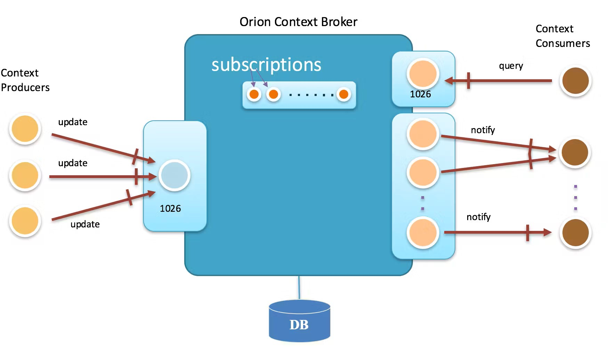
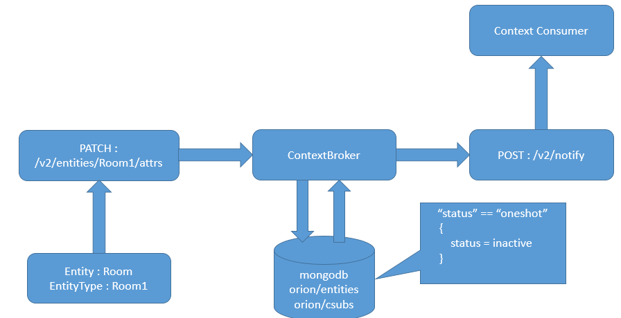

# Streaming

* Simple computations over small amounts of continuously incoming data
  * Execution is in near-real-time
* What we need
  * A message queueing service
  * An execution engine

# Streaming system definition

* The term "streaming" has been used to mean a variety of different things
  * Video streaming
  * Streaming systems
  * Streaming algorithms
* In our context, a  _system for data_  s _treaming _ is
* **_in mind _**
* Remember that
  * Batch engines can be (and have been) used to process infinite datasets
  * Streaming engines can be (and have been) used to process finite datasets
#

Un sistema dedicato all'elaborazione dei dati e pensato, progettato per elaborare dataset infiniti.

DA MIGLIORARE

# Data streaming characteristics

* **Infinite dataset**
  * Data is always being generated
  * **No control over the order** in which data elements arrive
* **Infinite computation**
  * The system must be always on and must be able to keep up with the data
    * There must be a plan to avoid  _overflowing _ (e.g., auto-scalability)
* **Low-latency, approximate and/or speculative results**
  * Data can usually be processed a single time ( **_one pass_** )
  * Only a fraction of the dataset can be kept in memory for analyses
  * **Approximation may be required**  to accommodate the low-latency requirement

# Architecture

Message queuing

(event-driven service bus)

Long term storage

In-memory storage

# Message queuing tier

* The message queuing tier handles the  **transportation of data between different tiers**
  * Most importantly, between collection to analysis tiers
* Why message queuing?
  * By  **decoupling the pipeline of operations** (collection, analysis, data access), each node in the cluster will do  _one_  job only
  * Message queuing provides a solid framework for a  **safe communication** between such nodes
  * Message queuing handles  **funneling**  of  _n _ data streams to  _m _ consumers

#

Funnel: imbuto
Funnelling: accodamento?

# Producer-Broker-Consumer

* Core concepts
  * The  **Consumer**  of data
  * The  **queues**  of data

# FIWARE

# Message delivery semantics

* **_Exactly once_** : a message is never lost and is read once and only once
  * Required in applications where data means money (financial/ad systems)
  * Performance is sacrificed to provide safety mechanisms
* **_At most once_** : a message may get lost, but it will never be read twice
  * Allowed where not all data is required (monitoring systems, down-sampling)
  * Fast and trivial
* **_At least once_** : a message will never be lost, but it may be read twice
  * Balances the two previous semantics
  * Easier to provide than  _exactly once_
  * The consumer can still check for duplicates to adopt  _exactly once_
* Beware: guarantees depends on the chosen tools \+ application logic  _on the whole pipeline_
#

Che cosa sono le garanzie semantiche? Cercare una definizione. – livello di garanzia sulla consegna del messaggio
The general theory is that appropriate message handling, beyond ensuring that they are delivered at least once, is dependent on the application logic and should be handled at that level

# Analysis: continuous queries

* A  **issued once and then is continuously executed**  against the data
  * In contrast, traditional queries are simply executed once when issued
  * A continuous query may need to maintain a  __state__
* State: an intermediate result that is continuously updated by the query
  * A query is  _stateless _ if each execution is independent from the other
* What makes continuous queries different from traditional ones?
  * **Memory constraint**  (for both data processing and state maintenance)
    * Data cannot be processed altogether ( _one pass_  __ algorithms__ )
    * Not much space to store the state
  * **Time constraint**
    * Data that can't be processed in time may have to be dropped ( _load shedding_ )
    * Algorithms (e.g., predictive models) may lose efficacy over time ( _concept drift_ )
#

NON SONO TUTTI MEMORY CONSTRAINT
[SD qua e là]
[thus] Input data is processed either on a per-tuple or per-window basis 
one pass: can't iterate on the data, would require too much memory
since I'm computing one piece at a time, I need to know how to aggregate it

# Continuous query model

|  | Typical query | Continuous query |
| :-: | :-: | :-: |
| Query model | Queries are based on a one-time model and a consistent state of the data __Pull model__ : the user executes a query and gets an answer, and the query is forgotten | The query is continuously executed based on the data that is flowing into the system __Push model__ : a user registers a query once, and the results are regularly pushed to the client |
| Query state | If the system crashes while a query is being executed, it must be re-issued on the whole dataset | Registered continuous queries may or may not need to continue where they left off; in the first case, a  __state __ has to be maintained |

#

[SD]

# Distributed execution

An architecture that is common to different frameworks

# Sliding windows

* **Sliding windows define length and period in terms of stream time**
  * Beware of the difference between event time and stream time
* Depending on the comparison of length and period, specialized versions of sliding windows can be defined
  * **Fixed windows** : when length and period are the same
    * E.g.: analyze the last 5 minutes of data every 5 minutes
    * _Tumbling windows _ are a special case of fixed windows, where length and period are expressed in terms of number of items (instead of time)
  * **Overlapping windows** : when the length is greater than the period
    * E.g.: analyze the last 5 minutes of data every 2 minutes
  * **Sampling windows** : when the length is smaller than the period
    * E.g.: analyze the last 2 minutes of data every 5 minutes

# Data-driven windows

* **Data-driven windows define the length in terms of the content that comes with the data**
  * In this case, the period determines the  _update interval_
* Typical use case: sessions
  * A session is a sequence of events terminated by a gap of inactivity grater than some timeout
    * Goal: determine the average amount of traffic generated by sessions
* Main characteristic:  **apriori**
  * How can I know when the session of a user has ended?
  * How can I know when the event of a user's session are going to stop coming?

# Algorithms

* Consider  _n _ the space of events captured by the data stream
* Streaming algorithm have the following requirements:
  * **_One-pass_** ; once examined, items must be discarded
  * Use  **small space** for the internal state: (O(polylog(n)))
  * **Fast update** of the internal state: O(1) to O(polylog(n))
  * **Fast computation of answers**
  * Provide  **approximated answers with (ε, δ)-guarantees**
    * Let R be the exact result, ε and δ > 0
    * With probability at least 1 − δ, the algorithm outputs R' such that (1 − ε)R ≤ R' ≤ (1 \+ ε)R
    * For instance, take ε=0.02 and δ=0.01
    * Then, I have a 99% probability that the obtained result R' equals the real result ± 2%
#

[One-Pass Streaming Algorithms] polylog(n) = (log n)^k
https://stackoverflow.com/questions/1801135/what-is-the-meaning-of-o-polylogn-in-particular-how-is-polylogn-defined

# Algorithms (examples)

* Given  **list**  as an input
  * Count the number of elements
  * Find the  _n_ th element
* Given  **a list of numbers**
  * Find the  _k_  largest or smallest elements ( _k_  given in advance)
  * Find the sum/mean/variance/st.dev. of the elements of the list
* Given  **a list of symbols from an alphabet** of k symbols (given in advance)
  * Count the number of times each symbol appears in the input ( _frequency_ )
  * Find the most or least frequent elements ( _heavy hitters_ )
  * Sort the list according to some order on the symbols
  * Find the maximum gap between two appearances of a given symbol
#

Wikipedia: la solvibilità di questi algoritmi è legata al fatto che per «one-pass» si intendono algoritmi che hanno storage<O(n) e O(1) di update – motivo per cui, quelli che non sono solvibili, non lo sono perché non possono tenere tutta la lista in memoria

* Some problems are  **** solvable by one-pass algorithms
* Given  **any list** as an input
  * Find the middle element of the list
* Given  **a list of numbers**
  * Find the median
  * Find the most frequent symbol
  * Sort the list

# Approximated algorithms

* Analyzing a data stream is challenging due to:
  * Space constraints
  * Time constraints
  * Algorithm unfeasibility in one-pass
* One solution is to rely on  _approximated algorithms_
* Approximation can be achieved by relying on two main concepts:
  * Sampling
  * Random projections

# Approximation by sampling

* Many different sampling methods have been proposed
  * _E.g., Distinct sampling, Quantile sampling, _  **_Reservoir sampling_**
* Sampling algorithms are known on time series and cash register models to
  * Find the number of distinct items
  * Find the quantiles
  * Find frequent items
* Notes
  * Some systems (e.g., IP packet sniffers) already do sampling
  * Sampling is not a powerful primitive for many problems
    * Too many samples for performing sophisticated analyses
  * Sampling is more challenging in the turnstile model

# Approximation with random projections

* An approach that relies on  **dimensionality reduction** , using projection along random vectors
  * Project high-dimensional data into a suitable lower-dimensional space…
  * ... in a way which approximately preserves the distances between the points
  * Projections are called  _sketches_
* Random projection algorithms are known on (also) turnstile models to
  * Estimate the number of distinct elements at any time
  * Estimate the quantiles at any time
  * Track most frequent items, wavelets, histograms, etc.
  * Random subset sums, counting sketches,  **Bloom filters**